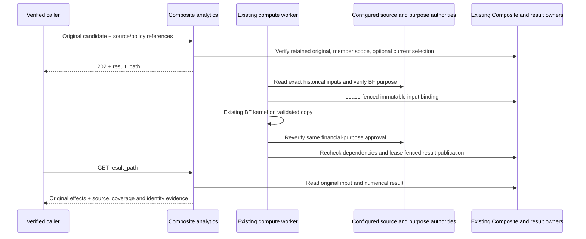

# Single-period Composite Brinson-Fachler caller guide

The bounded BF analysis decomposes one retained READY Composite return into allocation,
selection and interaction against complete historical benchmark group economics. It is
`CALCULATED_ANALYSIS`. It does not select or approve an official result.

The deployed source reader and financial-purpose verifier default to unavailable. Controlled
signed synthetic tests establish software behavior only. Genuine supplier applicability,
institutional methodology approval and downstream publication acceptance remain separate.

## Reader paths

- Callers: request, polling and refusal behavior below.
- Methodology reviewers: [v3 method and complete OR17 oracle](../methodologies/metrics/metric-composite-single-period-brinson-fachler.md).
- Source owners: historical source and policy requirements below; HTTP cannot install authorities.
- Operators: original replay, corrections and current-use boundaries below.
- Business readers: [Composite Attribution](../../wiki/Composite-Attribution.md).

## Request and result

Use `POST /performance/composites/analytics` with a verified bearer principal, admitted
`X-Tenant-Id`, Composite analytics capability and current access to every included portfolio.
The [controlled OR17 example](../examples/composite_attribution_or17.json) contains the complete
request and expected financial output. Its identifiers are synthetic; replace them with the
tenant's retained candidate, source manifest and policy binding. Never submit group arrays,
maker/checker identities or authority evidence in the HTTP request.

Required selection is `metric_id=SINGLE_PERIOD_BRINSON_FACHLER`,
`method=BRINSON_FACHLER_ARITHMETIC_THREE_EFFECT:v1`. Supply `composite_id`, `candidate_id`,
`source_manifest_id`, `policy_binding_id`, explicit `period_start`/`period_end`, reporting currency
and return view. Only `FLOAT64` executes; `DECIMAL_STRICT` refuses with
`ATTRIBUTION_PRECISION_UNSUPPORTED` before source reads or job registration.

The response is `202` with `poll_path` and `result_path`. The existing compute worker executes
the analysis. `GET result_path` returns the accepted envelope while pending, the retained result
when complete, or a typed failure. A retry with the same calculation ID must match the original
request; changed inputs need a new calculation ID. An accepted job is not a completed result.



Financial source reads, independent verification and arithmetic execute outside write
transactions. The existing job lease fences binding and publication. No additional scheduler,
financial engine or numerical result ledger is introduced.

## Historical source and policy requirements

The configured source supplies a full `AttributionSourceBundle`, not member attribution effects.
Performance reconciles complete underlying member/group economics against source-approved pooled
Composite group economics and the actual retained Composite original before running BF.

| Evidence | Required fields and meaning |
| --- | --- |
| Identity and period | `tenant_id`, `composite_id`, `source_manifest_id`, `candidate_id`, `original_response_digest`, `vector_digest`, dates, reporting currency and return view exactly bind the retained original. |
| Membership | Exact historical `membership_revision`/`membership_digest`, expected portfolio universe, full membership status/effective interval/reason, original Composite weight and actual member return. |
| Member groups | Every included portfolio/group pair, actual beginning-capital member weight, actual return and source row ID; complete member totals reconcile independently. |
| Pooled groups | Complete expected portfolio and benchmark group universes, source row ID, actual portfolio/benchmark weights and both actual returns for every group. No inferred missing observation. |
| Classification and benchmark | Historical classification revision/pin and benchmark identity/revision/pin, covering the exact requested period and basis. Current classifications cannot replace historical versions. |
| Source custody | Exactly four distinct membership, group-economics, classification and benchmark pins; owner/product/revision/source cut/payload digest, full raw bodies, page IDs/count, complete coverage and zero omitted components. |
| Compatibility | Full compatible pin set plus explicit compatibility reference. Matching dates alone do not establish joint applicability. |
| Policy | Exact binding/revision, BF purpose/method, source-approved pooled aggregation, beginning-capital arithmetic basis, currency, return view, fee/tax basis, effective interval and tolerance no greater than `1e-12`. |
| Financial authority | Separate BF-purpose verification of the complete bundle and policy digests; retained original evidence wire/digest, canonical independent maker/checker and explicit synthetic or institutional qualification. |

Both group-weight sums must independently equal one. Initial scope requires positive long-only
portfolio and benchmark group weights and positive included member weights. Observed zero return
is valid; absent return is not zero. Derivatives, signed/zero exposures, missing/off-benchmark
groups and incomplete universes refuse. Equal incomplete sums such as `0.9/0.9` remain invalid
even when their effects happen to reconcile.

For the controlled example, removing `g2` from the group array refuses
`SOURCE_UNIVERSE_INCOMPLETE`; supplying `g2` with an absent benchmark return refuses model
validation. Performance neither fills the missing return nor allocates a residual.

## Availability and ownership

| Dependency | Current engineering boundary |
| --- | --- |
| Captured Composite original | Existing Performance candidate/captured-vector owner; READY single-period original required. |
| Historical membership | Manage-owned historical eligibility and membership evidence; a populated current membership alone is insufficient. |
| Member/group economics | Configured financial supplier with complete underlying rows and approved pooled-group aggregation; default unavailable. |
| Historical classification and benchmark | Exact source-owned revisions with full weights/returns, paging and compatibility; no latest-only fallback. Current Core contracts do not establish this complete historical BF authority. |
| BF financial purpose | Independently configured verifier, separate from TWR or result-selection approval; default unavailable. |
| Numerical result | Existing Performance async result owner, with immutable input custody subordinate to CompositeMetadataStore. |

Owner-qualified source evidence and institutional approval must be established separately.
Neither controlled fixtures nor a successful calculation grant them.

## Retained dataset and downstream use

Consumers read the same retained `GET result_path` response. `outcome.groups` contains each
group's allocation, selection, interaction and total; `outcome` also carries aggregate effects,
portfolio/benchmark/active returns, reconciliation delta, `DECIMAL_RETURN` units, `FLOAT64` and
the arithmetic active-return convention. Multiply decimal effects by 100 for percentage points
or 10,000 for basis points. Consumers must not recompute, relink or annualize these effects.

`observation` retains the full source bundle, original financial-purpose evidence, separate
weight sums, original return and reconciliation. Top-level fields preserve original input
manifest digest, financial input fingerprint, calculation hash, shared calculation-engine
version, correction identity and optional official scope/revision. Coverage and qualification
must travel with the financial figures; a pending or failed response supplies no financial dataset.

This registered analytical response does not extend the separate TWR
`CompositePerformanceAnalytics:v1` product contract or claim its trust telemetry. A new
downstream gateway/report binding requires its own reviewed publication contract; no separate
Report/Workbench calculator or product is added here.

## Original, current use and corrections

Optional `official_scope_id` and `official_revision` must appear together. Admission, input
binding and publication recheck that exact current selection against the original candidate and
captured vector. Withdrawal or replacement before publication refuses `OFFICIAL_SELECTION_STALE`.
The analysis cannot activate, replace or withdraw a selection.

Once published, the immutable original remains readable after source unavailability or later
selection changes. Replay validates retained custody and financial identity without rerunning BF
or requesting a new BF approval. Captured-original reads still require their existing retained
source-authority registrations. Original evidence is distinct from current permission to use it;
downstream publication must consult the existing result-authority current-use surface.

Corrected members, benchmark or classification require a new calculation ID, new source
manifest and applicable approval. Set `correction_of_calculation_id` to the retained original.
Both originals remain immutable. Reusing an existing ID for revised inputs refuses.

## Refusal and recovery

### Executable HTTP examples

Swagger publishes `bf_request` and `bf_correction_request` on the existing analytics POST,
and `bf_accepted` on its 202 response. The existing result GET publishes `bf_pending` (202),
`bf_original_ready`, `bf_original_replay` and `bf_corrected_ready` (200). Original replay is
byte-for-value identical to the retained original; a correction has a new calculation identity,
benchmark/classification revisions and manifest digest. Explicit null official-selection fields
remain null. These examples use controlled synthetic sources and non-certifying purpose evidence.

The original OR17 example has portfolio return 0.068, benchmark 0.055 and active difference
0.013 (6.8%, 5.5%, and 1.3 percentage points). The corrected benchmark example changes the first
benchmark group return to 0.09: benchmark return becomes 0.06 and active difference 0.008.
Every allocation, selection and interaction cell comes from production admission and the existing
BF kernel, serialized through the production response DTO. No response math runs at app import.

Named errors distinguish source unavailability (503), independent purpose unavailability (503),
incomplete observed groups (409), and unsupported strict precision (422). The first and last can
refuse POST before registration; group and purpose failures arise during worker execution and are
read through GET. A failed job publishes no financial result.

`docs/examples/composite_attribution_endpoint_family.json` binds all eleven named modes to
registered behavior tests. `tests/composite_attribution_example_factory.py` authors the packaged
values through production DTO, admission, response and original-replay paths using deterministic
synthetic source fixtures. The contract test compares the factory, static DTOs, generated OpenAPI
and behavior ledger exactly, and rejects missing modes or missing executable behavior references.
Run from the repository root:

```powershell
python -m pytest tests/unit/app/test_composite_attribution_openapi_contract.py tests/integration/test_composite_attribution_api.py -q --no-cov
```

```bash
python -m pytest tests/unit/app/test_composite_attribution_openapi_contract.py tests/integration/test_composite_attribution_api.py -q --no-cov
```

This certifies bounded contract behavior. Institution-supplied historical observations, independently
approved policy/verifier and joined Gateway/Report publication remain unearned.

- `401/403`: bearer, audience, tenant, capability or current portfolio-scope admission failed.
- `422 ATTRIBUTION_PRECISION_UNSUPPORTED`: choose supported FLOAT64 explicitly; exact source money does not provide strict attribution arithmetic.
- `503 SOURCE_AUTHORITY_UNAVAILABLE` or `ATTRIBUTION_PURPOSE_AUTHORITY_UNAVAILABLE`: the required configured authority is absent; never substitute fixtures in production.
- `409`: source/custody conflict, incomplete universe, reconciliation mismatch, incompatible basis or stale official selection. Inspect the exact typed error and retained source references.
- Durable schema migration required: use the existing explicit schema owner/migration flow. Runtime verification never repairs missing guards.

Failures remain operational job/execution evidence and do not create an immutable financial
result. Investigate the original pinned dependency and issue a new correction identity when
financial truth changes. Multi-period linking, BHB, factor attribution, currency decomposition,
carve-outs, tax attribution, GIPS certification and live institutional acceptance remain outside
this single-period convention.
