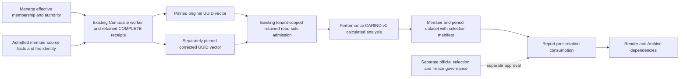

# Calling Pinned Composite Linked Contribution

Use `POST /performance/composites/analytics` with `metric_id=LINKED_MEMBER_CONTRIBUTION` and `method=CARINO:v1` to obtain a calculated multi-period member contribution dataset. Performance links original retained Decimal member facts with the existing Carino factor. [The methodology](../methodologies/metrics/metric-composite-linked-member-contribution.md) defines the formula, precision, units, domain and OR13 controls.

The result carries `CALCULATED_ANALYSIS`, `RETAINED_SOURCE_ATTESTATION_NOT_LIVE_QUALIFIED` and `constituent_decomposition=AVAILABLE`. Preserve these fields in every downstream presentation. Synthetic fixtures prove calculation and replay mechanics, not official selection, live authority qualification or whole-bank readiness. #610 remains the separate official approval/freeze dependency.

## Request and Source Selection

| Field | Client obligation |
| --- | --- |
| `X-Tenant-Id` header | Supply admitted tenant authority; never infer another tenant from a receipt |
| `metric_id` | `LINKED_MEMBER_CONTRIBUTION` |
| `method` | `CARINO:v1` |
| `composite_id` | Exact identity shared by all selected receipts |
| `period_start`, `period_end` | Inclusive boundaries covered completely by selected windows |
| `return_view` | Exact retained fee view: `GROSS`, `NET_ACTUAL` or admitted `NET_MODEL_FEE` |
| `reporting_currency` | Exact reporting currency; specify it for reproducible consumption |
| `calculation_id` | Stable caller calculation UUID for repeatable request/result identity |
| `materialization_ids` | 1–120 distinct COMPLETE receipt UUIDs in chronological order |

Obtain receipt UUIDs through the [existing materialization workflow](composite_materialization.md). The client supplies identity and scope, not member returns, weights or contributions. Do not combine the vector with `restatement_sequence`, reorder it, select an implicit latest revision, or substitute a corrected receipt without an explicit reviewed new request. The existing annual dispersion metric remains available with its own request contract; the new metric does not reinterpret annual fields or methods.

## Dependency and Replay Flow



The retained manifest pins definition, membership, attestation, source cut, method binding and receipt fingerprint. Period rows separately retain source snapshot/fingerprint and member restatement identity. These are complementary evidence: a stable portfolio ID alone cannot identify the financial source revision.

## Neutral Two-Period Numerical Control

The synthetic OR13 fixture uses two consecutive monthly receipts for `SYNTHETIC_LINKED_USD`, USD/GROSS, two members A/B with beginning assets `100` each. Period member returns A/B are `0.05/-0.03` and `0.01/0.03`. Period contributions are A `0.025/0.005`, B `-0.015/0.015`; Composite period returns are `0.01/0.02`.

| Dataset value | Decimal-return control | Presentation |
| --- | --- | --- |
| A linked contribution | `0.030274630541907723798278421725685604316257567000362` | About 3.0274630541907724 pp |
| B linked contribution | `-0.000074630541907723798278421725685604316257567000360925` | About -0.00746305419077238 pp |
| Cumulative return and total linked contribution | `0.0302` | 3.02% return; 3.02 pp total contribution |

Original absolute tolerance is `1e-12`. [The packaged example](../../app/api/examples/composite_linked_contribution.json) contains the complete request, actual registered response and missing-final-period refusal from this synthetic fixture. Its deterministic receipt UUIDs apply only to the executed fixture database. In an admitted environment, obtain that environment's retained UUIDs and authority evidence. `tests/composite_linked_contribution_helpers.py` creates the source packets and typed request; `tests/integration/test_composite_linked_contribution_api.py` verifies the packaged response against the registered HTTP operation and an independent 90-digit Decimal/log reference.

From the repository root, this Python client reads the packaged request. Replace its receipt IDs and scope with your admitted environment's explicit vector before calling it. Set `PERFORMANCE_BASE_URL` and `COMPOSITE_TENANT_ID` in the calling environment. It preserves decimal strings and refuses HTTP failures without inventing totals:

```python
import json
import os
from pathlib import Path
from urllib.request import Request, urlopen

example = json.loads(Path("app/api/examples/composite_linked_contribution.json").read_text())
request = Request(
    os.environ["PERFORMANCE_BASE_URL"].rstrip("/") + "/performance/composites/analytics",
    data=json.dumps(example["request"]).encode(),
    headers={"Content-Type": "application/json", "X-Tenant-Id": os.environ["COMPOSITE_TENANT_ID"]},
    method="POST",
)
with urlopen(request, timeout=30) as response:
    result = json.load(response)
print(json.dumps(result, indent=2))
```

## Correction and Replay Runbook

1. Retain the complete original request, tenant, receipt vector and response, including `selection_manifest.calculation_fingerprint` and `engine_version`.
2. Materialize a separately admitted correction through the existing worker. Keep the original receipt immutable; do not replace it in stored consumer evidence.
3. Repeat the original request. The old vector must still produce its original financial values, source pins and fingerprint. Retaining a correction alone is not a selector.
4. Build an explicit candidate request using the corrected receipt UUID and the unchanged unaffected UUIDs in chronological order. Review its retained authority and method compatibility independently.
5. Preserve both responses with their request vectors. A changed fingerprint binds changed request/result evidence; it does not by itself explain cause, materiality or approval.
6. Verify replay after the relevant durable store/process restart using the same retained database and explicit vectors. Fresh-process acceptance is a separate evidence requirement from closing/reopening a store.

In the source-safe fixture, correcting the first period to member returns `0.06/-0.02` changes its Composite return to `0.02`; the second period remains `0.02`. The new cumulative return is `1.02*1.02-1=0.0404`. The original vector remains `0.0302`. No correction delta, causal attribution or official revision comparison is calculated by this operation.

## Supported States and First Response

| State or request | Behavior | Consumer/operator action |
| --- | --- | --- |
| Complete compatible retained vector | 200 calculated dataset | Retain units, method, qualification and full evidence |
| Exact zero or supported near-zero return | Available numerical result | Display zero as a number, never as unavailable |
| Authoritative member entry/exit/exclusion | Rows only for participating READY periods | Use `participating_period_count`; do not infer missing-source zero rows |
| Missing middle/final period or required member evidence | 409, commonly `REQUIRED_PERIOD_UNAVAILABLE` | Repair source retention and resubmit a complete explicit vector |
| Receipt outside tenant | 404 | Check tenant and receipt custody without disclosing another tenant's state |
| Duplicate/reversed/overlapping IDs or invalid method | 422 | Correct the request; do not retry unchanged |
| Mixed fee/currency/calculation policy or method authority | 422 | Select compatible receipts; do not transform economics in the client |
| At/below -100% reaching Carino | 422 `COMPOSITE_CARINO_LOG_DOMAIN_REFUSED` | Keep method unavailable; no raw fallback |
| Earlier below-domain materialization refusal | Existing unavailable-receipt error | Repair upstream facts; do not bypass retained admission |
| Failed cumulative precision reconciliation | 422 `COMPOSITE_CARINO_PRECISION_REFUSED` | Retain request/pins for Performance diagnosis; no forced residual |
| Imported Composite-only or caller override | No derived member decomposition | Do not invent member rows or residual recipients |
| Rankings, rollups, annualized transforms, attribution or MWR | Outside this method | Follow their separately governed scope |

Errors return no partial member totals. A missing member observation cannot be repaired by dropping that member from the denominator. Clients should use the retained admission result, rather than reconstruct effective membership from current holdings.

For `NET_MODEL_FEE`, all selected windows must carry the same complete immutable method/profile binding. One profile can contain unequal rates for different members and periods. A changed profile revision/digest refuses even with unchanged logical method or schedule IDs. Existing rate, schedule, calendar, source-wire and verifier controls remain mandatory. There is no cross-profile compatibility inference or mixed gross/model-net linking.

For a three-period request, deliberately remove the middle UUID while retaining the original start/end bounds. The registered refusal test asserts 409 and absence of `members`/`cumulative_return`. This distinguishes missing middle evidence from an authoritative member exit within a complete period vector.

## Internal, External and Report Consumption

Parse Decimal JSON strings with decimal arithmetic. Return and contribution values are ratios; convert once for presentation. Keep `reporting_currency` on monetary assets, and never attach a currency symbol to a contribution ratio. External callers consume the same typed dataset and refusal contract as internal callers.

| Dataset field | Report/client mapping | Calculation ownership |
| --- | --- | --- |
| `members[].portfolio_id` | Stable member key/label lookup | Identity only; do not join to today's membership to redefine population |
| `members[].linked_contribution` | Contribution value column | Authoritative Performance result |
| `members[].participating_period_count` | Participation evidence column | Authoritative count |
| `periods[]` | Auditable period detail sheet/table | Preserve original return, assets, weight, contribution and linked factor |
| `cumulative_return` | Composite cumulative return | Authoritative Performance result |
| `total_linked_contribution` | Calculated contribution total | Consume returned total; no Report linking formula |
| `reconciliation_difference` | Financial precision control | Retain without allocating it |
| `display_rounding_difference` | Display projection explanation | Separate from member economics |
| `units`, `method`, `status`, `qualification` | Dataset metadata and visible eligibility | Preserve exactly |
| `selection_manifest` and row source pins | Source/audit attachment | Preserve both window and member evidence |

For Excel presentation, converting an available Decimal string `B2` to percentage points can use `=100*NUMBERVALUE(B2,".",",")`; basis points use `10000` instead. Excel binary rounding can differ from Performance's Decimal values, so retain the original string and use API totals and differences as authoritative. Formatting or summing displayed rows must not overwrite `total_linked_contribution`, create a member residual, or imply official report applicability.

Report #417, Render #338 and Archive #176 remain downstream producer/integration dependencies. This guide maps the dataset they can consume; it does not claim those integrations or report templates are implemented or certified by this slice.

## Executable Acceptance Sources

The current bounded native sources are:

- `tests/composite_linked_contribution_helpers.py`: independent 90-digit Decimal/log reference, original OR13 controls, two-period source packets and request builder.
- `tests/integration/test_composite_linked_contribution_api.py`: registered worker/retained-reader HTTP controls, correction replay, unchanged TWR compatibility, missing-middle/member and tenant/scope/method/domain refusals.
- `tests/unit/engine/test_composite_carino_factors.py`: strict Decimal limits/domain and legacy portfolio compatibility.
- `tests/integration/test_composite_linked_model_fee_api.py`: one approved full profile with unequal multi-window rates, independent linked reference, changed-revision and mixed-view refusal, and unavailable approval refusal.
- `tests/benchmarks/test_postgres_composite_materialization.py`: registered PostgreSQL worker/API retention and separate-interpreter original/correction replay, snapshot/read-only evidence and tenant/gap refusal through `tests/benchmarks/composite_linked_process_controls.py`.

From the `lotus-performance` repository root, run the focused source-safe controls with an approved isolated `LINEAGE_METADATA_DATABASE_URL` configured before import:

```powershell
python -m pytest tests/unit/engine/test_composite_carino_factors.py tests/integration/test_composite_linked_contribution_api.py tests/integration/test_composite_linked_model_fee_api.py -q
```

```bash
python -m pytest tests/unit/engine/test_composite_carino_factors.py tests/integration/test_composite_linked_contribution_api.py tests/integration/test_composite_linked_model_fee_api.py -q
```

Actual PostgreSQL, fresh-process original/correction replay, exact-head CI, reviewed mainline validation and authored wiki publication/parity are delivery evidence requirements. Source-safe local controls alone do not establish those requirements or official source qualification. Keep the successful native exit/check identifiers with the delivery record rather than inferring execution from the presence of a test file.
