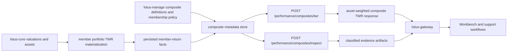

# Composite Performance Guide

This guide describes the RFC-049 composite performance implementation in `lotus-performance`.
It is grounded in the shipped composite models, engine, API routes, inspector service, tests, and
data-product contracts.

## Current Capability

`lotus-performance` now owns persisted-fact composite TWR for private-banking composites.

Supported now:

- persisted member-return fact ingestion through the composite metadata store;
- asset-weighted composite TWR from persisted member-return facts;
- geometric linking across calculable periods;
- return-view separation for `GROSS`, `NET_ACTUAL`, and `NET_MODEL_FEE`;
- single reporting-currency guard for each calculable period;
- source fingerprints, source snapshots, restatement versions, and source calculation ids in output
  evidence;
- classified inspection artifacts for audit and support;
- `CompositePerformanceAnalytics:v1` data-product declaration and trust telemetry.

Not supported by this endpoint:

- ad hoc request-time member return arrays;
- hidden on-the-fly portfolio TWR fan-out;
- composite contribution, composite attribution, or composite MWR;
- sleeves, carve-outs, wrap programs, model portfolios, pooled funds, private-market composites,
  portability records, tax-aware composites, leveraged composites, or long/short special structures;
- multi-currency composite aggregation beyond the current fail-closed single reporting-currency
  guard;
- benchmark active return for composites.

## Why Persisted Member Returns

Composite calculation is audit-sensitive. The implementation uses persisted member-return facts
instead of calculating every member portfolio on demand because support teams need to know exactly
which member return, restatement version, source snapshot, and fingerprint produced a published
composite result.

The persisted fact model also enables:

- deterministic replay;
- restatement comparison;
- source-authority separation between `lotus-manage`, `lotus-core`, and `lotus-performance`;
- batch or worker isolation for heavier composite workloads;
- supportable inspection artifacts without rebuilding source inputs from downstream payloads.

## Source Authority

| Area | Source owner | Current Lotus treatment |
| --- | --- | --- |
| Composite definition | `lotus-manage` | Defines `composite_id`, display name, strategy code, inception, termination, reporting currency, and calculation method. |
| Effective-dated membership | `lotus-manage` | Owns inclusion, exclusion, review, grace-period, minimum-asset, discretionary, and termination policy before facts are materialized. |
| Member portfolio returns | `lotus-performance` | Owns TWR methodology and persisted member-return facts used by the composite. |
| Portfolio assets and source valuations | `lotus-core` | Owns source valuation and cash-flow data used upstream to produce member returns and market values. |
| Benchmark assignment | source authority declared in composite metadata | Captured for lineage; composite benchmark active return is not part of the current endpoint. |

## API: Calculate Composite TWR

Route:

`POST /performance/composites/twr`

Use this endpoint when the requested composite, window, and member-return facts are already
materialized in the composite metadata store.

Request:

```json
{
  "calculation_id": "7f2b08b0-58e5-49be-b3ef-7a9cfb0321ce",
  "composite_id": "PB_GLOBAL_BALANCED_USD",
  "period_start": "2026-01-01",
  "period_end": "2026-03-31"
}
```

Response excerpt:

```json
{
  "calculation_id": "7f2b08b0-58e5-49be-b3ef-7a9cfb0321ce",
  "composite_id": "PB_GLOBAL_BALANCED_USD",
  "status": "READY",
  "period_start": "2026-01-01",
  "period_end": "2026-03-31",
  "cumulative_return": "0.037850000000",
  "reason_codes": [],
  "methodology": "persisted_member_return_asset_weighted_twr_v1",
  "periods": [
    {
      "period_start": "2026-01-01",
      "period_end": "2026-01-31",
      "status": "READY",
      "return_value": "0.017500000000",
      "cumulative_return": "0.017500000000",
      "beginning_market_value": "400.000000",
      "ending_market_value": "407.000000",
      "member_count": 2,
      "excluded_member_count": 0,
      "dispersion_equal_weight": "0.007071067812",
      "return_view": "NET_ACTUAL",
      "reporting_currency": "USD",
      "source_fingerprints": ["sha256:member-a-2026-01", "sha256:member-b-2026-01"],
      "restatement_versions": ["v1"],
      "reason_codes": [],
      "member_contributions": [
        {
          "portfolio_id": "PB_SG_GLOBAL_BAL_001",
          "period_start": "2026-01-01",
          "period_end": "2026-01-31",
          "return_value": "0.010000000000",
          "beginning_market_value": "100.000000",
          "beginning_asset_weight": "0.250000000000",
          "contribution": "0.002500000000",
          "source_snapshot_id": "portfolio-twr-2026-01",
          "source_fingerprint": "sha256:member-a-2026-01",
          "restatement_version": "v1",
          "calculation_id": "member-calc-a-2026-01"
        }
      ]
    }
  ]
}
```

## API: Inspect Composite Evidence

Route:

`POST /performance/composites/inspect`

Use this endpoint when operations, audit, support, or implementation proof needs a supportability
view over the same persisted facts used by the calculation.

Request:

```json
{
  "inspection_id": "8d1e37d2-aeca-488c-bd43-77dbf6739103",
  "composite_id": "PB_GLOBAL_BALANCED_USD",
  "period_start": "2026-01-01",
  "period_end": "2026-03-31"
}
```

The inspector returns:

- `verdict`: `supportable`, `supportable_with_warnings`, or `not_supportable`;
- `findings[]`: bounded finding code, severity, owner repository, summary, action, and evidence;
- `evidence_summary`: member fact count, period count, calculation status, reason codes, artifact count;
- `artifacts[]`: UTF-8 artifact content with access classification.

Current artifacts:

| Artifact | Classification | Purpose |
| --- | --- | --- |
| `member_inputs.csv` | `operator_only` | Member fact inventory with returns, assets, status, reason codes, fingerprints, and restatement versions. |
| `period_weights.csv` | `operator_only` | Member weights and contributions used by each calculated period. |
| `composite_returns.csv` | `customer_consumable` | Period returns, cumulative returns, counts, dispersion, and reason codes. |
| `lineage_manifest.json` | `operator_only` | Composite id, calculation status, source fingerprints, and restatement versions. |
| `support_brief.md` | `operator_only` | Human support summary for audit and operations. |

## Status And Reason Codes

| Condition | Endpoint behavior | Reason code |
| --- | --- | --- |
| Composite definition missing | HTTP 404 | `COMPOSITE_DEFINITION_NOT_FOUND` |
| Request end date before start date | HTTP 422 | Pydantic validation detail |
| No persisted facts in requested window | HTTP 422 | `NO_MEMBER_RETURN_FACTS` |
| Period has facts but no ready facts | blocked period | `no_ready_member_return_facts` or upstream non-ready reason codes |
| Ready beginning assets are not positive | blocked period | `nonpositive_composite_beginning_assets` |
| Ready facts mix return views | blocked period | `mixed_member_return_views` |
| Ready facts mix reporting currencies | blocked period | `mixed_member_reporting_currencies` |
| Some member facts are non-ready but at least one ready fact remains | degraded period/calculation | upstream fact reason codes |

## Architecture



## Operational Playbook

1. Confirm the composite definition exists and has the expected source-authority policy.
2. Confirm persisted member-return facts exist for every expected member and period.
3. Run `POST /performance/composites/inspect` before publishing a new or restated composite result.
4. Review `member_inputs.csv` for non-ready facts, mixed return views, currency mismatch, and stale
   restatement versions.
5. Review `period_weights.csv` to confirm weights sum to one for each ready period.
6. Review `composite_returns.csv` for blocked or degraded periods, dispersion, and cumulative return.
7. Use `source_fingerprint`, `source_snapshot_id`, `restatement_version`, and `calculation_id` to
   replay or investigate source member returns.
8. Do not publish customer-facing composite returns when the inspector verdict is
   `not_supportable`.

## Data Product Posture

`CompositePerformanceAnalytics:v1` is declared in
`contracts/domain-data-products/lotus-performance-products.v1.json`.

Current mesh posture:

- scope level: portfolio set;
- approved consumer: `lotus-gateway`;
- route: `POST /performance/composites/twr`;
- freshness class: batch;
- trust metadata: product identity, lineage version, generation/as-of dates, correlation id,
  request fingerprint, source services, source fingerprints, quality status, and restatement evidence.

Repo-local trust telemetry lives at:

`contracts/trust-telemetry/composite-performance-analytics.telemetry.v1.json`

## Support Boundaries

The current implementation is deliberately narrower than the full composite-performance industry
domain. Unsupported advanced scopes must remain explicit in demos, client conversations, and
downstream product material until implemented and proven.

Current unsupported scopes:

- composite contribution;
- composite attribution;
- composite MWR;
- sleeves and carve-outs;
- model portfolios and wrap programs;
- pooled fund and private-market composites;
- portability records;
- tax-aware, leveraged, and long/short special composite structures;
- multi-currency composite aggregation beyond the fail-closed single reporting-currency guard.

## References

- [Composite TWR methodology](../methodologies/metrics/metric-composite-twr.md)
- [Composite TWR endpoint certification](../technical/composite-twr-endpoint-certification.md)
- [Composite performance documentation map](../technical/composite-performance-documentation-map.md)
- [RFC 049](../RFCs/RFC%20049%20-%20Composite%20Performance%20Industry%20Methodology%20Alignment%20and%20Evidence%20Contract.md)
