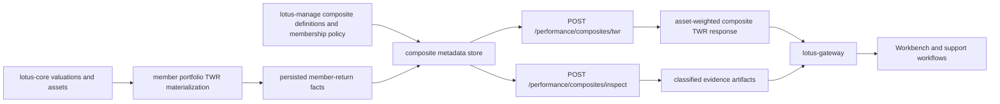

# Composite Performance Guide

This guide describes the RFC-049 composite performance implementation in `lotus-performance`.
It is grounded in the shipped composite models, engine, API routes, inspector service, tests, and
data-product contracts.

## Current Capability

`lotus-performance` now owns persisted-fact composite TWR for private-banking composites.

Supported now:

- tenant-owned definitions, memberships, immutable facts, publications, replay, inspection, and cleanup;
- tenant-local definition validation plus durable composite foreign keys for every membership,
  fact, and publication write;
- persisted member-return fact ingestion through the composite metadata store;
- asset-weighted composite TWR from persisted member-return facts;
- geometric linking across calculable periods;
- return-view separation for `GROSS`, `NET_ACTUAL`, and `NET_MODEL_FEE`;
- explicit reporting-currency identity for each calculation;
- immutable restatement retention with numeric, non-lexical latest selection and explicit historical
  sequence replay;
- source fingerprints, source snapshots, restatement versions, restatement sequences, and source
  calculation ids in output evidence;
- classified inspection artifacts for audit and support;
- `CompositePerformanceAnalytics:v1` data-product declaration and trust telemetry.

Pinned multi-period composite contribution is also available through
`POST /performance/composites/analytics` with `metric_id=LINKED_MEMBER_CONTRIBUTION`
and `method=CARINO:v1`. It consumes original retained Decimal member facts and an
explicit COMPLETE window vector. See the [linked contribution client guide](composite_linked_contribution.md)
and [methodology](../methodologies/metrics/metric-composite-linked-member-contribution.md).
This is calculated analysis with retained source attestation, not official selection or live qualification.

Pooled monetary analysis uses the same analytics operation with
`metric_id=POOLED_MONEY_WEIGHTED_RETURN` and `method=XIRR:v1`, returning `202` for
the existing worker. It pools exact dated source money before calling the existing
MWR solver; member IRRs are never averaged. See the
[pooled caller guide](composite_pooled_mwr.md) and
[methodology](../methodologies/metrics/metric-composite-pooled-mwr.md).
This is controlled synthetic qualification: the default source reader refuses,
actual supplier applicability remains separate and ACT/365 is the only admitted basis.

Not supported by this endpoint:

- ad hoc request-time member return arrays;
- hidden on-the-fly portfolio TWR fan-out;
- linked composite contribution (use the separate analytics operation above), composite attribution, or composite MWR;
- sleeves, carve-outs, wrap programs, model portfolios, pooled funds, private-market composites,
  portability records, tax-aware composites, leveraged composites, or long/short special structures;
- multi-currency composite aggregation beyond the current fail-closed single reporting-currency
  guard;
- benchmark active return for composites.

## Why Persisted Member Returns

Composite calculation is audit-sensitive. The implementation uses persisted member-return facts
instead of calculating every member portfolio on demand because support teams need to know exactly
which member return, restatement version, source snapshot, and fingerprint produced a published
composite result.

The persisted fact model also enables:

- deterministic replay;
- restatement comparison;
- source-authority separation between `lotus-manage`, `lotus-core`, and `lotus-performance`;
- batch or worker isolation for heavier composite workloads;
- supportable inspection artifacts without rebuilding source inputs from downstream payloads.

## Source Authority

| Area | Source owner | Current Lotus treatment |
| --- | --- | --- |
| Composite definition | `lotus-manage` | Defines `composite_id`, display name, strategy code, inception, termination, reporting currency, and calculation method. |
| Effective-dated membership | `lotus-manage` | Owns inclusion, exclusion, review, grace-period, minimum-asset, discretionary, and termination policy before facts are materialized. |
| Member portfolio returns | `lotus-performance` | Owns TWR methodology and persisted member-return facts used by the composite. |
| Portfolio assets and source valuations | `lotus-core` | Owns source valuation and cash-flow data used upstream to produce member returns and market values. |
| Benchmark assignment | source authority declared in composite metadata | Captured for lineage; composite benchmark active return is not part of the current endpoint. |

## API: Calculate Composite TWR

For source-backed fact creation, use the separate
[governed composite materialization workflow](composite_materialization.md). It pins Manage
authority and retained stateful TWR evidence before publication. Gross and actual-net remain
distinct source bases. A bound `NET_MODEL_FEE` command supports the first explicit complete-period
management-fee wealth-factor convention on approved internal native receipts. The configured
Performance local catalog supplies exact immutable profile bytes; resolution defaults to
`UNAVAILABLE` and independent verification remains unavailable. Read the
[periodic model-fee methodology](../methodologies/metrics/metric-composite-periodic-model-fee.md)
for its inputs, exact formula, numerical examples and remaining #609 acceptance.

The separately named [scheduled model-fee method](composite_scheduled_model_fee.md) supports
annual flat, marginal-tiered and whole-AUM model wealth-rate selection on original native beginning
assets, with nominal fixed ACT/365 accrual. Its v5 receipt and fresh arithmetic are bound to exact
historical custody; the periodic contract remains unchanged. Model wealth deductions do not create
actual cash-fee postings or change source assets. Independent approval still defaults unavailable.

Route:

`POST /performance/composites/twr`

The caller must provide its admitted `X-Tenant-Id`. Tenant authority is transport context, not a
request-body field. Missing or blank authority is refused with HTTP 401 and malformed authority
with HTTP 400 before any composite lookup. The same external composite and portfolio identifiers
may exist independently for different tenants.

Use this endpoint when the requested composite, window, and member-return facts are already
materialized in the composite metadata store.

Request:

```json
{
  "calculation_id": "7f2b08b0-58e5-49be-b3ef-7a9cfb0321ce",
  "composite_id": "PB_GLOBAL_BALANCED_USD",
  "period_start": "2026-01-01",
  "period_end": "2026-03-31",
  "return_view": "NET_ACTUAL",
  "reporting_currency": "USD"
}
```

Omit `restatement_sequence` to select the greatest numeric sequence visible for the requested fact
set and require that sequence to be completed; the service never falls back past a higher
unpublished sequence. An unpinned read requires an immutable publication manifest whose inclusive period covers
the request and whose exact source-backed family universe matches the selected facts; facts written
before completion are retained but unavailable as latest. Supply a sequence to replay exactly that
retained historical set, even when a later sequence adds or removes a family. If the selected
historical sequence has a completed manifest, its currently retained rows must still equal that
declared family set; missing or extra restored rows fail closed instead of changing the replay. A
request wider than that manifest also fails closed; it cannot reinterpret a completed sequence as
an unpublished compatibility read. An entirely absent
explicit sequence, missing completion manifest, or incomplete unpinned latest publication returns
HTTP 409. This allows an intentional member removal while continuing to reject a one-member partial
correction. A later February-only publication does not supersede retained January evidence; a
request spanning both fails closed until one complete generation covers that wider window.

Response excerpt:

```json
{
  "calculation_id": "7f2b08b0-58e5-49be-b3ef-7a9cfb0321ce",
  "composite_id": "PB_GLOBAL_BALANCED_USD",
  "status": "READY",
  "period_start": "2026-01-01",
  "period_end": "2026-03-31",
  "cumulative_return": "0.037850000000",
  "reason_codes": [],
  "methodology": "persisted_member_return_asset_weighted_twr_v1",
  "periods": [
    {
      "period_start": "2026-01-01",
      "period_end": "2026-01-31",
      "status": "READY",
      "return_value": "0.017500000000",
      "cumulative_return": "0.017500000000",
      "beginning_market_value": "400.000000",
      "ending_market_value": "407.000000",
      "member_count": 2,
      "excluded_member_count": 0,
      "dispersion_equal_weight": "0.007071067812",
      "return_view": "NET_ACTUAL",
      "reporting_currency": "USD",
      "source_fingerprints": ["sha256:member-a-2026-01", "sha256:member-b-2026-01"],
      "restatement_versions": ["v1"],
      "restatement_sequence": 1,
      "reason_codes": [],
      "member_contributions": [
        {
          "portfolio_id": "PB_SG_GLOBAL_BAL_001",
          "period_start": "2026-01-01",
          "period_end": "2026-01-31",
          "return_value": "0.010000000000",
          "beginning_market_value": "100.000000",
          "beginning_asset_weight": "0.250000000000",
          "contribution": "0.002500000000",
          "source_snapshot_id": "portfolio-twr-2026-01",
          "source_fingerprint": "sha256:member-a-2026-01",
          "restatement_version": "v1",
          "restatement_sequence": 1,
          "calculation_id": "member-calc-a-2026-01"
        }
      ]
    }
  ]
}
```

`periods[].restatement_sequence` is the immutable numeric generation selected for that period. It
remains present when a period is blocked and `member_contributions` is empty, so consumers can bind
the result to the completed publication that was evaluated.

## API: Inspect Composite Evidence

Route:

`POST /performance/composites/inspect`

Use this endpoint when operations, audit, support, or implementation proof needs a supportability
view over the same persisted facts used by the calculation.

Request:

```json
{
  "inspection_id": "8d1e37d2-aeca-488c-bd43-77dbf6739103",
  "composite_id": "PB_GLOBAL_BALANCED_USD",
  "period_start": "2026-01-01",
  "period_end": "2026-03-31",
  "return_view": "NET_ACTUAL",
  "reporting_currency": "USD"
}
```

The inspector returns:

- `verdict`: `supportable`, `supportable_with_warnings`, or `not_supportable`;
- `findings[]`: bounded finding code, severity, owner repository, summary, action, and evidence;
- `evidence_summary`: member fact count, period count, calculation status, reason codes, artifact count;
- `artifacts[]`: UTF-8 artifact content with access classification.

Current artifacts:

| Artifact | Classification | Purpose |
| --- | --- | --- |
| `member_inputs.csv` | `operator_only` | Member fact inventory with returns, assets, status, reason codes, fingerprints, version labels, and numeric restatement sequences. |
| `period_weights.csv` | `operator_only` | Member weights and contributions used by each calculated period. |
| `composite_returns.csv` | `customer_consumable` | Period returns, cumulative returns, counts, dispersion, and reason codes. |
| `lineage_manifest.json` | `operator_only` | Tenant id, composite id, calculation status, source fingerprints, and restatement versions. |
| `support_brief.md` | `operator_only` | Tenant-bound human support summary for audit and operations. |

## Status And Reason Codes

| Condition | Endpoint behavior | Reason code |
| --- | --- | --- |
| Tenant authority missing or blank | HTTP 401 | `TENANT_AUTHORITY_REQUIRED` |
| Tenant authority exceeds the governed bound | HTTP 400 | `TENANT_AUTHORITY_MALFORMED` |
| Composite definition missing | HTTP 404 | `COMPOSITE_NOT_FOUND` |
| Request end date before start date | HTTP 422 | Pydantic validation detail |
| No persisted facts in requested window | HTTP 422 | `NO_MEMBER_RETURN_FACTS` |
| Latest sequence is incomplete, or explicit sequence is absent | HTTP 409 | `COMPOSITE_FACT_SELECTION_INCOMPLETE` |
| Period has facts but no ready facts | blocked period | `no_ready_member_return_facts` or upstream non-ready reason codes |
| Ready beginning assets are not positive | blocked period | `nonpositive_composite_beginning_assets` |
| Ready facts mix return views | blocked period | `mixed_member_return_views` |
| Ready facts mix reporting currencies | blocked period | `mixed_member_reporting_currencies` |
| Some member facts are non-ready but at least one ready fact remains | degraded period/calculation | upstream fact reason codes |

## Architecture


```mermaid
flowchart LR
    A[lotus-manage composite definitions and membership policy] --> B[composite metadata store]
    C[lotus-core valuations and assets] --> D[member portfolio TWR materialization]
    D --> E[persisted member-return facts]
    E --> B
    B --> F[POST /performance/composites/twr]
    F --> G[asset-weighted composite TWR response]
    B --> H[POST /performance/composites/inspect]
    H --> I[classified evidence artifacts]
    G --> J[lotus-gateway]
    I --> J
    J --> K[Workbench and support workflows]
```

## Operational Playbook

1. Confirm the composite definition exists and has the expected source-authority policy.
2. Confirm persisted member-return facts exist for every expected member and period.
3. Run `POST /performance/composites/inspect` before publishing a new or restated composite result.
4. Review `member_inputs.csv` for non-ready facts, selected return view/currency, source version
   labels, and numeric restatement sequences.
5. Review `period_weights.csv` to confirm weights sum to one for each ready period.
6. Review `composite_returns.csv` for blocked or degraded periods, dispersion, and cumulative return.
7. Use `source_fingerprint`, `source_snapshot_id`, `restatement_version`,
   `restatement_sequence`, and `calculation_id` to replay or investigate source member returns.
8. Do not publish customer-facing composite returns when the inspector verdict is
   `not_supportable`.

## Data Product Posture

`CompositePerformanceAnalytics:v1` is declared in
`contracts/domain-data-products/lotus-performance-products.v1.json`.

Current mesh posture:

- scope level: portfolio set;
- approved consumer: `lotus-gateway`;
- route: `POST /performance/composites/twr`;
- freshness class: batch;
- trust metadata: product identity, lineage version, generation/as-of dates, correlation id,
  request fingerprint, source services, source fingerprints, quality status, and restatement evidence.

Repo-local trust telemetry lives at:

`contracts/trust-telemetry/composite-performance-analytics.telemetry.v1.json`

## Support Boundaries

The current implementation is deliberately narrower than the full composite-performance industry
domain. Unsupported advanced scopes must remain explicit in demos, client conversations, and
downstream product material until implemented and proven.

Current unsupported scopes:

- contribution rankings, classified rollups and annualized contribution transforms;
- composite attribution;
- composite MWR;
- sleeves and carve-outs;
- model portfolios and wrap programs;
- pooled fund and private-market composites;
- portability records;
- tax-aware, leveraged, and long/short special composite structures;
- multi-currency composite aggregation beyond the fail-closed single reporting-currency guard.

## References

- [Composite TWR methodology](../methodologies/metrics/metric-composite-twr.md)
- [Composite TWR endpoint certification](../technical/composite-twr-endpoint-certification.md)
- [Composite performance documentation map](../technical/composite-performance-documentation-map.md)
- [RFC 049](../RFCs/RFC%20049%20-%20Composite%20Performance%20Industry%20Methodology%20Alignment%20and%20Evidence%20Contract.md)
