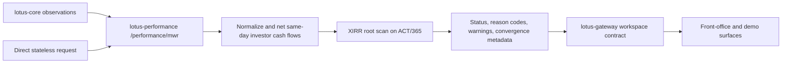
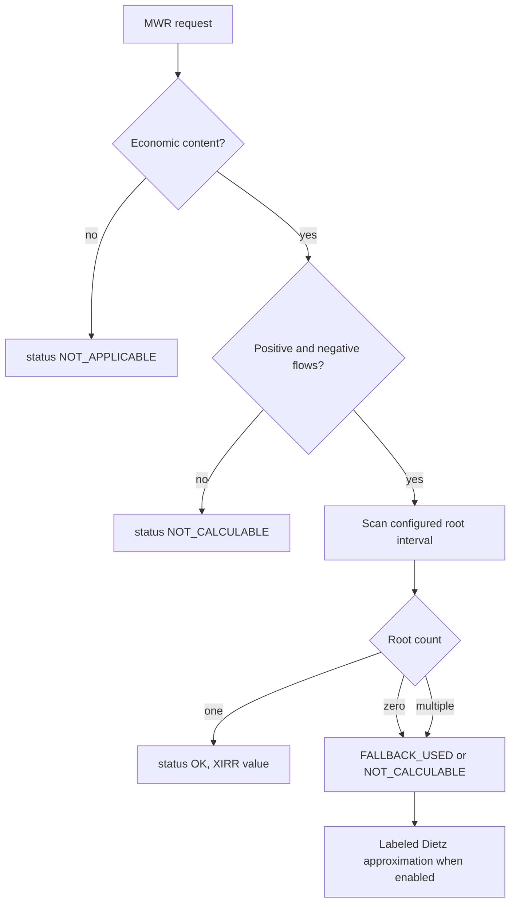

# Lotus MWR Production Controls

This page is the Lotus implementation-backed version of the reviewed money-weighted return material.
It describes what `lotus-performance` supports today, how the calculation is controlled, and how the
contract is consumed by downstream Lotus applications.

## Audience

- Business users and relationship managers: understand when MWR is the right investor-return lens.
- Operations and support: triage calculation statuses, fallbacks, and data-quality conditions.
- Developers and data product owners: maintain the calculation, API contract, and mesh publication
  boundary.
- Sales, pre-sales, and demo teams: explain Lotus MWR behavior accurately without over-claiming.

## Feature Coverage

`lotus-performance` exposes MWR through `/performance/mwr` in two supported modes:

- `stateless`: callers provide valuation endpoints and dated investor cash flows in the request.
- `stateful`: Lotus retrieves observations from `lotus-core`, derives valuation and cash-flow
  evidence for the requested portfolio window, and returns calculation lineage.

The primary supported method is an XIRR-style dated money-weighted return on an ACT/365 basis. The
response also exposes `holding_period_return` so short-window results are not confused with the
annualized primary value. When XIRR is not economically or numerically appropriate, the response uses
explicit supportability metadata instead of silently emitting an arbitrary return.

## Business Flow

MWR answers a different business question from TWR. TWR isolates manager performance from external
cash flows. MWR answers the investor capital-timing question: the return actually experienced after
subscription, redemption, contribution, and withdrawal timing is included.

## Solver Controls

The solver is intentionally diagnostic:

- same-day investor cash flows are netted after sign normalization;
- root search scans the configured rate interval instead of depending on a single initial guess;
- `MULTIPLE_IRR_ROOTS_DETECTED` is emitted when the cash-flow profile has more than one root;
- `NO_ROOT_FOUND` is emitted when no valid root exists in the configured bounds;
- `NO_POSITIVE_AND_NEGATIVE_CASH_FLOW` and `NO_ECONOMIC_CONTENT` prevent misleading normal-zero
  interpretations;
- `convergence` records algorithm, residual NPV, root count, bounds, day-count basis, anchor date,
  normalized flow count, and gross cash-flow scale.

## Data Mesh Boundary

`lotus-performance` is the producer of governed performance calculation truth. It owns:

- MWR method semantics and day-count basis;
- response status, reason-code vocabulary, and supportability flags;
- calculation supportability and lineage evidence;
- OpenAPI schema, API vocabulary inventory, and monetary-float allowlist governance.

`lotus-gateway` preserves the MWR supportability fields for downstream workspace consumers. It does
not reinterpret solver status, collapse reason codes, or relabel approximation metadata.

## Non-Functional Controls

- API governance: `/performance/mwr` is covered by OpenAPI quality, no-alias checks, API vocabulary
  validation, and response-attribute certification.
- Reproducibility: deterministic cash-flow normalization and solver metadata make calculation output
  explainable across reruns.
- Supportability: every non-OK calculation path carries status and reason-code evidence.
- Domain correctness: XIRR and Dietz are not presented as interchangeable; Dietz is exposed only as a
  labeled approximation path.
- Consumer compatibility: downstream Lotus consumers receive the expanded response contract without
  relying on implicit payload interpretation.

## Validation Evidence

The current implementation is backed by:

- unit tests for XIRR, short-period annualization, same-day netting, no-root, multiple-root, no
  economic-content, and fallback paths;
- integration tests for `/performance/mwr` response status, reason codes, warning propagation,
  holding-period return, and convergence metadata;
- documentation contract tests that keep public docs, wiki links, and response certification aligned;
- `make check`, `make domain-product-validate`, OpenAPI quality, and API vocabulary validation.
