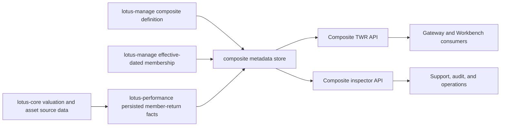

# Composite Performance Documentation Map

This map explains where composite performance truth lives after RFC-049 Slice 11.

## Audience Routing

| Audience | Start here | Why |
| --- | --- | --- |
| Business users and sales | `wiki/Composite-Performance.md` | Explains the current private-banking composite capability, boundaries, and demo-safe language. |
| Operations and support | `docs/guides/composite_performance.md` and `docs/technical/composite-twr-endpoint-certification.md` | Provides API usage, artifacts, reason codes, and support workflow. |
| Engineers | `docs/methodologies/metrics/metric-composite-twr.md` and OpenAPI `/docs` | Gives exact formulas, request/response fields, validation behavior, and field-level schema. |
| Audit and methodology review | `docs/methodologies/metrics/metric-composite-twr.md` | Provides v3 methodology, variable dictionary, deterministic steps, and worked examples. |
| Data product governance | `contracts/domain-data-products/lotus-performance-products.v1.json` and `contracts/trust-telemetry/composite-performance-analytics.telemetry.v1.json` | Declares data-product identity, route, freshness, approved consumer, and trust metadata. |
| RFC governance | `docs/RFCs/RFC 049 - Composite Performance Industry Methodology Alignment and Evidence Contract.md` | Tracks slice scope, acceptance criteria, and closure proof. |

Data-product identity: `CompositePerformanceAnalytics`.

Unsupported boundary phrase pinned for product material: multi-currency composite aggregation beyond
the current single reporting-currency guard is not supported.

## Current Documentation Set

| Artifact | Purpose | Boundary |
| --- | --- | --- |
| `docs/methodologies/metrics/metric-composite-twr.md` | Audit-grade methodology for persisted-fact asset-weighted composite TWR. | Does not document unsupported composite contribution, attribution, MWR, or advanced structures as implemented. |
| `docs/guides/composite_performance.md` | API guide, source-authority explanation, operational workflow, and support boundaries. | Human guide only; OpenAPI remains field-level contract. |
| `docs/technical/composite-twr-endpoint-certification.md` | Endpoint invariants, error behavior, inspector certification, and test-pyramid evidence. | Branch-certified until Slice 12 live proof and final closure. |
| `wiki/Composite-Performance.md` | Product-facing wiki page for demos, operators, business users, and engineers. | Summarizes and links; it is not the full methodology source. |
| `wiki/Supported-Features.md` | Implementation-backed feature ledger and unsupported-scope boundary. | Final demo-safe promotion waits for RFC-049 closure. |

## Source Flow

## Documentation Controls

- Detailed methodology remains under `docs/methodologies/metrics/`.
- Product and operator navigation lives under `wiki/`.
- Endpoint certification lives under `docs/technical/`.
- RFC mechanics remain in the RFC, not duplicated into the wiki.
- Unsupported advanced scopes remain explicit in both wiki and supported-features material.
