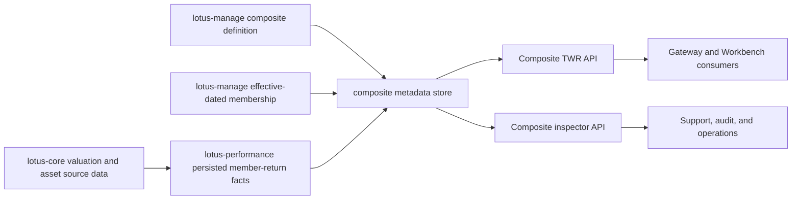

# Composite Performance Documentation Map

This map explains where composite performance truth lives after RFC-049 implementation proof and
final closure preparation.

## Audience Routing

| Audience | Start here | Why |
| --- | --- | --- |
| Business users and sales | `wiki/Composite-Performance.md` | Explains the current private-banking composite capability, boundaries, and demo-safe language. |
| Operations and support | `docs/guides/composite_performance.md` and `docs/technical/composite-twr-endpoint-certification.md` | Provides API usage, artifacts, reason codes, and support workflow. |
| Engineers | `docs/methodologies/metrics/metric-composite-twr.md` and OpenAPI `/docs` | Gives exact formulas, request/response fields, validation behavior, and field-level schema. |
| Audit and methodology review | `docs/methodologies/metrics/metric-composite-twr.md` | Provides v3 methodology, variable dictionary, deterministic steps, and worked examples. |
| Data product governance | `contracts/domain-data-products/lotus-performance-products.v1.json` and `contracts/trust-telemetry/composite-performance-analytics.telemetry.v1.json` | Declares data-product identity, route, freshness, approved consumer, and trust metadata. |
| RFC governance | `docs/RFCs/RFC 049 - Composite Performance Industry Methodology Alignment and Evidence Contract.md` | Tracks slice scope, acceptance criteria, and closure proof. |

Data-product identity: `CompositePerformanceAnalytics`.

Unsupported boundary phrase pinned for product material: multi-currency composite aggregation beyond
the current single reporting-currency guard is not supported.

## Current Documentation Set

| Artifact | Purpose | Boundary |
| --- | --- | --- |
| `docs/methodologies/metrics/metric-composite-twr.md` | Audit-grade methodology for persisted-fact asset-weighted composite TWR. | TWR scope; linked composite contribution has its own method below. Attribution, MWR and advanced structures remain separate. |
| `docs/methodologies/metrics/metric-composite-linked-member-contribution.md` and `docs/guides/composite_linked_contribution.md` | Pinned multi-period member contribution through the existing analytics operation. | `CARINO:v1`, original retained Decimal facts, source/replay evidence and consumer units; calculated analysis, not official selection or live qualification. |
| `docs/guides/composite_performance.md` | API guide, source-authority explanation, operational workflow, and support boundaries. | Human guide only; OpenAPI remains field-level contract. |
| `docs/guides/composite_materialization.md` | Governed command, pinned source/member evidence, atomic admission and bounded recovery. | Does not inherit older persisted-fact endpoint certification or imply live upstream acceptance. |
| `docs/technical/composite-twr-endpoint-certification.md` | Endpoint invariants, error behavior, inspector certification, live proof, and test-pyramid evidence. | Certification covers the RFC-049 supported composite TWR boundary only. |
| `wiki/Composite-Performance.md` | Product-facing wiki page for demos, operators, business users, and engineers. | Summarizes and links; it is not the full methodology source. |
| `wiki/Supported-Features.md` | Implementation-backed feature ledger and unsupported-scope boundary. | Promotes only the persisted-fact composite TWR and inspector capability proven by RFC-049. |

## Source Flow

The first model-fee convention has a [v3 method/variable/oracle document](../methodologies/metrics/metric-composite-periodic-model-fee.md)
and [caller/migration instructions](../guides/composite_materialization.md#periodic-model-fee-materialization).
Its internal native gross producer preserves distinct original/fee custody. The configured
Performance local catalog publishes and retrieves immutable unapproved input; source resolution
defaults unavailable and independent production verification remains unavailable. Synthetic
registered PostgreSQL proof does not establish official activation or close #609.

Annual member dispersion has its own [caller guide](../guides/composite_annual_dispersion.md) and
[metric methodology](../methodologies/metrics/metric-composite-annual-member-dispersion.md).
`POST /performance/composites/analytics` selects the annual metric and either equal-weight sample
or year-begin asset-weighted population standard deviation. It consumes twelve exact COMPLETE
historical materialization receipts through a read port and keeps full-year and December counts
separate. The TWR endpoint certification above does not certify this new operation.

Annual responses are `CALCULATED_ANALYSIS` with
`RETAINED_SOURCE_ATTESTATION_NOT_LIVE_QUALIFIED`. The existing monthly retained-publication guards
support exact source replay; official selection, imported history, external input admission,
model-net policy, live producer acceptance, and production PostgreSQL/scale acceptance remain
separately governed work. Synthetic numerical and registered API tests demonstrate bounded
behavior without promoting those missing authorities.

```mermaid
flowchart LR
    A[lotus-manage composite definition] --> D[composite metadata store]
    B[lotus-manage effective-dated membership] --> D
    C[lotus-performance persisted member-return facts] --> D
    E[lotus-core valuation and asset source data] --> C
    D --> F[Composite TWR API]
    D --> G[Composite inspector API]
    F --> H[Gateway and Workbench consumers]
    G --> I[Support, audit, and operations]
```

## Documentation Controls

- Detailed methodology remains under `docs/methodologies/metrics/`.
- Product and operator navigation lives under `wiki/`.
- Endpoint certification lives under `docs/technical/`.
- RFC mechanics remain in the RFC, not duplicated into the wiki.
- Unsupported advanced scopes remain explicit in both wiki and supported-features material.
