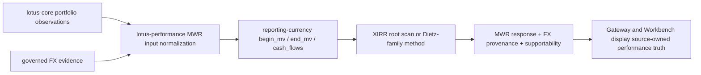

# MWR FX-Aware Contract Design

This document defines the Lotus readiness contract for adding FX-aware money-weighted return (MWR)
without weakening the current implementation-backed contract.

## Current Production Contract

`POST /performance/mwr` currently computes MWR from a single reporting-currency input schedule:

- `begin_mv`
- `end_mv`
- `cash_flows[].amount`
- `start_date`
- `as_of`

The current engine does not convert per-flow source currencies inside MWR. It expects all market
values and cash flows to already be expressed in one consistent reporting currency before XIRR,
Modified Dietz, or Simple Dietz execution. This is intentional: today's `cashflows_used` response
echo proves the signed schedule used by the engine, not FX conversion provenance.

Stateless callers may now supply `source_preconverted_fx_evidence` for already converted inputs.
When present, `lotus-performance` validates complete per-input FX provenance for both market values
and every cash flow, rejects inconsistent reporting amounts or missing evidence with HTTP 422, and
emits `currency_evidence.currency_mode="SOURCE_PRECONVERTED_WITH_FX_EVIDENCE"` with
`conversion_evidence_status="complete_source_preconverted_fx_metadata"`. This is a source-
preconverted evidence contract, not an in-engine FX conversion contract.

Current stateful execution does preserve the reporting-currency context that `lotus-core` already
publishes on `PortfolioTimeseriesInput`. The MWR response now includes `reporting_currency` and a
`currency_evidence` block with `market_values_used[]`, `cashflow_evidence[]`, and
`currency_mode="SINGLE_REPORTING_CURRENCY"`. That block documents the source-owned values and
cash-flow components used by MWR. It deliberately reports
`conversion_evidence_status="upstream_preconverted_missing_per_input_fx_metadata"` because the
current upstream portfolio-timeseries contract exposes converted amounts and currency context, but
not per-input FX rate source, rate version, conversion policy, conversion timestamp, or conversion
fingerprint fields.

## Design Goal

FX-aware MWR should allow private-bank users to explain investor-experience return when capital
movements, valuations, or reporting contexts cross currencies. The design must preserve the Lotus
ownership boundary:

1. `lotus-core` remains the source authority for portfolio observations, source currencies,
   reporting currency context, and governed FX evidence.
2. `lotus-performance` remains the methodology authority for MWR normalization, XIRR root solving,
   Dietz fallback behavior, supportability metadata, and emitted performance product truth.
3. `lotus-gateway`, Workbench, reporting, and other consumers display the emitted performance
   product; they must not reconstruct FX conversion, infer missing rate evidence, or recalculate
   MWR locally.

## Required Input Provenance

Before FX-aware MWR can become an implemented API contract, every converted monetary input must
carry enough evidence to make the reporting-currency schedule reproducible.

| Input evidence | Required meaning |
| --- | --- |
| `source_amount` | Original amount before conversion. |
| `source_currency` | ISO reporting source currency attached to the original observation or cash flow. |
| `reporting_amount` | Converted amount used by the MWR engine. |
| `reporting_currency` | Portfolio or requested reporting currency used for the calculation. |
| `fx_rate` | Rate used to convert source amount to reporting amount. |
| `fx_pair` | Canonical currency pair for the conversion. |
| `fx_rate_date` | Business date for the rate. |
| `fx_rate_source` | Source system, vendor, or governed Lotus rate set. |
| `fx_rate_version` | Restatement/version identifier when available. |
| `conversion_policy` | Policy such as transaction-date spot, valuation-date spot, or source-preconverted. |
| `conversion_timestamp` | Timestamp at which conversion evidence was assembled. |
| `conversion_fingerprint` | Stable fingerprint for reproducibility and lineage tie-out. |

For stateful MWR, this evidence must come from governed upstream analytics-input contracts before
stateful MWR can claim complete per-input FX provenance. For stateless MWR, the caller must provide
complete conversion evidence through `source_preconverted_fx_evidence` if the response should carry
complete FX provenance. Missing, partial, or inconsistent evidence fails closed rather than falling
back to guessed rates. In operational terms, the endpoint must fail closed when source and
reporting-currency evidence cannot be tied out.

## Implemented And Proposed Response Semantics

Implemented for stateless source-preconverted evidence:

- `reporting_currency` for the MWR result.
- `currency_evidence.currency_mode="SOURCE_PRECONVERTED_WITH_FX_EVIDENCE"` when every supplied
  input has complete validated source-preconverted FX evidence.
- `currency_evidence.market_values_used[]` with source amount, source currency, reporting amount,
  reporting currency, FX rate, rate source/version/date, conversion policy/timestamp, and
  conversion fingerprint.
- `currency_evidence.cashflow_evidence[]` with the same per-cash-flow conversion fields aligned to
  `cash_flows[]` by index.
- reason codes documenting that the engine calculated a reporting-currency schedule after evidence
  validation.

Still proposed for future stateful upstream FX-aware MWR:

- `reporting_currency` for the MWR result.
- `cashflows_used[]` entries with both source and reporting-currency evidence when FX conversion is
  active from governed upstream source contracts.
- conversion-policy metadata in `meta`, `diagnostics`, or a governed supportability block.
- reason codes for missing FX evidence, stale rates, conflicting reporting currency, or unsupported
  conversion policy.

No downstream consumer may treat the current base-only `cashflows_used[].amount` as enough to
explain an FX-aware MWR calculation. Consumers may display `currency_evidence` as source-component
and reporting-currency context, but must not reinterpret it as complete per-input FX provenance.

## Data Mesh Requirements

FX-aware MWR is a governed data mesh extension, not a local calculation flag. The slice that
implements it must include:

1. repo-native domain data product declaration updates for any new product version or materially
   expanded contract;
2. upstream consumer declarations for the governed FX evidence product once `lotus-core` publishes
   it as an analytics-input contract;
3. lineage fingerprints for upstream portfolio, reference, and FX evidence;
4. data-quality and freshness posture for conversion evidence;
5. OpenAPI examples covering base-only, source-preconverted, and FX-aware converted schedules;
6. gateway and Workbench propagation of reporting currency, conversion policy, reason codes, and
   supportability state;
7. tests proving deterministic conversion, missing-rate failure, stale-rate failure, restatement
   fingerprint changes, and downstream response preservation.

## Flow

## Definition Of Done For Implementation

FX-aware MWR is not done until all of these are true:

- OpenAPI exposes the new request and response fields with no alias drift.
- Stateful mode consumes a governed upstream FX analytics-input contract, not an operational-read
  shortcut with implicit semantics.
- `currency_evidence.conversion_evidence_status` moves from
  `upstream_preconverted_missing_per_input_fx_metadata` to a complete governed status in stateful
  mode only after upstream per-input FX evidence is available and validated.
- Stateless mode validates complete FX evidence when source-preconverted evidence is supplied.
- Engine tests cover XIRR and Dietz-family schedules with mixed source currencies after conversion.
- API tests cover missing FX evidence, stale FX evidence, conflicting reporting currency, and
  source-preconverted schedules.
- Gateway and Workbench tests prove consumers preserve emitted FX provenance and do not recalculate
  conversion or MWR locally.
- Methodology, API guide, wiki, and support docs describe the implemented behavior using Lotus
  reporting-currency and supportability language.

Until stateful upstream FX evidence and downstream consumers are complete, Lotus documentation must
continue to describe MWR as a single-reporting-currency calculation with optional stateless
source-preconverted FX provenance, not as an in-engine FX conversion capability.
