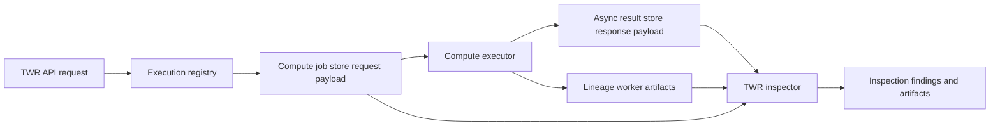

# Architecture

## Runtime shape

The implemented topology is documented in [docs/technical/runtime_topology.md](../docs/technical/runtime_topology.md):

1. `performance-analytics`
2. `performance-compute-executor`
3. `performance-lineage-worker`
4. `performance-lineage-db`
5. optional `performance-runtime-retention-worker`

The repo remains one business service with operationally split runtime responsibilities.

## Code layout

- `app/`
  FastAPI entrypoints, models, services, workers, runtime wiring
- `engine/`
  analytics and orchestration logic
- `core/`
  shared calculation and utility foundations
- `adapters/`
  storage and integration seams
- `docs/`
  architecture, standards, runbooks, guides, RFCs, and certification evidence
- `scripts/`
  local validation and operational tooling
- `tests/`
  unit, integration, e2e, docs regression, and benchmark coverage

## Public surface groups

Router grouping in [main.py](../main.py):

- `/performance`
  TWR, benchmark, contribution, executions, inspections, lineage, workspace summary, attribution, MWR
- `/integration`
  capabilities, returns-series, benchmark exposure context, runtime status, work items, recoveries,
  recovery drills, runtime retention
- platform surfaces
  `/`, health endpoints, metrics, Swagger, and OpenAPI

## Critical seams

- upstream source-data seam:
  `lotus-core` control-plane and analytics-input contracts
- async compute seam:
  durable execution registry plus executor job storage
- lineage seam:
  durable metadata plus artifact materialization
- inspection seam:
  TWR inspector resolves completed responses through async result storage and resolves request
  truth through lineage metadata, lineage files, or durable compute-job payloads
- operator seam:
  runtime-status, work-items, recoveries, drill history, and retention history

## TWR Inspection Runtime

Resolved async TWR inspection uses a three-part durable evidence path:

The compute-job fallback is part of the supportability contract. It keeps inspections reliable when
a completed async result is already visible to the API while lineage artifacts are still
materializing or are worker-local.

## Deeper docs

- [docs/technical/architecture.md](../docs/technical/architecture.md)
- [docs/technical/runtime_topology.md](../docs/technical/runtime_topology.md)
- [docs/technical/RFC-0082-upstream-contract-family-map.md](../docs/technical/RFC-0082-upstream-contract-family-map.md)
