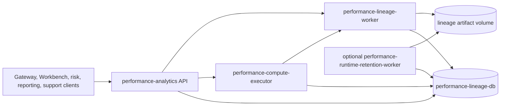
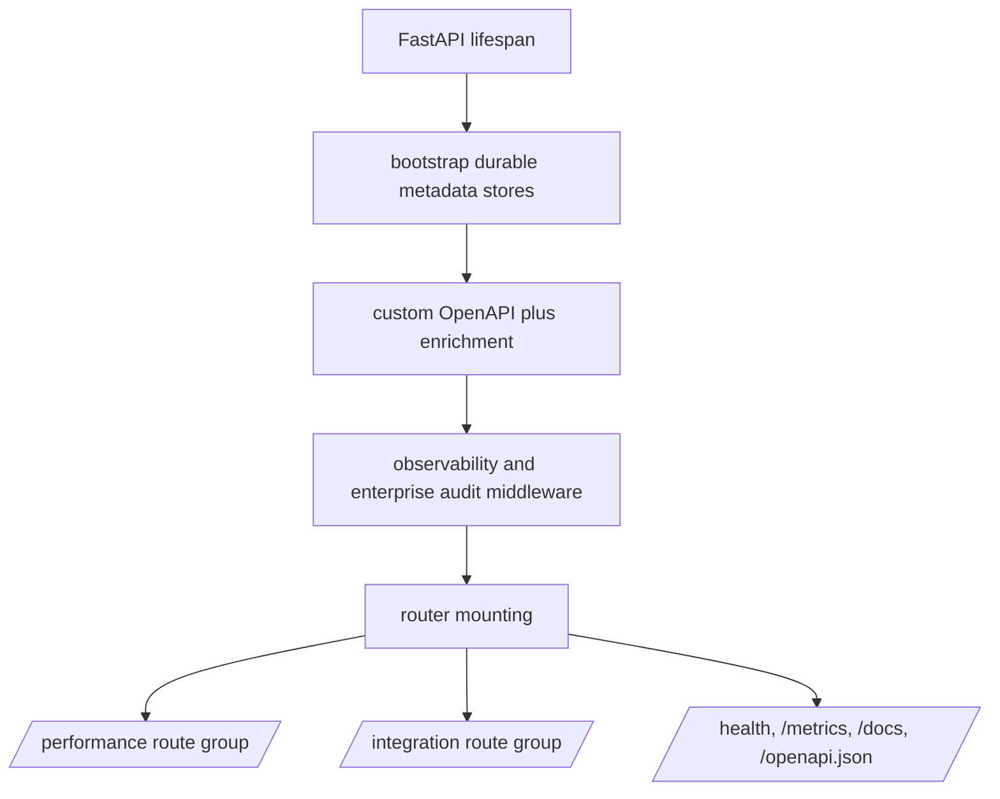
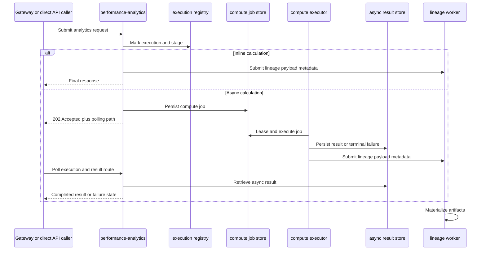
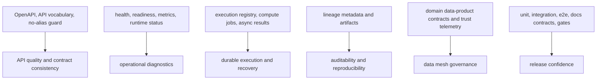
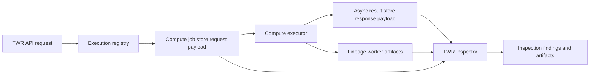

# Architecture

`lotus-performance` is the Lotus performance analytics authority. Architecturally, it is a domain
service: it owns performance methodology, supportability evidence, async execution posture, and
lineage-backed reproducibility. It does not own source-of-record portfolio, benchmark, index, FX, or
reference data.

This page is written for mixed audiences:

- business and sales readers can see how performance numbers become client-safe evidence
- operations readers can see which runtime components and controls support production posture
- engineers can trace the wiki claims back to `main.py`, runtime docs, contracts, and tests

## Runtime shape

The implemented topology is documented in [docs/technical/runtime_topology.md](https://github.com/sgajbi/lotus-performance/blob/main/docs/technical/runtime_topology.md):

1. `performance-analytics`
2. `performance-compute-executor`
3. `performance-lineage-worker`
4. `performance-lineage-db`
5. optional `performance-runtime-retention-worker`

The repo remains one business service with operationally split runtime responsibilities.



Runtime responsibilities:

| Component | Responsibility | Business and operator meaning |
| --- | --- | --- |
| `performance-analytics` | Serves public APIs, handles synchronous calculations, submits async work, exposes health/readiness/metrics, and wires observability and audit middleware. | Product entrypoint and live contract surface. |
| `performance-compute-executor` | Leases durable compute jobs and executes heavier analytics workloads. | Long-running analytics are recoverable and inspectable rather than hidden in request threads. |
| `performance-lineage-worker` | Materializes lineage artifacts from durable lineage payload metadata. | Audit and support evidence can be retrieved after calculation completion. |
| `performance-lineage-db` | Stores execution, stage, compute-job, async-result, lineage, and upstream snapshot state. | Operational truth is durable enough for polling, recovery, and support workflows. |
| `performance-runtime-retention-worker` | Optional ops-profile cleanup worker for governed retention. | Retention can be automated with evidence instead of manual cleanup. |

## Code layout

- `app/`
  FastAPI entrypoints, models, services, workers, runtime wiring
- `engine/`
  analytics and orchestration logic
- `core/`
  shared calculation and utility foundations
- `adapters/`
  storage and integration seams
- `docs/`
  architecture, standards, runbooks, guides, RFCs, and certification evidence
- `scripts/`
  local validation and operational tooling
- `tests/`
  unit, integration, e2e, docs regression, and benchmark coverage

## Application wiring

`main.py` wires the runtime in four layers:

1. application lifespan bootstraps durable metadata stores
2. OpenAPI is generated and enriched before being served
3. observability, enterprise runtime validation, and audit middleware are attached
4. route modules are mounted under `/performance`, `/integration`, and platform health surfaces



## Public surface groups

Router grouping in [main.py](https://github.com/sgajbi/lotus-performance/blob/main/main.py):

- `/performance`
  TWR, benchmark, contribution, executions, inspections, lineage, workspace summary, attribution,
  MWR, composites, and mandate performance health context
- `/integration`
  capabilities, returns-series, benchmark exposure context, runtime status, work items, recoveries,
  recovery drills, runtime retention
- platform surfaces
  `/`, health endpoints, metrics, Swagger, and OpenAPI

```mermaid
flowchart LR
    API[lotus-performance API] --> Performance[/performance]
    API --> Integration[/integration]
    API --> Platform[platform surfaces]
    Performance --> Analytics[TWR, benchmark, MWR, contribution, attribution, composites, workspace summary]
    Performance --> Evidence[executions, inspections, lineage, mandate health context]
    Integration --> DataProducts[returns series, benchmark exposure context, capabilities]
    Integration --> RuntimeOps[runtime status, work items, recoveries, drills, retention]
    Platform --> Health[health, readiness, metrics, Swagger, OpenAPI]
```

## Critical seams

- upstream source-data seam:
  `lotus-core` control-plane and analytics-input contracts
- async compute seam:
  durable execution registry plus executor job storage
- lineage seam:
  durable metadata plus artifact materialization
- reproducibility seam:
  `core/repro.py` sorts object keys, and arrays remain order-sensitive so sequence-bearing evidence stays
  part of `input_fingerprint` and `calculation_hash` identity. Any order-insensitive field must be
  schema-aware and sorted by a documented business key before hashing.
- inspection seam:
  TWR inspector resolves completed responses through async result storage and resolves request
  truth through lineage metadata, lineage files, or durable compute-job payloads
- operator seam:
  runtime-status, work-items, recoveries, drill history, and retention history

## Request Lifecycle

The service supports both synchronous and asynchronous calculation posture. The exact offload
decision is endpoint-specific, but the support model is common: callers either receive a final
response or a `202 Accepted` response with a polling path.



This lifecycle matters for demos because it shows that supportability is designed into the product:
large calculations are not just background tasks; they are execution records, result records,
lineage payloads, and retrievable artifacts.

## Non-Functional Architecture

The non-functional posture is implemented through code, scripts, contracts, and runtime surfaces.
It should be presented as part of the product, not as a side note.



Current implementation-backed controls include:

| Concern | Implemented control | Evidence |
| --- | --- | --- |
| Contract quality | OpenAPI enrichment, OpenAPI quality gate, API vocabulary inventory, no-alias guard | `main.py`, `app/openapi_enrichment.py`, `scripts/openapi_quality_gate.py`, `scripts/api_vocabulary_inventory.py`, `scripts/no_alias_contract_guard.py` |
| Observability | metrics endpoint, queue-pressure metrics, runtime status, health and readiness endpoints | `/metrics`, `/health`, `/health/ready`, `/integration/runtime-status`, [Operations Runbook](Operations-Runbook) |
| Auditability | execution lifecycle, lineage metadata, lineage artifacts, upstream snapshots | `/performance/executions/*`, `/performance/lineage/*`, lineage certification docs |
| Data mesh posture | producer and consumer declarations plus trust telemetry | `contracts/domain-data-products/`, `contracts/trust-telemetry/`, `scripts/validate_domain_data_product_contracts.py` |
| Numeric safety | monetary-float guard and focused tests around methodology helpers | `scripts/check_monetary_float_usage.py`, unit tests |
| Release discipline | repo-native fast and PR-grade gates | `make check`, `make ci`, `make ci-local`, [Validation and CI](Validation-and-CI) |

## TWR Inspection Runtime

Resolved async TWR inspection uses a three-part durable evidence path:



The compute-job fallback is part of the supportability contract. It keeps inspections reliable when
a completed async result is already visible to the API while lineage artifacts are still
materializing or are worker-local.

## Current Boundaries

Implemented boundaries that should remain clear in architecture, demos, and client material:

- `lotus-performance` owns performance methodology and emitted evidence; `lotus-core` owns source
  data and analytics-input contracts
- `lotus-gateway` and `lotus-workbench` consume and preserve performance-owned contracts; they do
  not reconstruct TWR, MWR, contribution, attribution, composite weights, lineage, or supportability
  state
- portfolio TWR is not group, sleeve, or composite TWR; composite TWR is exposed through
  `POST /performance/composites/twr`
- risk workflows should consume performance-owned returns-series integration outputs rather than
  reaching into TWR response internals
- runtime-control surfaces are operator contracts, not business analytics endpoints

## Deeper docs

- [docs/technical/architecture.md](https://github.com/sgajbi/lotus-performance/blob/main/docs/technical/architecture.md)
- [docs/technical/runtime_topology.md](https://github.com/sgajbi/lotus-performance/blob/main/docs/technical/runtime_topology.md)
- [docs/technical/RFC-0082-upstream-contract-family-map.md](https://github.com/sgajbi/lotus-performance/blob/main/docs/technical/RFC-0082-upstream-contract-family-map.md)
- [Supported Features](Supported-Features)
- [Integrations](Integrations)
- [Operations Runbook](Operations-Runbook)
- [Validation and CI](Validation-and-CI)
