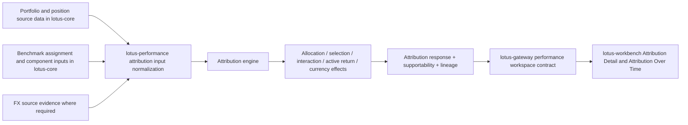

# Attribution Analytics

Attribution analytics explains the active return between a portfolio and its benchmark. In Lotus,
`lotus-performance` owns the performance attribution methodology and calculation result. Gateway
and Workbench may publish or display the result, but they must not reconstruct attribution effects
locally.

## What Is Implemented Now

`POST /performance/attribution` supports:

1. stateless attribution with caller-owned portfolio and benchmark inputs;
2. stateful attribution using `lotus-core` portfolio, position, benchmark, and FX source inputs;
3. instrument-level attribution through `mode="by_instrument"`;
4. pre-aggregated group attribution through `mode="by_group"`;
5. Brinson-style allocation, selection, interaction, total effect, and active-return
   reconciliation;
6. ordered grouping dimensions for multi-level attribution output;
7. currency-aware attribution when `currency_mode="BOTH"`, `report_ccy`, required FX rates, and
   `group_by=["currency", ...]` style evidence are present;
8. sync execution for smaller requests and async execution through execution polling and result
   retrieval for heavier work;
9. lineage artifacts for aligned panel and single-period effect review;
10. bounded period status, reason codes, residual materiality, and supportability evidence;
11. bounded `calculation_supportability` for front-office degraded-state handling.

The current stateful public contract is intentionally fenced to:

1. `mode="by_instrument"`;
2. `group_by` values `asset_class`, `sector`, `country`, and `currency`;
3. `currency_mode="BOTH"` only when `report_ccy` is supplied;
4. mixed-currency sourced positions only when required FX rates are supplied.

During stateful normalization, Lotus records source-alignment evidence for portfolio observation
count, position row count, resolved benchmark id, benchmark component observation count, index
record count, classification completeness, currency/FX source posture, and source-contract
limitations. This evidence keeps private-banking attribution source-backed without moving
attribution methodology into `lotus-core`.

## Business Flow

## Upstream And Downstream Integration

| System | Responsibility |
| --- | --- |
| `lotus-core` | Source authority for portfolio timeseries, position timeseries, benchmark assignment, benchmark components, classification labels, and FX source inputs. |
| `lotus-performance` | Attribution methodology authority. It normalizes source inputs, calculates effects, reconciles active return, emits supportability, and captures lineage. |
| `lotus-gateway` | Experience API boundary. It preserves source-owned attribution totals and exposes Workbench-safe contracts. |
| `lotus-workbench` | Front-office product surface. It renders attribution detail and attribution trend through Gateway/BFF only. |
| `lotus-risk` | Separate risk-attribution authority. It does not use `POST /performance/attribution` for historical risk attribution. |

## Current Supportability

Attribution responses emit `calculation_supportability` with bounded state, reason,
freshness-bucket, input-row count, resolved-period count, benchmark-row count, and metric labels.
The Prometheus metric is:

`lotus_performance_calculation_supportability_total{operation="attribution",supportability_state,reason,freshness_bucket}`

Metric labels are bounded and must not contain portfolio, client, account, benchmark, calculation,
trace, correlation, request, response, or security values.

Each attribution period also carries period-level supportability:

1. `status` identifies valid, warning, partial, unavailable, or invalid attribution posture;
2. `reason_codes` and `reasons` identify off-benchmark exposure, benchmark-only exposure,
   unclassified segments, missing benchmark evidence, currency attribution gaps, skipped linking,
   and residual materiality concerns;
3. `reconciliation.residual_materiality` classifies the active-return residual against governed
   warning and material thresholds, providing material residual classification for operations and
   front-office review.

## Current Boundaries

The current implementation does not yet promote:

1. fixed-income factor attribution;
2. derivative exposure attribution;
3. sleeve attribution;
4. composite attribution;
5. benchmark-version, classification-version, calendar-policy, derivative/short-flag, or
   fee/tax/income breakout claims from stateful source contracts.

RFC 048 is the active implementation vehicle for improving the supported attribution contract. This
page should be updated only with implementation-backed outcomes as RFC 048 slices complete.

## Where To Go Next

| Need | Reference |
| --- | --- |
| API usage and examples | [docs/guides/attribution.md](../docs/guides/attribution.md) |
| Endpoint certification | [docs/technical/attribution-endpoint-certification.md](../docs/technical/attribution-endpoint-certification.md) |
| Documentation ownership map | [docs/technical/attribution-documentation-map.md](../docs/technical/attribution-documentation-map.md) |
| Metric formulas | [docs/methodologies/metrics/master-index.md](../docs/methodologies/metrics/master-index.md) |
| Supported feature ledger | [Supported Features](Supported-Features) |
| Data-product posture | [Mesh Data Products](Mesh-Data-Products) |
