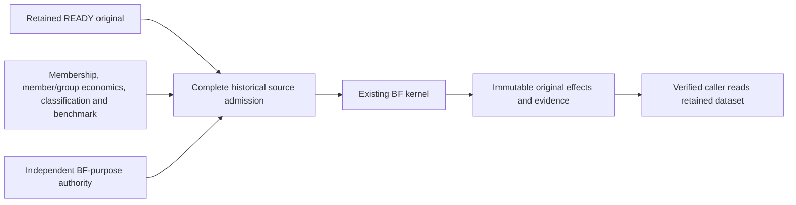

# Composite Attribution

Single-period Composite Brinson-Fachler analysis explains the arithmetic difference between
one retained READY Composite return and its historical benchmark through allocation,
selection and interaction effects. Output is calculated analysis with original source evidence.

**Availability:** source and financial-purpose authority defaults are unavailable. Signed
controlled synthetic examples establish software behavior, not institutional approval, live
supplier readiness or permission to publish an official result.

## Choose a reader path

| Reader | Start here |
| --- | --- |
| Caller or operator | [Caller guide](https://github.com/sgajbi/lotus-performance/blob/main/docs/guides/composite_attribution.md): request, polling, refusals, original replay and corrections. |
| Methodology reviewer | [BF methodology](https://github.com/sgajbi/lotus-performance/blob/main/docs/methodologies/metrics/metric-composite-single-period-brinson-fachler.md): formulas, variables, complete OR17 oracle and limits. |
| Source owner | Caller guide's historical source/policy requirements and availability matrix. |
| Official-result consumer | [Composite Result Authority](Composite-Result-Authority): original evidence and current permission to use a result are separate. |

`POST /performance/composites/analytics` accepts references with
`metric_id=SINGLE_PERIOD_BRINSON_FACHLER` and
`method=BRINSON_FACHLER_ARITHMETIC_THREE_EFFECT:v1`. The existing worker produces the result;
callers follow the returned result path. Group arrays and approvals are not HTTP inputs.

All effects use decimal-return units and FLOAT64. Full member and group universes, both actual
returns, independently normalized weights, original-return reconciliation and exact historical
pins are mandatory. Missing returns are never interpreted as observed zero. Optional official
selection dependencies are checked through publication; this operation grants no approval.

Published originals replay without fresh BF source reads or recalculation. Corrections use new
identities and preserve earlier originals. Downstream consumers retain units, coverage,
qualification and source evidence with the figures and separately check current-use authority.

The initial convention supports one arithmetic period, one reporting currency and positive
long-only beginning-capital group weights. Multi-period linking, BHB, factors, derivatives,
off-benchmark/zero/signed exposures, carve-outs, tax attribution and GIPS certification remain
outside this scope. See [Composite Performance](Composite-Performance) for the broader capability.
