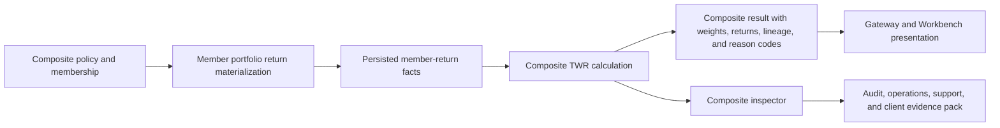

# Composite Performance

Composite performance is the private-banking group-return capability introduced by RFC-049. It
calculates asset-weighted composite TWR from persisted member-return facts and keeps the evidence
needed for audit, operations, support, downstream consumers, and client-demo preparation.

## Current Functional Coverage

Supported after RFC-049 implementation proof:

- persisted member-return fact based composite TWR;
- asset-weighted period returns;
- geometric linking across calculable periods;
- one-member treatment with no dispersion;
- degraded periods when non-ready facts are excluded but ready facts can still calculate;
- blocked periods when calculation would be misleading;
- source fingerprints, restatement versions, source snapshots, and member calculation ids;
- inspector findings and classified artifacts;
- `CompositePerformanceAnalytics:v1` data-product declaration;
- Gateway route realization and Workbench typed BFF consumption;
- live direct performance, Gateway, Workbench BFF, canonical front-office, and operations proof.

## What The Composite API Does

The calculation endpoint is:

`POST /performance/composites/twr`

It accepts a `composite_id`, inclusive date window, and optional `calculation_id`. It reads
persisted member-return facts from the composite metadata store and returns:

- calculation status;
- cumulative composite return;
- ordered period returns;
- member weights and contributions;
- included source fingerprints;
- restatement versions;
- period reason codes;
- dispersion where at least two ready members exist.

The inspection endpoint is:

`POST /performance/composites/inspect`

It returns supportability findings plus classified artifacts:

- `member_inputs.csv`;
- `period_weights.csv`;
- `composite_returns.csv`;
- `lineage_manifest.json`;
- `support_brief.md`.

## Business Flow

## Source Authority

| Domain area | Owner | Lotus behavior |
| --- | --- | --- |
| Composite definition | `lotus-manage` | Owns composite identity, strategy grouping, inception, termination, reporting currency, and calculation method. |
| Composite membership | `lotus-manage` | Owns effective-dated inclusion and exclusion policy before facts are materialized. |
| Member returns | `lotus-performance` | Owns persisted member-return facts and composite TWR methodology. |
| Asset and valuation source facts | `lotus-core` | Owns source valuations and assets used upstream to produce member returns and market values. |
| Downstream experience shaping | `lotus-gateway` and Workbench | Consume source-owned performance outputs; they should not rebuild composite calculations. |

## Non-Functional Coverage

| Capability | Current posture |
| --- | --- |
| Data product identity | `CompositePerformanceAnalytics:v1` in `contracts/domain-data-products/lotus-performance-products.v1.json`. |
| Freshness | Batch freshness class; facts must carry source-fact lineage and restatement evidence. |
| Lineage | Source fingerprints, source snapshots, calculation ids, restatement versions, and inspector lineage manifest. |
| Audit support | Methodology v3 doc, endpoint certification, reason codes, classified artifacts, and deterministic replay fields. |
| Security and evidence classification | Inspector artifacts distinguish `operator_only` from `customer_consumable`. |
| Downstream integration | Gateway and Workbench branches consume the new endpoints through typed contracts. |
| Operational triage | Inspector verdicts and findings route no-fact, blocked, and degraded cases with owner and action. |

## Support And Audit Interpretation

Use the inspector before publishing a new or restated composite result.

Interpretation rules:

- `supportable`: no blocking or warning findings from the inspected persisted facts.
- `supportable_with_warnings`: at least one degraded condition exists but the result can be
  explained from ready facts.
- `not_supportable`: the result is blocked and should not be used as a client-facing composite
  performance number.

Common blocked reasons:

- no persisted member-return facts in the window;
- no ready member-return facts in a period;
- nonpositive beginning composite assets;
- mixed member return views;
- mixed reporting currencies.

## Current Boundaries

The current implementation does not support:

- composite contribution;
- composite attribution;
- composite MWR;
- sleeves and carve-outs;
- model portfolios and wrap programs;
- pooled fund or private-market composites;
- portability records;
- tax-aware, leveraged, or long/short special composite structures;
- multi-currency composite aggregation beyond the single reporting-currency guard;
- benchmark active return for composites.

## References

- [Composite performance guide](../docs/guides/composite_performance.md)
- [Composite TWR methodology](../docs/methodologies/metrics/metric-composite-twr.md)
- [Composite endpoint certification](../docs/technical/composite-twr-endpoint-certification.md)
- [Composite documentation map](../docs/technical/composite-performance-documentation-map.md)
- [Supported Features](Supported-Features)
- [Mesh Data Products](Mesh-Data-Products)
