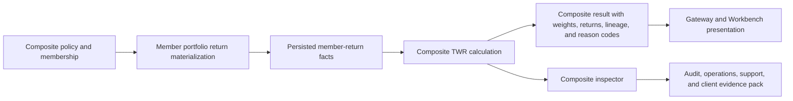
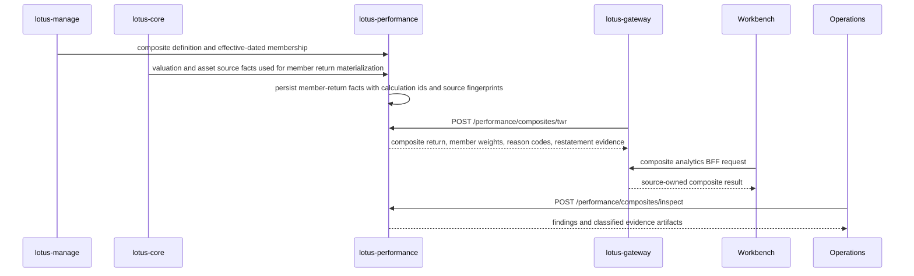

# Composite Performance

Composite performance is the private-banking group-return capability introduced by RFC-049. It
calculates asset-weighted composite TWR from persisted member-return facts and keeps the evidence
needed for audit, operations, support, downstream consumers, and client-demo preparation.

## Audiences

| Audience | What this page supports |
| --- | --- |
| Business users | Explains what composite performance means, what can be trusted, and which advanced structures are not currently supported. |
| Developers | Identifies the producer-owned endpoints, source authorities, data-product contracts, and integration rules. |
| Operations and support | Shows the inspection workflow, blocked/degraded interpretation, and evidence artifacts used for triage. |
| Sales, pre-sales, and demos | Provides implementation-backed language for presenting composite TWR without implying unsupported GIPS, attribution, sleeve, or carve-out capability. |

## Current Functional Coverage

Supported after RFC-049 implementation proof:

- admitted-tenant isolation across definitions, memberships, facts, publication fences, replay,
  inspection evidence, and supported cleanup;
- same-tenant definition validation and durable parent foreign keys for memberships, facts, and
  publication manifests;
- persisted member-return fact based composite TWR;
- asset-weighted period returns;
- geometric linking across calculable periods;
- one-member treatment with no dispersion;
- degraded periods when non-ready facts are excluded but ready facts can still calculate;
- blocked periods when calculation would be misleading;
- immutable gross/net/currency fact identities with retained predecessor versions;
- source fingerprints, source version labels, numeric restatement sequences, source snapshots, and
  member calculation ids;
- inspector findings and classified artifacts;
- `CompositePerformanceAnalytics:v1` data-product declaration;
- Gateway route realization and Workbench typed BFF consumption;
- live direct performance, Gateway, Workbench BFF, canonical front-office, and operations proof.

## What The Composite API Does

### Governed Fact Creation

`POST /performance/composites/materializations` pins Manage definition, membership and complete
universe authority plus retained stateful TWR calculations. The existing worker creates exact-money,
source-attributable facts without request-time fan-out. Admission is atomic with the execution and
queue; missing evidence cannot release a survivor-only composite. Supported producer views are
`GROSS` and `NET_ACTUAL`, not `NET_MODEL_FEE` or inferred foreign-currency asset conversion.

Inspect `GET /performance/composites/materializations/{materialization_id}` for every expected
member's WAITING, READY, EXCLUDED or BLOCKED outcome. Later pages require the first page's
`expected_revision`; changed evidence returns a conflict. Calculate only after COMPLETE.
Bounded retries prioritize the least-inspected waiting members. Durable inspection counts prevent
an unavailable early member from starving later members after restart or replacement jobs.
Receipts separate Core valuation lineage from Manage membership and survive member-execution expiry.
Retained reads validate command, member and release evidence; incompatible restored ledger schemas
require reviewed migration. PostgreSQL currency guards use ASCII codepoints rather than
collation-dependent text ranges. Legacy fact-only cleanup refuses materialized scopes.
See the [materialization guide](https://github.com/sgajbi/lotus-performance/blob/main/docs/guides/composite_materialization.md)
for source pinning, bounded retry recovery and independent test evidence. Live source qualification,
disaster recovery and horizontal capacity are separate acceptance obligations.

### Published Fact Calculation

The calculation endpoint is:

`POST /performance/composites/twr`

All composite endpoints require admitted `X-Tenant-Id` transport authority. Tenant scope is not a
body claim or a default: missing/blank authority is refused before durable access, and identical
external composite ids remain independent across tenants. Inspection lineage and support briefs
carry the admitted tenant so evidence cannot be detached from its ownership context. Definition
selection verifies the canonical tenant, external composite id, and deterministic durable key
together; an opaque key alone cannot authorize a read.

It accepts a `composite_id`, inclusive date window, optional `calculation_id`, return view,
reporting currency, and optional numeric restatement sequence. Omission selects the greatest numeric
candidate visible for the request and requires a completed durable publication manifest whose exact
source-backed family set matches the selected facts. A higher unpublished candidate fails closed;
the service never falls back to an older completed sequence. Unpublished facts remain durable but
are not eligible as latest. This distinguishes an intentional membership removal from a partial write
without superseding a disjoint historical window. An explicit sequence replays exactly its retained
historical set even if later membership differs. When a completed manifest exists for that sequence,
missing or extra durable families fail closed instead of changing the historical replay, and a
request wider than the manifest returns a conflict instead of treating the sequence as unpublished. It reads
persisted member-return facts from the composite metadata store and returns:

Publication fencing uses the logical composite, return-view, reporting-currency, and sequence
identity. A legacy primary key cannot bypass the fence after currency canonicalization. Bootstrap
rejects retained non-integer or nonpositive fact/publication sequences and whitespace-only source
version labels. It only canonicalizes original ASCII currency case variants; Unicode lookalikes are
never normalized into an accepted code. A populated early publication table missing its expected-family or
source-fingerprint lineage column is refused rather than assigned invented authority; an empty
partial table is rebuilt atomically. PostgreSQL also rejects space-, tab-, or newline-only labels from direct writers
and strengthens an earlier space-only named constraint during upgrade. A validated nullable legacy
version column is promoted to non-null. PostgreSQL upgrades reject
incomplete or malformed retained publication periods,
reject null, malformed, duplicate, or out-of-window retained family manifests and blank source
fingerprints, promote the validated publication currency, both period boundaries, and both lineage columns to non-null,
and enforce canonical definition, fact, and publication currency plus positive sequence and valid
period constraints. PostgreSQL and SQLite direct-insert guards enforce the same publication-lineage
shape. Request validation rejects Unicode currency lookalikes before uppercasing.
Fresh and upgraded SQLite schemas reject blank or overlong fact version labels, noncanonical
definition/fact/publication currencies, non-integer fact/publication sequences, and publication dates outside the real year
0001 through 9999 calendar domain from direct writes. Existing SQLite upgrades establish a real
writer transaction, suspend managed guards before normalization, require retained boundaries to
use text storage and exact `YYYY-MM-DD` values, then install equivalent future-write triggers.
Rollback restores both prior data and guard definitions.
PostgreSQL and SQLite install mutation guards only after legacy validation: fact payloads and
completed publication manifests cannot be updated or deleted, and completed facts cannot be deleted.
Corrections are written as a new restatement sequence. Memberships, facts, and publications require
a same-tenant definition through explicit writer validation and durable composite foreign keys.
Supported writers share a tenant maintenance fence; tenant-wide cleanup takes it exclusively, then
locks fact and publication tables, suspends the managed guards, deletes the manifest before its facts, recreates the guards,
and commits transactionally. Cleanup or demo-seed tooling from an older revision must not overlap
the migrated schema.

- calculation status;
- cumulative composite return;
- ordered period returns;
- member weights and contributions;
- included source fingerprints;
- restatement versions;
- the period-level numeric restatement sequence, retained even when a blocked period has no member contributions;
- period reason codes;
- dispersion where at least two ready members exist.

The inspection endpoint is:

`POST /performance/composites/inspect`

It returns supportability findings plus classified artifacts:

- `member_inputs.csv`;
- `period_weights.csv`;
- `composite_returns.csv`;
- `lineage_manifest.json`;
- `support_brief.md`.

## Business Flow

```mermaid
flowchart LR
    A[Composite policy and membership] --> B[Member portfolio return materialization]
    B --> C[Persisted member-return facts]
    C --> D[Composite TWR calculation]
    D --> E[Composite result with weights, returns, lineage, and reason codes]
    E --> F[Gateway and Workbench presentation]
    D --> G[Composite inspector]
    G --> H[Audit, operations, support, and client evidence pack]
```

## End-To-End Product Flow

```mermaid
sequenceDiagram
    participant Manage as lotus-manage
    participant Core as lotus-core
    participant Perf as lotus-performance
    participant Gateway as lotus-gateway
    participant Workbench as Workbench
    participant Ops as Operations

    Manage->>Perf: composite definition and effective-dated membership
    Core->>Perf: valuation and asset source facts used for member return materialization
    Perf->>Perf: persist member-return facts with calculation ids and source fingerprints
    Gateway->>Perf: POST /performance/composites/twr
    Perf-->>Gateway: composite return, member weights, reason codes, restatement evidence
    Workbench->>Gateway: composite analytics BFF request
    Gateway-->>Workbench: source-owned composite result
    Ops->>Perf: POST /performance/composites/inspect
    Perf-->>Ops: findings and classified evidence artifacts
```

## Source Authority

| Domain area | Owner | Lotus behavior |
| --- | --- | --- |
| Composite definition | `lotus-manage` | Owns composite identity, strategy grouping, inception, termination, reporting currency, and calculation method. |
| Composite membership | `lotus-manage` | Owns effective-dated inclusion and exclusion policy before facts are materialized. |
| Member returns | `lotus-performance` | Owns persisted member-return facts and composite TWR methodology. |
| Asset and valuation source facts | `lotus-core` | Owns source valuations and assets used upstream to produce member returns and market values. |
| Downstream experience shaping | `lotus-gateway` and Workbench | Consume source-owned performance outputs; they should not rebuild composite calculations. |

## Non-Functional Coverage

| Capability | Current posture |
| --- | --- |
| Data product identity | `CompositePerformanceAnalytics:v1` in `contracts/domain-data-products/lotus-performance-products.v1.json`. |
| Freshness | Batch freshness class; facts must carry source-fact lineage and restatement evidence. |
| Lineage | Source fingerprints, source snapshots, calculation ids, source version labels, numeric restatement sequences, and inspector lineage manifest. |
| Audit support | Methodology v3 doc, endpoint certification, reason codes, classified artifacts, and deterministic replay fields. |
| Security and evidence classification | Inspector artifacts distinguish `operator_only` from `customer_consumable`. |
| Downstream integration | Gateway and Workbench branches consume the new endpoints through typed contracts. |
| Operational triage | Inspector verdicts and findings route no-fact, blocked, and degraded cases with owner and action. |

## Data Product Posture

`CompositePerformanceAnalytics:v1` is a governed mesh data product, not a display-only API. The
contract is declared in `contracts/domain-data-products/lotus-performance-products.v1.json` and
backed by `contracts/trust-telemetry/composite-performance-analytics.telemetry.v1.json`.

Data mesh interpretation:

- producer: `lotus-performance`;
- approved downstream consumer: `lotus-gateway`, with Workbench consumption through Gateway/BFF;
- freshness class: batch;
- required identifier: `composite_id`;
- required evidence: source fingerprints, request fingerprint, generation/as-of dates, source
  services, restatement evidence, data-quality status, and lineage posture;
- consumer rule: Gateway and Workbench may present source-owned evidence but must not recompute
  composite returns, weights, lineage, or restatement posture downstream.

## Operational Support Model

Composite support starts from the persisted facts and inspector, not from screenshots or downstream
rendering. When a composite value is questioned:

1. identify the `composite_id`, date window, `calculation_id`, return view, reporting currency,
   source version label, and numeric restatement sequence;
2. call `POST /performance/composites/inspect` for the same composite and window;
3. review the inspector `verdict`, findings, affected periods, member facts, source fingerprints,
   and artifact classifications;
4. use `support_brief.md` for first-line triage and `lineage_manifest.json` for operator-level
   evidence;
5. only treat a number as client-safe when the calculation is not blocked and the supportability
   evidence explains any degradation.

Support states:

| State | Meaning | Product treatment |
| --- | --- | --- |
| `supportable` | Ready persisted facts explain the composite result without blocking findings. | Safe to present within the supported composite TWR scope. |
| `supportable_with_warnings` | The result can be explained, but non-ready facts or warnings need disclosure. | Present with supportability context; do not hide degradation. |
| `not_supportable` | The result is blocked or lacks facts needed for a trustworthy composite return. | Do not present as client-facing composite performance. |

## Support And Audit Interpretation

Use the inspector before publishing a new or restated composite result.

Interpretation rules:

- `supportable`: no blocking or warning findings from the inspected persisted facts.
- `supportable_with_warnings`: at least one degraded condition exists but the result can be
  explained from ready facts.
- `not_supportable`: the result is blocked and should not be used as a client-facing composite
  performance number.

Common blocked reasons:

- no persisted member-return facts in the window;
- no ready member-return facts in a period;
- nonpositive beginning composite assets;
- mixed member return views;
- mixed reporting currencies.

## Business And Demo Readiness

Demo-safe claims:

- Lotus can calculate private-banking composite TWR from persisted member-return facts.
- Composite results carry member weights, contributions, source fingerprints, source version labels,
  numeric restatement sequences, reason codes, and supportability state.
- The inspector produces classified artifacts that support audit, operations, and client-safe
  evidence-pack preparation.
- Gateway and Workbench consume the source-owned composite endpoints rather than recreating the
  calculation downstream.

Do not claim:

- GIPS compliance or independent verification;
- composite contribution, attribution, or MWR;
- sleeve, carve-out, model-portfolio, wrap-program, private-market, portability, tax-aware,
  leveraged, or long/short special-structure support;
- multi-currency composite aggregation beyond the single reporting-currency guard;
- benchmark active return for composites.

## Current Boundaries

The current implementation does not support:

- composite contribution;
- composite attribution;
- composite MWR;
- sleeves and carve-outs;
- model portfolios and wrap programs;
- pooled fund or private-market composites;
- portability records;
- tax-aware, leveraged, or long/short special composite structures;
- multi-currency composite aggregation beyond the single reporting-currency guard;
- benchmark active return for composites.

## References

- [Composite performance guide](https://github.com/sgajbi/lotus-performance/blob/main/docs/guides/composite_performance.md)
- [Composite TWR methodology](https://github.com/sgajbi/lotus-performance/blob/main/docs/methodologies/metrics/metric-composite-twr.md)
- [Composite endpoint certification](https://github.com/sgajbi/lotus-performance/blob/main/docs/technical/composite-twr-endpoint-certification.md)
- [Composite documentation map](https://github.com/sgajbi/lotus-performance/blob/main/docs/technical/composite-performance-documentation-map.md)
- [Supported Features](Supported-Features)
- [Mesh Data Products](Mesh-Data-Products)
