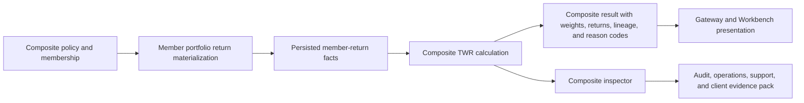
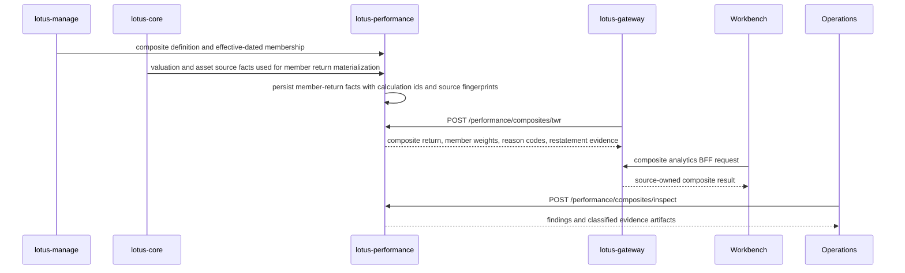

# Composite Performance

Composite performance calculates asset-weighted group TWR from retained member facts and keeps
the source evidence needed for audit and client reporting. Supported calculated replay remains
separate from official approval, freeze, live-source qualification and institutional compliance.

## Reader Tasks

| Reader task | Start here |
| --- | --- |
| Calculate or inspect retained performance | [Caller and migration guide](https://github.com/sgajbi/lotus-performance/blob/main/docs/guides/composite_materialization.md) |
| Preserve and retrieve an original calculated result | [Result candidate capture](https://github.com/sgajbi/lotus-performance/blob/main/docs/guides/composite_result_candidates.md) |
| Interpret the supported model-fee calculation | [Model-fee methodology](https://github.com/sgajbi/lotus-performance/blob/main/docs/methodologies/metrics/metric-composite-periodic-model-fee.md) |
| Use annual flat, marginal-tiered or whole-AUM model wealth rates | [Scheduled caller guide](https://github.com/sgajbi/lotus-performance/blob/main/docs/guides/composite_scheduled_model_fee.md) |
| Operate or recover the service | [Operations runbook](Operations-Runbook) |

## Result Capture and Evidence Posture

Explicit [result candidate capture](https://github.com/sgajbi/lotus-performance/blob/main/docs/guides/composite_result_candidates.md)
can preserve a complete READY response and its original calculation identity beyond
ordinary execution retention. It requires a deployment-verified bearer principal,
current portfolio grants and known server release provenance; trust defaults unavailable.
The original response and nonfinancial descriptor commit together in one owning database.
PostgreSQL capture requires explicit TCP database URLs and complete installed server
identity; Unix sockets and destination query overrides refuse. SQLite uses actual
durable file identity. These custody restrictions do not change ordinary calculations.
Historical reads never recalculate the original. This bounded #610 increment does not
approve source makers, select official results or freeze a period.

## Model Fees and Currency Normalization

The first periodic model-fee producer transforms approved internal gross member wealth
factors before the existing asset weighting. A separate immutable method/schedule/calendar
binding and v4 receipt preserve original gross custody, source assets and explicit fee
entries. Actual net is a distinct retained source basis. Performance can retain and retrieve
exact unapproved method profiles through its configured local catalog. Profiles are bounded
by one MiB of canonical wire and the default one-MiB HTTP body limit.
Database guards refuse UPDATE/DELETE and PostgreSQL TRUNCATE of the catalog. Resolution defaults
unavailable, and independent production verification remains unavailable; synthetic
SQLite/PostgreSQL controls do not establish activation. Only complete approved periods with unbundled
management-fee fractions are supported by this convention. See the [model-fee methodology](https://github.com/sgajbi/lotus-performance/blob/main/docs/methodologies/metrics/metric-composite-periodic-model-fee.md)
and [caller/migration guide](https://github.com/sgajbi/lotus-performance/blob/main/docs/guides/composite_materialization.md).

The separate `CompositeScheduledModelFeeProfile:v1` product adds flat annual, marginal-tiered
and whole-AUM band selection using verified original beginning reporting assets. It derives a
nominal annual model wealth fraction over actual inclusive days on a fixed 365-day basis and
retains v5 schedule/gross custody. Its implied modeled charge applies to post-gross wealth;
it is not a fixed beginning-assets cash fee. Source assets remain unchanged. Fresh scheduled
arithmetic is selected from exact retained receipts, preserving historical periodic behavior
when current definitions change. Full immutable profile bindings must agree across selected
windows; unequal member/period rates inside one profile are permitted. Native-only scope,
independent approval and complete periods remain mandatory. FX composition, intraperiod
interpolation, rebates, performance/wrap/tax fees and official activation remain unavailable.
Read the [scheduled methodology](https://github.com/sgajbi/lotus-performance/blob/main/docs/methodologies/metrics/metric-composite-scheduled-model-fee.md).

The retained internal TWR materialization path can consume a pinned FX normalization
source to convert original member assets and EOD flows into the reporting currency.
It preserves original money and each fixing revision; changed fixing evidence requires
a separate restatement. The defined increment supports direct unhedged natural daily
EOD fixings. Production source/verifier composition remains unavailable, and external
or hybrid aggregate normalization refuses. Actual signed fees translate at the economic-day
fixing; gross and actual net views preserve the same source money. Retained FLOAT64 returns
keep the shipped reporting precision while asset and flow translation stays exact.
Adjacent windows require compatible independently admitted method and policy bindings;
Recoverable FX outages retain the full admitted population for same-job recovery.
Bound internal projections may report in a currency different from the admitted native
definition, with independently verified matching native-currency evidence. The native
Manage definition and legacy default stay native; scoped publication manifests carry
the verified command currency. Omitted-currency TWR and inspection reads select
the single published currency covering the whole requested window in the tenant/composite/fee-view/sequence
scope; multiple projections require explicit currency and refuse with 409 otherwise.
Other periods or views cannot silently select a projection. Explicit currency and
pinned-window requests retain their exact scope; legacy unbound defaults remain supported.
Explicit legacy chronology remains readable; latest selection still requires a completed
covering publication. Direct FX custody refuses every snapshot lacking its exact
source-owned request/response retrieval wire, including extra otherwise well-formed snapshots.
The reader validates all execution FX snapshots, including unexpected currency pairs.
Rates-only native FX responses are valid: matched request metadata and snapshot source identity
own the pair, while the exact raw response hash owns the rates. Optional currency echoes must agree.
Identity conversions retain no FX snapshots or retrieval wires.
Native regime changes, including a continuing member's source-money currency change, across a
window vector require explicit history treatment and currently refuse.
Annual dispersion and comparison use the same retained FX compatibility checks before
linking monthly returns, even when each selected month is individually complete.
Only READY participating identities enter continuing-member currency comparisons.
Malformed nonfinite or non-JSON FX source wires block before release. Retained validation
admits one shared FX source per transition/read while checking every member's money evidence.
FX-bound release and reload require normalized v3 evidence for every member, including
identity conversions; legacy receipts cannot substitute for that custody proof.
See the [money, flow, fee and correction examples](https://github.com/sgajbi/lotus-performance/blob/main/docs/guides/composite_materialization.md#retained-member-currency-normalization)
for the internal calculation and client explanation. Synthetic registered PostgreSQL
and fresh-process proof does not establish live source or official publication authority.

## Current scope and reader paths

| Reader | Start here |
| --- | --- |
| Client or business user | [Current functional coverage](#current-functional-coverage) and [worked replay examples](https://github.com/sgajbi/lotus-performance/blob/main/docs/guides/composite_materialization.md#explicit-retained-window-replay) explain supported results and refusals. |
| Developer | [API and source authority](#what-the-composite-api-does) describes admission, exact retained evidence and unavailable production verifiers. |
| Operations and support | [Operations runbook](Operations-Runbook) provides health, durable progress, lineage and recovery entrypoints. |
| Sales and demos | Use the supported scope below; pending source, official publication and compliance acceptance cannot become demo claims. |

## Retained window replay

The existing TWR route supports an explicit chronological `materialization_ids` vector of 1–120
COMPLETE retained windows, mutually exclusive with `restatement_sequence`. It verifies full contiguous
coverage, tenant/composite/fee/currency, exact shared method/calendar binding, policy, immutable
publication and member evidence before invoking the existing engine. Missing/incomplete windows
refuse with `REQUIRED_PERIOD_UNAVAILABLE` and no financial payload; no survivor chain is returned.
The request ceiling is a new interactive resource bound, supporting ten years of monthly windows;
larger requests refuse explicitly and retained history is not truncated.

The returned selection manifest/fingerprint binds the request, exact historical vector, engine and
result. This is calculated replay, not a stored result, official selection, approval or freeze;
#610's durable authority obligations remain open. Existing latest and single-sequence behavior stays
unchanged. See [the executable window-replay guide](https://github.com/sgajbi/lotus-performance/blob/main/docs/guides/composite_materialization.md#explicit-retained-window-replay)
for canonical OR-01/02/18 examples, exact source hash, snapshot and refusal contracts.

Adding model-fee support preserves existing gross and actual-net retained-window fingerprints,
including windows with pinned FX evidence. Absent fee fields do not enter the legacy receipt
shape; a bound fee profile and its command binding both participate in the retained-window hash.

Composite performance is the private-banking group-return capability introduced by RFC-049. It
calculates asset-weighted composite TWR from persisted member-return facts and keeps the evidence
needed for audit, operations, support, downstream consumers, and client-demo preparation.

## Current Functional Coverage

Supported after RFC-049 implementation proof:

- admitted-tenant isolation across definitions, memberships, facts, publication fences, replay,
  inspection evidence, and supported cleanup;
- same-tenant definition validation and durable parent foreign keys for memberships, facts, and
  publication manifests;
- persisted member-return fact based composite TWR;
- asset-weighted period returns;
- geometric linking across calculable periods;
- one-member treatment with no dispersion;
- degraded periods when non-ready facts are excluded but ready facts can still calculate;
- blocked periods when calculation would be misleading;
- immutable gross/net/currency fact identities with retained predecessor versions;
- source fingerprints, source version labels, numeric restatement sequences, source snapshots, and
  member calculation ids;
- inspector findings and classified artifacts;
- `CompositePerformanceAnalytics:v1` data-product declaration;
- Gateway route realization and Workbench typed BFF consumption;
- live direct performance, Gateway, Workbench BFF, canonical front-office, and operations proof.

## What The Composite API Does

### Versioned Source Authority

The materialization worker also decodes typed `CompositeDefinition:v2` authority profiles. It
requires independent provider registration, authority-profile approval, evaluated eligibility
approval and method/calendar approval. Production verification and observation adapters remain
unavailable; recognized institutional attestation references fail closed. Controlled synthetic
tests do not activate live or official sources.

Required member returns and beginning assets may select internal, external or hybrid authority.
An optional explicit ending-asset selection must cover all members and the full profile horizon.
Without it, materialization retains null ending assets even when an unselected wire contains a
number; dependent asset-reporting calculations refuse. External returns have no invented internal
calculation IDs. Internal returns retain genuine stateful calculation IDs and Core evidence.

`source_authority_identity` summarizes a selected component. Retained v2 receipts preserve every
fact's selection and provider observation, including each provider's own cut independently of the
Manage membership/universe cut. Internal receipt selections explicitly pin the actual retained
input fingerprint and Manage cut; they do not assert a Core source-time watermark.

The owner-invoked schema apply adds an authority-identity JSON column and conditional nullable
ending assets/calculation identity while preserving v1 internal-fact constraints. Runtime readers
verify schema rather than migrating. Bounded isolated PostgreSQL tests prove populated migration
preservation, guard refusal and transactional rollback. The unchanged frozen monthly wire now
resolves through exact admitted method/command bindings; it supplies no ending assets and its
asset-reporting route refuses 422. The existing contribution primitive proves original 1/60 and
corrected 49/3050 without inventing fields. Separate explicit observations retain selected ending
assets and support the controlled asset report.

Registered HTTP/default-worker tests use fresh Python processes for original/correction, retained
read, exact/conflicting replay, transient WAITING and same-generation recovery with a replacement
executor UUID after retry exhaustion. Fresh interpreters do not certify OS/service restart;
synthetic authority ports do not grant bank approval. Separate PostgreSQL admission, publication,
lineage-storage lease-fence and disjoint compute-claim controls cover bounded concurrency; lineage
lease tests do not certify composite executor lease expiry. Deployment rollback, live joined producer
qualification and the broader #607 acceptance remain open. See the repository
[materialization guide](https://github.com/sgajbi/lotus-performance/blob/main/docs/guides/composite_materialization.md)
for the observation example, refusal boundaries and remaining #607 acceptance.

### Governed Fact Creation

`POST /performance/composites/materializations` pins Manage definition, membership and complete
universe authority plus retained stateful TWR calculations. The existing worker creates exact-money,
source-attributable facts without request-time fan-out. Admission is atomic with the execution and
queue; missing evidence cannot release a survivor-only composite. Supported producer views are
`GROSS` and `NET_ACTUAL`, not `NET_MODEL_FEE` or inferred foreign-currency asset conversion.

Inspect `GET /performance/composites/materializations/{materialization_id}` for every expected
member's WAITING, READY, EXCLUDED or BLOCKED outcome. Later pages require the first page's
`expected_revision`; changed evidence returns a conflict. Calculate only after COMPLETE.
Bounded retries prioritize the least-inspected waiting members. Durable inspection counts prevent
an unavailable early member from starving later members after restart or replacement jobs.
Receipts separate Core valuation lineage from Manage membership and survive member-execution expiry.
Retained reads validate command, member and release evidence; incompatible restored ledger schemas
require reviewed migration. PostgreSQL currency guards use ASCII codepoints rather than
collation-dependent text ranges. Legacy fact-only cleanup refuses materialized scopes.
See the [materialization guide](https://github.com/sgajbi/lotus-performance/blob/main/docs/guides/composite_materialization.md)
for source pinning, bounded retry recovery and independent test evidence. Live source qualification,
disaster recovery and horizontal capacity are separate acceptance obligations.

### Published Fact Calculation

The calculation endpoint is:

`POST /performance/composites/twr`

All composite endpoints require admitted `X-Tenant-Id` transport authority. Tenant scope is not a
body claim or a default: missing/blank authority is refused before durable access, and identical
external composite ids remain independent across tenants. Inspection lineage and support briefs
carry the admitted tenant so evidence cannot be detached from its ownership context. Definition
selection verifies the canonical tenant, external composite id, and deterministic durable key
together; an opaque key alone cannot authorize a read.

It accepts a `composite_id`, inclusive date window, optional `calculation_id`, return view,
reporting currency, and optional numeric restatement sequence. Omission selects the greatest numeric
candidate visible for the request and requires a completed durable publication manifest whose exact
source-backed family set matches the selected facts. A higher unpublished candidate fails closed;
the service never falls back to an older completed sequence. Unpublished facts remain durable but
are not eligible as latest. This distinguishes an intentional membership removal from a partial write
without superseding a disjoint historical window. An explicit sequence replays exactly its retained
historical set even if later membership differs. When a completed manifest exists for that sequence,
missing or extra durable families fail closed instead of changing the historical replay, and a
request wider than the manifest returns a conflict instead of treating the sequence as unpublished. It reads
persisted member-return facts from the composite metadata store and returns:

Publication fencing uses the logical composite, return-view, reporting-currency, and sequence
identity. A legacy primary key cannot bypass the fence after currency canonicalization. Bootstrap
rejects retained non-integer or nonpositive fact/publication sequences and whitespace-only source
version labels. It only canonicalizes original ASCII currency case variants; Unicode lookalikes are
never normalized into an accepted code. A populated early publication table missing its expected-family or
source-fingerprint lineage column is refused rather than assigned invented authority; an empty
partial table is rebuilt atomically. PostgreSQL also rejects space-, tab-, or newline-only labels from direct writers
and strengthens an earlier space-only named constraint during upgrade. A validated nullable legacy
version column is promoted to non-null. PostgreSQL upgrades reject
incomplete or malformed retained publication periods,
reject null, malformed, duplicate, or out-of-window retained family manifests and blank source
fingerprints, promote the validated publication currency, both period boundaries, and both lineage columns to non-null,
and enforce canonical definition, fact, and publication currency plus positive sequence and valid
period constraints. PostgreSQL and SQLite direct-insert guards enforce the same publication-lineage
shape. Request validation rejects Unicode currency lookalikes before uppercasing.
Fresh and upgraded SQLite schemas reject blank or overlong fact version labels, noncanonical
definition/fact/publication currencies, non-integer fact/publication sequences, and publication dates outside the real year
0001 through 9999 calendar domain from direct writes. Existing SQLite upgrades establish a real
writer transaction, suspend managed guards before normalization, require retained boundaries to
use text storage and exact `YYYY-MM-DD` values, then install equivalent future-write triggers.
Rollback restores both prior data and guard definitions.
PostgreSQL and SQLite install mutation guards only after legacy validation: fact payloads and
completed publication manifests cannot be updated or deleted, and completed facts cannot be deleted.
Corrections are written as a new restatement sequence. Memberships, facts, and publications require
a same-tenant definition through explicit writer validation and durable composite foreign keys.
Supported writers share a tenant maintenance fence; tenant-wide cleanup takes it exclusively, then
locks fact and publication tables, suspends the managed guards, deletes the manifest before its facts, recreates the guards,
and commits transactionally. Cleanup or demo-seed tooling from an older revision must not overlap
the migrated schema.

- calculation status;
- cumulative composite return;
- ordered period returns;
- member weights and contributions;
- included source fingerprints;
- restatement versions;
- the period-level numeric restatement sequence, retained even when a blocked period has no member contributions;
- period reason codes;
- dispersion where at least two ready members exist.

The inspection endpoint is:

`POST /performance/composites/inspect`

It returns supportability findings plus classified artifacts:

- `member_inputs.csv`;
- `period_weights.csv`;
- `composite_returns.csv`;
- `lineage_manifest.json`;
- `support_brief.md`.

## Business Flow

```mermaid
flowchart LR
    A[Composite policy and membership] --> B[Member portfolio return materialization]
    B --> C[Persisted member-return facts]
    C --> D[Composite TWR calculation]
    D --> E[Composite result with weights, returns, lineage, and reason codes]
    E --> F[Gateway and Workbench presentation]
    D --> G[Composite inspector]
    G --> H[Audit, operations, support, and client evidence pack]
```

## End-To-End Product Flow

```mermaid
sequenceDiagram
    participant Manage as lotus-manage
    participant Core as lotus-core
    participant Perf as lotus-performance
    participant Gateway as lotus-gateway
    participant Workbench as Workbench
    participant Ops as Operations

    Manage->>Perf: composite definition and effective-dated membership
    Core->>Perf: valuation and asset source facts used for member return materialization
    Perf->>Perf: persist member-return facts with calculation ids and source fingerprints
    Gateway->>Perf: POST /performance/composites/twr
    Perf-->>Gateway: composite return, member weights, reason codes, restatement evidence
    Workbench->>Gateway: composite analytics BFF request
    Gateway-->>Workbench: source-owned composite result
    Ops->>Perf: POST /performance/composites/inspect
    Perf-->>Ops: findings and classified evidence artifacts
```

## Source Authority

| Domain area | Owner | Lotus behavior |
| --- | --- | --- |
| Composite definition | `lotus-manage` | Owns composite identity, strategy grouping, inception, termination, reporting currency, and calculation method. |
| Composite membership | `lotus-manage` | Owns effective-dated inclusion and exclusion policy before facts are materialized. |
| Member returns | `lotus-performance` | Owns persisted member-return facts and composite TWR methodology. |
| Asset and valuation source facts | `lotus-core` | Owns source valuations and assets used upstream to produce member returns and market values. |
| Downstream experience shaping | `lotus-gateway` and Workbench | Consume source-owned performance outputs; they should not rebuild composite calculations. |

## Non-Functional Coverage

| Capability | Current posture |
| --- | --- |
| Data product identity | `CompositePerformanceAnalytics:v1` in `contracts/domain-data-products/lotus-performance-products.v1.json`. |
| Freshness | Batch freshness class; facts must carry source-fact lineage and restatement evidence. |
| Lineage | Source fingerprints, source snapshots, calculation ids, source version labels, numeric restatement sequences, and inspector lineage manifest. |
| Audit support | Methodology v3 doc, endpoint certification, reason codes, classified artifacts, and deterministic replay fields. |
| Security and evidence classification | Inspector artifacts distinguish `operator_only` from `customer_consumable`. |
| Downstream integration | Gateway and Workbench branches consume the new endpoints through typed contracts. |
| Operational triage | Inspector verdicts and findings route no-fact, blocked, and degraded cases with owner and action. |

## Data Product Posture

`CompositePerformanceAnalytics:v1` is a governed mesh data product, not a display-only API. The
contract is declared in `contracts/domain-data-products/lotus-performance-products.v1.json` and
backed by `contracts/trust-telemetry/composite-performance-analytics.telemetry.v1.json`.

Data mesh interpretation:

- producer: `lotus-performance`;
- approved downstream consumer: `lotus-gateway`, with Workbench consumption through Gateway/BFF;
- freshness class: batch;
- required identifier: `composite_id`;
- required evidence: source fingerprints, request fingerprint, generation/as-of dates, source
  services, restatement evidence, data-quality status, and lineage posture;
- consumer rule: Gateway and Workbench may present source-owned evidence but must not recompute
  composite returns, weights, lineage, or restatement posture downstream.

## Operational Support Model

Composite support starts from the persisted facts and inspector, not from screenshots or downstream
rendering. When a composite value is questioned:

1. identify the `composite_id`, date window, `calculation_id`, return view, reporting currency,
   source version label, and numeric restatement sequence;
2. call `POST /performance/composites/inspect` for the same composite and window;
3. review the inspector `verdict`, findings, affected periods, member facts, source fingerprints,
   and artifact classifications;
4. use `support_brief.md` for first-line triage and `lineage_manifest.json` for operator-level
   evidence;
5. only treat a number as client-safe when the calculation is not blocked and the supportability
   evidence explains any degradation.

Support states:

| State | Meaning | Product treatment |
| --- | --- | --- |
| `supportable` | Ready persisted facts explain the composite result without blocking findings. | Safe to present within the supported composite TWR scope. |
| `supportable_with_warnings` | The result can be explained, but non-ready facts or warnings need disclosure. | Present with supportability context; do not hide degradation. |
| `not_supportable` | The result is blocked or lacks facts needed for a trustworthy composite return. | Do not present as client-facing composite performance. |

## Support And Audit Interpretation

Use the inspector before publishing a new or restated composite result.

Interpretation rules:

- `supportable`: no blocking or warning findings from the inspected persisted facts.
- `supportable_with_warnings`: at least one degraded condition exists but the result can be
  explained from ready facts.
- `not_supportable`: the result is blocked and should not be used as a client-facing composite
  performance number.

Common blocked reasons:

- no persisted member-return facts in the window;
- no ready member-return facts in a period;
- nonpositive beginning composite assets;
- mixed member return views;
- mixed reporting currencies.

## Annual Member Dispersion Analysis

`POST /performance/composites/analytics` supports `ANNUAL_MEMBER_DISPERSION` from twelve exact
COMPLETE calendar-month materialization receipts. It links each historical full-year member's
returns before measuring their cross-sectional spread. Select `EQUAL_WEIGHT_SAMPLE_STDDEV` or
`YEAR_BEGIN_ASSET_WEIGHTED_POPULATION_STDDEV`; the weighted method uses positive January assets.
Full-year member count and December member count are separate. Five or fewer full-year members
can have an available number while presentation is not required for that small population.

The synthetic six-member sample yields decimal dispersion `0.018708286934`; this is a tested
example, not a qualified live portfolio. An original receipt vector remains replayable after a
correction and store reopen; the API never silently chooses latest inputs or today's survivors.

Read the [caller guide](https://github.com/sgajbi/lotus-performance/blob/main/docs/guides/composite_annual_dispersion.md)
and [methodology with worked examples](https://github.com/sgajbi/lotus-performance/blob/main/docs/methodologies/metrics/metric-composite-annual-member-dispersion.md).
Results carry `CALCULATED_ANALYSIS` and `RETAINED_SOURCE_ATTESTATION_NOT_LIVE_QUALIFIED`.
Official selection (#610), imported history (#543), external input admission (#607), and live
producer qualification remain separate. This operation does not establish GIPS compliance,
institutional approval, live runtime acceptance, or production scale acceptance.

## Pinned Linked Member Contribution

For pinned composite contribution, `POST /performance/composites/analytics` supports `metric_id=LINKED_MEMBER_CONTRIBUTION`
with `method=CARINO:v1`. An explicit chronological COMPLETE retained vector supplies original
Decimal member economics and historical membership/source pins. Linking reconciles without
residual allocation. Results carry `CALCULATED_ANALYSIS` and
`RETAINED_SOURCE_ATTESTATION_NOT_LIVE_QUALIFIED`; synthetic calculation/replay evidence does
not establish live source qualification or official selection.

Compatible `GROSS`, `NET_ACTUAL` and admitted `NET_MODEL_FEE` vectors are supported.
Model-net windows require the same complete immutable profile binding; unequal member/period
rates within that profile are supported. Changed revision/digest refuses, and no cross-profile
compatibility is inferred. Rankings, classified rollups, annualized transforms, attribution,
MWR and #610 official selection remain separate.

See the [linked caller guide](https://github.com/sgajbi/lotus-performance/blob/main/docs/guides/composite_linked_contribution.md)
for requests, replay and downstream consumption, and the
[methodology](https://github.com/sgajbi/lotus-performance/blob/main/docs/methodologies/metrics/metric-composite-linked-member-contribution.md)
for formulas and financial controls.

## Business And Demo Readiness

Demo-safe claims:

- Lotus can calculate private-banking composite TWR from persisted member-return facts.
- Composite results carry member weights, contributions, source fingerprints, source version labels,
  numeric restatement sequences, reason codes, and supportability state.
- The inspector produces classified artifacts that support audit, operations, and client-safe
  evidence-pack preparation.
- Gateway and Workbench consume the source-owned composite endpoints rather than recreating the
  calculation downstream.

Do not claim:

- GIPS compliance or independent verification;
- contribution rankings, classified rollups, annualized contribution transforms, attribution, or MWR;
- sleeve, carve-out, model-portfolio, wrap-program, private-market, portability, tax-aware,
  leveraged, or long/short special-structure support;
- multi-currency composite aggregation beyond the single reporting-currency guard;
- benchmark active return for composites.

## Current Boundaries

The current implementation does not support:

- contribution rankings, classified rollups and annualized contribution transforms;
- composite attribution;
- composite MWR;
- sleeves and carve-outs;
- model portfolios and wrap programs;
- pooled fund or private-market composites;
- portability records;
- tax-aware, leveraged, or long/short special composite structures;
- multi-currency composite aggregation beyond the single reporting-currency guard;
- benchmark active return for composites.

## Pinned Annual Comparison

`POST /performance/composites/analytics/comparison` compares two explicit annual receipt vectors
on common composite/year/fee/currency/method and admitted definition/policy. Both complete v1
results remain visible. `DISPERSION_OUTPUT_DELTA` is candidate minus baseline quantized output,
with null and side-specific reasons if either is unavailable; sorted full-year member additions
and removals describe populations. Changed evidence can yield zero. No causal, materiality,
official-selection or freeze claim follows. DEC-10/12/13 and live qualification remain unresolved.
See the [caller guide](https://github.com/sgajbi/lotus-performance/blob/main/docs/guides/composite_annual_dispersion.md)
for internal/client/Excel consumption and refusal behavior. This is only a bounded foundation for
#610 impact previews; publication of approved generations remains separate.

## PostgreSQL Retained-Consumer Acceptance

The required PostgreSQL materialization target includes registered annual/comparison HTTP reads
through the default retained reader and the complete durable schema owner. Controlled tenant
publications support independent numerical oracles, population/null/zero/refusal cases, two-tenant
authority, fingerprints, read-only snapshots and pinned replay after store close/reopen. Store
reopen is not a process restart or live-ingestion proof. The caller guide documents the focused
native gate; institutional decisions and the complete consumer chain remain separate acceptance.

## Published Eligibility Source Admission

For Manage's `CompositeSubjectEvaluationApproval:v1` binding, Performance reads the exact tenant-scoped
published resolver and separately validates canonical definition, membership and universe wires.
The strict finalization receipt preserves decimal/timestamp strings and nested hashes. Full member
identity, revisions, source cuts, source products and approved decisions must agree before admission.
The joined graph is retained in existing source JSON and rechecked during materialization replay.
Both reads and resolver calls carry the job's existing admitted service identity/capabilities.
Selected tenant/actor/role are protected; conflicting or duplicate authority refuses before I/O,
and absent capabilities remain absent.
Resolver retries use bounded backoff when `Retry-After` is malformed or nonfinite;
finite numeric and valid HTTP-date delays retain the configured retry limits.

Staged approvals and boolean verification do not authorize this lifecycle. Independent typed purpose
verification and issuer/artifact configuration remain unavailable in production. Synthetic owning
tests are non-certifying; `NOT_PUBLISHED`, `UNVERIFIED` and official `UNAVAILABLE` labels remain.
The fixture's assets/returns do not become supported financial products. Deployed cross-service and
PostgreSQL acceptance remain separate. The
[materialization guide](https://github.com/sgajbi/lotus-performance/blob/main/docs/guides/composite_materialization.md)
describes the resolver and focused proof.

Recurring months use the same resolver with their own exact
`CompositeMonthlyEvaluationApproval:v1` locator from the published universe. Its owner, policy-input
scope, source cut, evaluation revision and full approval hash must agree. The new
`CompositeMonthlyEligibilityPublicationReceipt:v1` binds the full unchanged definition, monthly
approval, membership/universe pins and publication sequence. New proposals require the server-owned
`publication_evidence_version: v1`; old absent-marker wires remain readable with unchanged hashes.
Missing current locators cannot inherit first-month financial admission.

Every source-product value is compared independently because legacy v1 universe hashing omits
nested content hashes. Current-month decisions must match the approved evaluation; earlier history
remains retained. Five-input `COMPOSITE_MONTHLY_SOURCE_CUT` verification stays separate from each
month's prospective policy/checker, original economic authority, method/calendar, per-fact financial
source admission and FX. Production verification remains unavailable. Retained producer history
proves wire compatibility; synthetic consumer control receipts do not prove bank qualification or
deployed custody. The materialization guide above contains the contract and focused commands.
The required PostgreSQL contract gate includes registered monthly worker, source JSON/reopen,
replay and foreign-tenant controls in an owned schema. These prove consumer custody using synthetic
upstream/verifier records; unsupported financial products remain refused with zero ready facts.
The sealed signed-Manage `063c3e8f` fixture adds consumer joins of actual July, August and September
resolver receipts with separately fetched canonical membership and universe responses. Cross-month
products, changed current locators and fully rehashed decision tampering are refused. The inputs
remain synthetic and unqualified; publication alone does not satisfy independent financial trust.

## References

- [Composite performance guide](https://github.com/sgajbi/lotus-performance/blob/main/docs/guides/composite_performance.md)
- [Composite TWR methodology](https://github.com/sgajbi/lotus-performance/blob/main/docs/methodologies/metrics/metric-composite-twr.md)
- [Composite endpoint certification](https://github.com/sgajbi/lotus-performance/blob/main/docs/technical/composite-twr-endpoint-certification.md)
- [Composite documentation map](https://github.com/sgajbi/lotus-performance/blob/main/docs/technical/composite-performance-documentation-map.md)
- [Supported Features](Supported-Features)
- [Mesh Data Products](Mesh-Data-Products)
