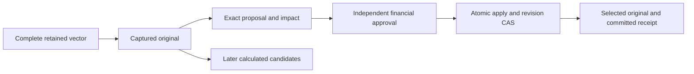

# Composite Result Authority

## Current Scope

Result authority separates calculated analysis from the decision to select, freeze, correct or
withdraw a captured composite original. The financial verifier defaults to unavailable; configured
signed conformance remains `SYNTHETIC_NON_CERTIFYING`. Institutional activation and full
[Performance #610](https://github.com/sgajbi/lotus-performance/issues/610) remain unresolved.

| Reader | Next Action |
| --- | --- |
| Business and support | Use the action and current-use rules below. |
| Reporting integration | Retain the exact decision identity or committed snapshot token. |
| Engineering | Read the [authority guide](https://github.com/sgajbi/lotus-performance/blob/main/docs/guides/composite_result_authority.md) and [v1 contract](https://github.com/sgajbi/lotus-performance/blob/main/docs/contracts/composite-result-authority-v1.json). |
| Demo and sales | Keep synthetic conformance separate from bank approval, source qualification and release certification. |

## How Selection Works

Approval alone does not change selection. `SELECT_INITIAL`, `REPLACE`, `FREEZE`, `REOPEN`,
`RESTORE_PRIOR` and `WITHDRAW_CURRENT_USE` each require an exact proposal and separate approval.
A frozen selection requires approved reopen before replacement, then a new proposal and approval
against the new revision. Restore creates a new decision referencing a previously selected original.
Withdrawal removes current use while preserving custody and freeze protection.

The four operations sit under `/performance/composites/result-authorities`: propose, approve,
apply, and read a scope. Verified bearer identity and current trusted portfolio grants are required.
Caller-asserted tenant, role or scope cannot grant authority. Canonical human identity checks prevent
the same person approving their own work through a second username. Source/method approvals cannot
stand in for financial-result approval.

## Overlapping Windows And Financial Use

Each wider window needs its own captured original. Authority reads preserve it without calculation
or linking. Changing a dependency atomically marks affected ordinary projections `STALE`; a frozen
overlap requires its approved reopen. Explicit bundles require their complete member closure and
expected revisions, so partial replacement cannot appear successful.

| Returned State | Consumer Action |
| --- | --- |
| `SELECTED` | Respect the receipt's synthetic qualification and current authority policy. |
| `STALE` | Obtain reviewed complete replacement before new financial use. |
| `WITHDRAWN` | Preserve historical evidence and stop current financial use. |

Report versions, recipients and institutional materiality remain `UNAVAILABLE`. Pending impact
counts indicate unapplied local review proposals, including obsolete ones; they do not certify
materiality or zero downstream impact. Existing TWR greatest-sequence analysis and candidate capture
continue independently of selection and freeze.

## Historical Reads And Support

`LATEST_APPROVED` reads the current revision. `EXACT` and `AS_REPORTED` require a retained
`decision_id`; `COMMITTED_TOKEN` requires the exact returned snapshot token. Historical selection
and current-use restrictions are shown separately. Arbitrary UTC knowledge time is unsupported.
The recording timestamp is not a database commit-time cutoff, and a token supplies no access grant.

| Symptom | First Response |
| --- | --- |
| Financial authority unavailable | Keep the workflow unavailable and obtain the governed integration; do not substitute source receipts. |
| Revision, freeze or bundle conflict | Reload the exact revision/impact set and obtain new approval. |
| Retained custody refusal | Stop financial use and follow reviewed recovery; do not regenerate the original. |

The [guide's evidence map](https://github.com/sgajbi/lotus-performance/blob/main/docs/guides/composite_result_authority.md#evidence-and-remaining-scope)
links policy, storage and PostgreSQL controls. Synthetic local execution passed 112 database-free
cases and the complete 62-case SQLite/PostgreSQL/registered-ASGI matrix, including native crash,
migration and concurrent owner transactions. [Issue #610](https://github.com/sgajbi/lotus-performance/issues/610)
retains executed results and earlier failures. These checks do not establish institutional
activation or protected-main release. Composite-only imported history,
manual financial overrides, institutional/GIPS activation and a complete external recipient graph
remain outside this increment. [Platform #923](https://github.com/sgajbi/lotus-platform/issues/923)
coordinates the unresolved institutional decisions.

Continue with [Composite Performance](Composite-Performance) for calculated analytics and
[Operations Runbook](Operations-Runbook) for general service operations.
