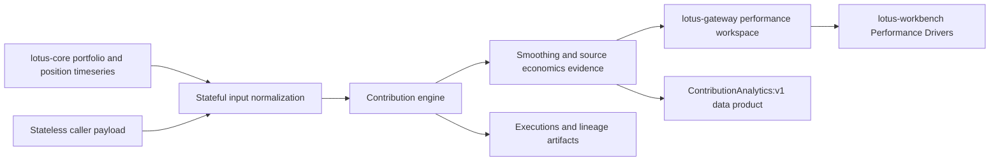
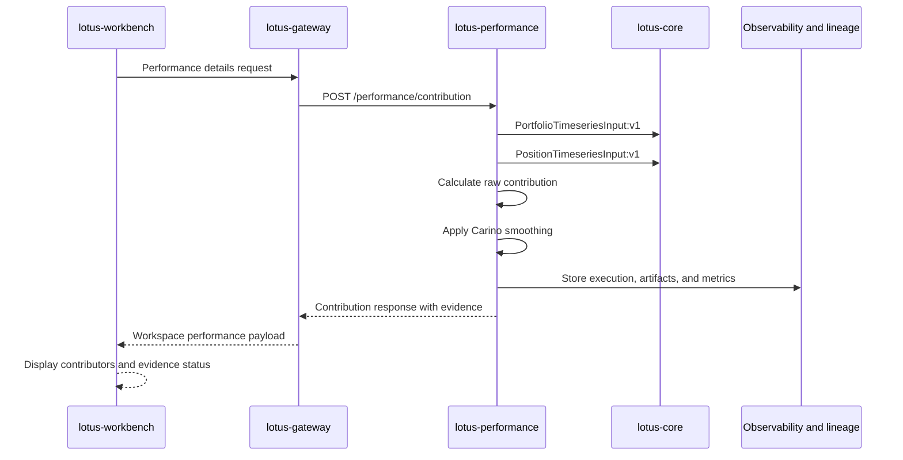

# Contribution Analytics

`ContributionAnalytics:v1` is the Lotus performance explanation data product. It answers the
private-banking question: "which positions, sleeves, and classifications drove the portfolio return
for this period?"

The product is owned by `lotus-performance`, consumed through `lotus-gateway`, and displayed in
`lotus-workbench`. Downstream systems may present the evidence, but they must not recompute
contribution totals, source-economics quality, or Carino smoothing state.

## Supported Capability

| Capability | Implementation-backed behavior |
| --- | --- |
| Position contribution | `POST /performance/contribution` returns position-level contribution, average weight, local contribution, FX contribution, and position return where supported. |
| Hierarchy contribution | Optional `hierarchy` groups position contribution by dimensions such as `asset_class`, `sector`, `country`, `currency`, and `position_id`. Missing classification is emitted as `Unclassified`; top-N bucketing can emit `Other`. |
| Stateful source input | `input_mode="stateful"` sources portfolio and position analytics inputs from `lotus-core` and normalizes them into the same calculation contract used by stateless requests. |
| Carino smoothing | Default `CARINO` smoothing uses `F_t = k_t / K` and emits period-level `smoothing_evidence` with raw, smoothed, final, linked-return, residual, factor, status, and reason-code fields. |
| Source economics evidence | Top-level `source_economics_evidence` states whether inputs are caller supplied or lotus-core sourced, which source contracts were used, which economics are available, and which component-P&L families remain unsupported or degraded. |
| Async and lineage | Contribution can return `202 Accepted`, exposes execution status, supports result polling, and emits lineage artifacts for reproducibility and support. |
| Downstream realization | Gateway preserves source-owned contribution return, smoothing evidence, and source-economics evidence. Workbench renders exact source-economics and smoothing statuses in Performance Drivers. |

## Business Flow

1. A front-office workflow requests contribution for a portfolio, period, basis, and optional
   hierarchy dimension.
2. `lotus-performance` resolves stateless or stateful inputs, calculates portfolio return,
   position contribution, hierarchy rows, smoothing evidence, and source-economics posture.
3. Gateway passes through source-owned contribution return and evidence fields without replacing
   them with TWR summary values.
4. Workbench displays contribution ranking and exact source-economics or smoothing statuses so
   users can tell whether the result is source-backed, limited, caller-supplied, smoothed, or
   fallback-governed.
5. Operations and support can inspect execution, lineage, diagnostics, and audit counts.

## Architecture and Integrations

| Integration | Direction | Contract posture |
| --- | --- | --- |
| `lotus-core` | upstream source | Provides portfolio and position timeseries; component P&L economics are not fully source-authored, so contribution reports `SOURCE_LIMITED`. |
| `lotus-performance` | producer | Owns contribution calculation, smoothing evidence, source economics evidence, lineage, supportability, and data-product truth. |
| `lotus-gateway` | downstream experience API | Preserves source-owned contribution totals and evidence without recomputing or overwriting them. |
| `lotus-workbench` | downstream product surface | Displays contribution ranking and evidence statuses in Performance Drivers and participates in canonical live validation. |
| Operations | support workflow | Uses readiness, metrics, execution polling, lineage artifacts, diagnostics, and reason codes to investigate support questions. |

## Operational Behavior

| Area | Behavior |
| --- | --- |
| Readiness | `lotus-performance` exposes readiness through `/health/ready`; live proof validated the service as ready. |
| Metrics | Prometheus metrics include contribution supportability and request counters, including success and validation-error classes. |
| Logs | Structured access logs carry correlation, request, and trace identifiers across Gateway, performance, and upstream source calls. |
| Lineage | Contribution executions expose retrieval, normalization, execution, and lineage materialization stages plus artifacts such as request, response, daily contribution, and portfolio TWR files. |
| Error handling | Invalid request shapes and unsupported stateful currency combinations return bounded validation errors; unsupported source economics are not treated as fatal when contribution can still be safely calculated. |
| Security posture | Downstream calls require governed caller context at Gateway; contribution evidence avoids exposing restricted customer data in public documentation. |

## Demo and Sales Narrative

Contribution Analytics should be presented as an explainable performance driver product for
private-banking portfolios. The strongest demo path is:

1. open Workbench Performance Drivers for `PB_SG_GLOBAL_BAL_001`;
2. show top contributors and detractors by asset class or position;
3. open the evidence context to show that the calculation is supported, source-limited, or
   caller-supplied as appropriate;
4. explain that Carino smoothing reconciles multi-period contribution to the linked portfolio return;
5. show that Gateway and Workbench display producer-owned evidence rather than reconstructing the
   calculation downstream.

The correct sales message is not "all possible component economics are available." The correct
message is that Lotus makes the calculation, method, lineage, and source limitations visible, which
is the safer enterprise behavior for private-banking support and client conversations.

## Edge-Case Semantics

The RFC-047 QA pack proves these contribution semantics:

- external deposits are not performance;
- internal trade flows are not portfolio external flow;
- income can remain assigned to the generating asset when source metadata supplies `income_pnl`;
- net fee drag can be carried by an explicit fee bucket when source metadata supplies `fee_pnl`;
- missing classification is emitted as `Unclassified`;
- short positions preserve signed average weight and inverse contribution sign behavior;
- invalid Carino domains fall back with explicit status and reason codes;
- hierarchy, position rows, daily series, and by-position series reconcile to source-owned totals.

## Data Mesh Posture

`ContributionAnalytics:v1` is declared in
`contracts/domain-data-products/lotus-performance-products.v1.json` and has repo-local trust
telemetry in `contracts/trust-telemetry/contribution-analytics.telemetry.v1.json`.

Source dependencies:

- `lotus-core:PortfolioTimeseriesInput:v1`
- `lotus-core:PositionTimeseriesInput:v1`

Approved consumer:

- `lotus-gateway`

Evidence expectations:

- daily freshness;
- lineage required;
- source contract evidence retained;
- bounded source-economics status and reason codes;
- unsupported component-P&L families represented explicitly instead of inferred downstream;
- Gateway and Workbench preserve producer-owned evidence.

## Audience Notes

Business users and client demos should use the Workbench Performance Drivers panel to explain
contributors and detractors. Sales and pre-sales can describe contribution as a governed,
source-evidenced performance explanation product, not just a calculation utility. Developers and
operations should use the API, execution, and lineage surfaces when validating support incidents or
integration behavior.

## References

- [Supported Features](Supported-Features)
- [Mesh Data Products](Mesh-Data-Products)
- [API Surface](API-Surface)
- [docs/guides/contribution.md](../docs/guides/contribution.md)
- [docs/technical/contribution-endpoint-certification.md](../docs/technical/contribution-endpoint-certification.md)
