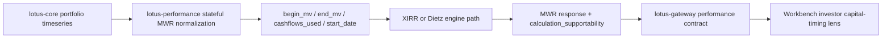

# Integrations

## Downstream consumers

Primary downstream consumers include:

- `lotus-gateway`
- selected `lotus-risk` stateful workflows
- operator and support tooling that consumes execution, runtime, and lineage surfaces

## Upstream dependencies

`lotus-performance` consumes `lotus-core` for governed source data and analytics-input contracts.
It does not outsource performance conclusions to `lotus-core`.

Current transport posture:

- control-plane base URL:
  `CORE_CONTROL_PLANE_BASE_URL`
- compatibility fallback:
  `CORE_QUERY_BASE_URL`
- no current gRPC contract

Governed base-URL examples:

1. `http://core-control.dev.lotus`
2. `http://127.0.0.1:8202`
3. `http://host.docker.internal:8202`
4. `http://lotus-core-control:8002`

## Contract grouping

- analytics surfaces:
  TWR, MWR, benchmark, workspace summary, contribution, attribution
- integration surfaces:
  returns-series, benchmark exposure context, capabilities
- operator surfaces:
  execution polling, lineage, runtime status, work items, recoveries, drills, retention

## Stateful MWR source flow

Stateful MWR is a source-owned performance methodology path. `lotus-performance` retrieves
portfolio analytics timeseries from `lotus-core`, normalizes the investor capital-flow schedule,
and emits MWR plus supportability metadata for downstream consumers.
Gateway and Workbench should consume the emitted MWR response as source-owned performance truth;
they must not reconstruct cash flows from TWR, benchmark, or workspace summary payloads.

## References

- [docs/technical/RFC-0082-upstream-contract-family-map.md](../docs/technical/RFC-0082-upstream-contract-family-map.md)
- [docs/guides/api_reference.md](../docs/guides/api_reference.md)
