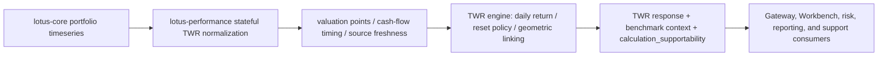
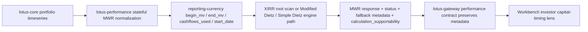
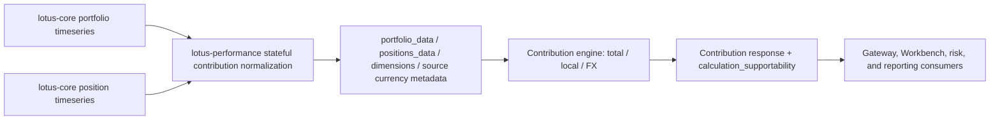
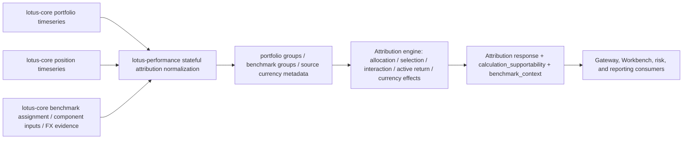
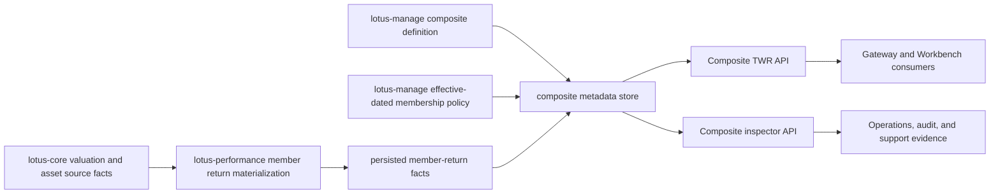

# Integrations

## Downstream consumers

Primary downstream consumers include:

- `lotus-gateway`
- selected `lotus-risk` stateful workflows
- operator and support tooling that consumes execution, runtime, and lineage surfaces

## Upstream dependencies

`lotus-performance` consumes `lotus-core` for governed source data and analytics-input contracts.
It does not outsource performance conclusions to `lotus-core`.

Current transport posture:

- control-plane base URL:
  `CORE_CONTROL_PLANE_BASE_URL`
- compatibility fallback:
  `CORE_QUERY_BASE_URL`
- no current gRPC contract

Governed base-URL examples:

1. [`core-control.dev.lotus`](http://core-control.dev.lotus)
2. [`127.0.0.1:8202`](http://127.0.0.1:8202)
3. [`host.docker.internal:8202`](http://host.docker.internal:8202)
4. [`lotus-core-control:8002`](http://lotus-core-control:8002)

## Contract grouping

- analytics surfaces:
  TWR, MWR, benchmark, workspace summary, contribution, attribution
- integration surfaces:
  returns-series, benchmark exposure context, capabilities
- operator surfaces:
  execution polling, lineage, runtime status, work items, recoveries, drills, retention

Benchmark exposure context is the performance-owned derived integration view for downstream risk
attribution. It resolves benchmark assignment and component weights through `lotus-core`, then
serves `POSITION`, `SECTOR`, `ASSET_CLASS`, and `ISSUER` rows at `frequency=DAILY`. Issuer rows use
lotus-core index-catalog `classification_labels.issuer_id` and `issuer_name`; `POSITION` is the only
grouping that carries `component_id`.

## Stateful TWR source flow

Stateful TWR is the source-normalized portfolio performance path. `lotus-performance` retrieves
portfolio timeseries from `lotus-core`, normalizes valuation and cash-flow facts into the owned TWR
engine input shape, and emits TWR response, benchmark context, supportability metadata, and lineage
evidence for downstream consumers. Gateway, Workbench, reporting, risk, and support consumers
should consume the emitted TWR contract rather than reconstructing daily returns from raw source
rows.

RFC-046 adds product-visible TWR evidence that downstream consumers should preserve rather than
flatten away: `calculation_evidence`, `calculation_supportability.source_quality_evidence`, and
`benchmark_context.supportability_evidence`. Gateway now carries benchmark currency state,
calendar alignment state, warning codes, and missing benchmark date count into workspace summaries;
Workbench can present that evidence in the return-path metrics. Risk engines should continue using
`POST /integration/returns/series` for canonical return-series input.

## Stateful MWR source flow

Stateful MWR is a source-owned performance methodology path. `lotus-performance` retrieves
portfolio analytics timeseries from `lotus-core`, normalizes the investor capital-flow schedule,
and emits MWR plus supportability metadata for downstream consumers.
Gateway and Workbench should consume the emitted MWR response as source-owned performance truth;
they must not reconstruct cash flows from TWR, benchmark, or workspace summary payloads.
Current MWR inputs are a single reporting-currency schedule. Gateway, Workbench, reporting, and
support tooling must not infer FX rates, conversion policy, or source-currency provenance from the
legacy `cashflows_used` echo. Stateless callers may provide complete
`source_preconverted_fx_evidence`; when present, downstream consumers should preserve the emitted
`currency_evidence` and must not recalculate FX conversion or MWR locally.
Stateful single-currency MWR emits `not_required_single_currency_inputs` when source and reporting
currencies match; cross-currency stateful MWR keeps the missing per-input FX metadata posture until
the upstream source contract publishes rate, policy, version, and fingerprint evidence.
Gateway should preserve calculation-quality fields (`status`, `reason_codes`, `warnings`,
`fallback_reason`, `is_approximation`, and `holding_period_return`) because they explain whether the
client-facing number is annualized XIRR, a labeled Modified Dietz fallback, a Simple Dietz result,
or not calculable.
The implementation-backed Lotus production control guide is maintained at
[docs/guides/mwr-lotus-production-controls.md](https://github.com/sgajbi/lotus-performance/blob/main/docs/guides/mwr-lotus-production-controls.md).
The stateful upstream FX-aware MWR gate is maintained at
[docs/technical/mwr-fx-contract-design.md](https://github.com/sgajbi/lotus-performance/blob/main/docs/technical/mwr-fx-contract-design.md).

## Stateful contribution source flow

Stateful contribution is a source-normalized performance methodology path. `lotus-performance`
retrieves portfolio and position timeseries from `lotus-core`, normalizes source rows into the
contribution engine request shape, and emits total, local, and FX contribution with bounded
supportability metadata. Gateway, Workbench, risk, and reporting consumers should consume the
emitted contribution response; they must not reconstruct position contribution from TWR, MWR,
attribution, or raw source rows.

## Stateful attribution source flow

Stateful attribution is a source-normalized performance methodology path. `lotus-performance`
retrieves portfolio and position timeseries from `lotus-core`, resolves benchmark assignment or an
explicit benchmark override, sources benchmark component inputs through the shared benchmark engine
path, and normalizes source currency evidence for the multi-currency branch. Gateway, Workbench,
risk, and reporting consumers should consume the emitted attribution response; they must not
reconstruct allocation, selection, interaction, active return, or currency attribution from
contribution, TWR, MWR, benchmark, or raw source rows.

## Composite performance source flow

Composite performance is a persisted-fact source flow. `lotus-manage` owns composite definition and
effective-dated membership policy, `lotus-core` owns source valuation and asset facts, and
`lotus-performance` owns persisted member-return facts plus asset-weighted composite TWR
methodology. Gateway and Workbench consume the emitted composite TWR and inspector evidence; they
must not reconstruct composite weights, source-fact lineage, restatement posture, or supportability
state downstream.

## References

- [docs/technical/RFC-0082-upstream-contract-family-map.md](https://github.com/sgajbi/lotus-performance/blob/main/docs/technical/RFC-0082-upstream-contract-family-map.md)
- [docs/technical/twr-documentation-map.md](https://github.com/sgajbi/lotus-performance/blob/main/docs/technical/twr-documentation-map.md)
- [docs/technical/composite-performance-documentation-map.md](https://github.com/sgajbi/lotus-performance/blob/main/docs/technical/composite-performance-documentation-map.md)
- [docs/guides/api_reference.md](https://github.com/sgajbi/lotus-performance/blob/main/docs/guides/api_reference.md)
