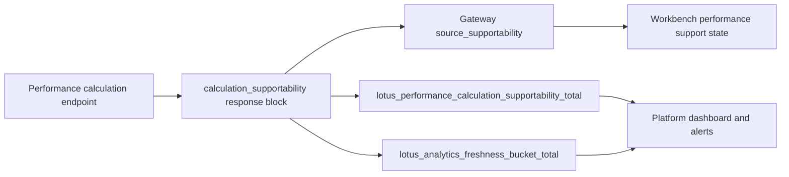

# Operations Runbook

This page is the first stop for production-support orientation. It summarizes the runtime surfaces
that operators can use to distinguish application health, durable execution progress, lineage
availability, recovery posture, and retention posture.

## Operator surface summary

Primary runtime surfaces:

- `GET /health`
- `GET /health/live`
- `GET /health/ready`
- `GET /metrics`
- `GET /integration/runtime-status`
- `GET /integration/runtime-work-items`
- `GET /integration/runtime-recoveries`
- `GET /integration/recovery-drills`
- `POST /integration/recovery-drills/run`
- `GET /integration/runtime-retention-cleanups`
- `POST /integration/runtime-retention-cleanups/run`
- `GET /performance/executions/{calculation_id}`
- `GET /performance/lineage/{calculation_id}`
- `POST /performance/inspections/twr`
- `GET /performance/inspections/{inspection_id}`

## First-response decision tree

| Symptom | First checks | Escalate with |
| --- | --- | --- |
| API is unavailable | `GET /health`, service logs, container status | failing health response, deployment revision, recent config changes |
| Readiness is false | `GET /health/ready`, `GET /integration/runtime-status`, database reachability | readiness payload, runtime-status snapshot, metadata database state |
| Async calculation is slow or stuck | `GET /performance/executions/{calculation_id}`, `GET /integration/runtime-work-items` | calculation id, execution state, work-item age, queue metrics |
| Completed calculation lacks expected evidence | `GET /performance/lineage/{calculation_id}`, endpoint result route, inspection route where applicable | request fingerprint, response supportability block, lineage metadata, artifact names |
| Recovery or retention looks degraded | runtime recoveries, recovery drills, retention cleanup history | recovery id or cleanup id, trigger source, terminal status, error summary |

## Error response triage

Public API errors include a support-safe envelope with a backward-compatible `detail` field plus
machine-readable `error_code`, `message`, `correlation_id`, `request_id`, `source`, and
`retryable`. Validation failures also include `validation_errors`; retryable upstream or throttling
failures may include `retry_after_seconds` or `remediation_hint`.

Use `correlation_id` and `request_id` as the primary join keys between client-visible failures,
structured service logs, durable execution state, runtime work items, and lineage evidence.
Unexpected `5xx` responses intentionally avoid raw exception text; inspect logs and durable
evidence under the same correlation context when deeper diagnosis is needed.

Application services should raise Lotus framework-neutral API errors with explicit status,
detail, and retryability metadata; FastAPI exception and response construction belongs at the API
adapter boundary. When a background worker records `APIServiceUnavailableError`, treat it as a
retryable source/dependency outage rather than a web-framework failure. The public HTTP envelope is
still produced by the central FastAPI exception handler.

For explicit non-error HTTP outcomes, services return `ApplicationHttpResponse` and API endpoints
convert it with `to_fastapi_response(...)`; this keeps async `202 Accepted` and authorization-denied
responses consistent without importing FastAPI response classes into application services.

## HTTP boundary controls

`lotus-performance` registers explicit HTTP boundary hardening in `app.http_security`.
Operators should review these settings for each environment:

- `HTTP_ALLOWED_HOSTS`: allowed Host header values for `TrustedHostMiddleware`
- `CORS_ALLOWED_ORIGINS`: browser origins allowed to call the API
- `HTTP_SECURITY_HSTS_ENABLED`: enable only when this service owns the HTTPS boundary
- `HTTP_SECURITY_HSTS_MAX_AGE_SECONDS`: HSTS max-age when HSTS is enabled

Local Docker deployments should keep `host.docker.internal` in `HTTP_ALLOWED_HOSTS` because
`lotus-gateway` calls `lotus-performance` through that Docker-to-host alias in the canonical
front-office stack.

Every success and handled error response should include `X-Content-Type-Options`,
`X-Frame-Options`, `Referrer-Policy`, and `Content-Security-Policy`. If TLS terminates at platform
ingress, HSTS may be owned there instead of by the service process; keep that decision explicit in
deployment configuration.

## Privileged evidence access

Lineage inventory and artifact downloads are controlled evidence-access surfaces. In
production-like profiles with `ENTERPRISE_ENFORCE_PRIVILEGED_READ_AUTHZ=true`, both
`GET /performance/lineage/{calculation_id}` and
`GET /performance/lineage/{calculation_id}/artifacts/{artifact_name}` require enterprise identity
headers and capability `operations.runtime.read`. Missing identity or missing capability should
return the standard authorization-denied envelope and emit deny audit metadata.

## Async worker diagnostics

API and background-worker logs use the same JSON logging contract. For async calculation incidents,
start with `calculation_id`, then join the API acceptance log, durable execution lifecycle,
compute-worker event, lineage-worker event, and result-polling log by `calculation_id` plus
`correlation_id` or `trace_id` when the accepted request propagated those values.
This applies consistently to returns-series, contribution, attribution, benchmark, TWR,
workspace-summary, and TWR-inspection async submissions. The transient `observability_context`
field is ignored for replay and conflict identity, so retries from the same business request do not
become different jobs only because correlation values changed.

Expected worker fields:

- compute executor: `worker_name=compute_executor_worker`, `queue=compute`, `calculation_id`,
  `analytics_type`, retryability, attempt counts, and failure classification
- lineage worker: `worker_name=lineage_worker`, `queue=lineage`, `calculation_id`,
  `calculation_type`, `lineage_stage`, and materialization-failure classification
- runtime-retention worker: `worker_name=runtime_retention_worker`, `queue=runtime_retention`,
  cleanup mode, cleanup status, trigger mode, operator id, job id, and prunable execution count

Runtime-retention previews and apply runs use retention-aligned durable-store indexes and
database-native count/delete operations. Operators should not expect cleanup cost to scale with
full ORM row materialization; execution and lineage paths still enumerate calculation ids only when
artifact directories or child rows must be counted or deleted deterministically.

Runtime work-item lineage inspection is also governed by query-plan evidence. The active, failed,
all, and reclaimable lineage inspection views use `calculation_type`-aware composite indexes on
lineage records plus payload calculation and lease-expiry indexes, so support drill-down remains
bounded as lineage history grows. Active and all-item views may sort on a derived active-since
expression; failed and reclaimable views should stay index-backed without avoidable sort work.

Runtime work-item and recovery drill-downs degrade per queue source. If a compute read fails while
lineage remains readable, or lineage fails while compute remains readable, the endpoint still
returns the healthy queue and marks only the failed queue `unavailable`. Stable queue-state reasons
are `compute_work_item_read_failed`, `lineage_work_item_read_failed`,
`compute_recovery_read_failed`, and `lineage_recovery_read_failed`. Join those responses to the
structured `runtime_operator_read_degraded` log event to inspect source, operation, exception class,
and safe filter context. The log intentionally records filter presence and bounded type filters,
not raw calculation-id fragments or cursor identifiers.

Runtime status follows the same public-reason principle. Unexpected component read failures use
stable reason codes such as `compute_queue_status_read_failed`,
`lineage_queue_status_read_failed`, `recovery_drill_history_read_failed`,
`runtime_retention_history_read_failed`, `runtime_retention_preview_read_failed`,
`recovery_drill_operator_action_read_failed`, and
`runtime_retention_operator_action_read_failed`. Join those response reasons to structured
`runtime_status_read_degraded` logs for component, operation, exception class, correlation id, and
request id. Do not treat raw Python exception class names as supported public runtime-status reason
codes.

Stateful lotus-core fan-out uses the shared upstream resilience layer and a lifecycle-managed
`httpx.AsyncClient` pool under the FastAPI lifespan. Tune `STATEFUL_INPUT_MAX_CONCURRENT_CHUNKS`
together with `UPSTREAM_HTTP_MAX_CONNECTIONS`, `UPSTREAM_HTTP_MAX_KEEPALIVE_CONNECTIONS`, and
`UPSTREAM_HTTP_KEEPALIVE_EXPIRY_SECONDS` when stateful analytics show connection pressure or
upstream keep-alive churn; do not create a separate runtime service for this class of issue without
workload-isolation evidence.

For compute executor incidents, distinguish calculation failure from durable success-finalization
failure. A `success_result_publication_failed` event means the calculation completed but the async
result write failed, so the job must not be marked complete until a retrievable result exists. A
`success_finalization_failed` event means the success result was already written but job completion
failed; stale-job reconciliation should then emit `success_finalization_recovered` and mark the
compute job complete from the persisted result. Late failure writes must not replace an existing
successful async result for the same calculation id.

Stale-owner finalization is intentionally a no-op. A `stale_owner_success_publication_skipped`
event means a compute worker finished after another worker reclaimed the calculation lease; it must
not publish the stale async result or mark the compute job complete. A
`stale_owner_lineage_finalization_skipped` event means a lineage worker no longer owns the active
payload lease; it must not mark lineage metadata complete or delete the replacement worker's
payload. Governed operator-action locks are also released by acquisition token, so a stale runtime
retention or recovery-drill run cannot remove a newer owner's lock after stale reclaim.

## Calculation supportability metric

Completed TWR, MWR, contribution, attribution, and returns-series responses emit a bounded
calculation supportability posture and increment:

`lotus_performance_calculation_supportability_total{operation,supportability_state,reason,freshness_bucket}`

The same response block includes `metric_labels` so downstream operators can see the exact
Prometheus label set that the service owns:

```json
{
  "metric_labels": ["operation", "supportability_state", "reason", "freshness_bucket"]
}
```

The same source-owned posture also increments the RFC-0108 cross-service freshness counter:

`lotus_analytics_freshness_bucket_total{service="lotus-performance",operation,freshness_bucket,supportability_state}`

Use `supportability_state="stale"` or `supportability_state="empty"` as operator attention signals
for front-office performance surfaces. Use `supportability_state="stale"` or
`supportability_state="degraded"` for `operation="returns_series"` source-quality triage. Current
operation labels are `twr`, `mwr`, `contribution`, `attribution`, and `returns_series`. The labels
are intentionally bounded and must not carry portfolio, client,
tenant, account, benchmark, calculation, trace, correlation, request body, response body, or
security identifiers.



## Readiness semantics

`/health/ready` is intentionally strict. It returns ready only when the API can support durable
executor-backed and lineage-backed workflows.

Durable readiness probes are isolated from the async request loop and bounded by
`DURABLE_READINESS_TIMEOUT_SECONDS`. Treat `durable_metadata_readiness_timeout` as a database or
catalog responsiveness signal, and treat `lineage_storage_readiness_timeout` as a lineage-storage
mount, write, or fsync latency signal.

If readiness returns `durable_metadata_schema_discovery_failed`, the database ping succeeded but the
service could not list the required durable metadata tables. Check catalog permissions, schema
visibility, metadata responsiveness, and migration state before accepting traffic.

## TWR inspection support workflow

Use `POST /performance/inspections/twr` when support needs proof behind a portfolio-level TWR
result. For `subject_type="twr_calculation"`, the inspector loads the completed response and then
resolves the request source in this order:

1. durable lineage metadata,
2. materialized lineage files,
3. durable compute-job request payload for async calculations.

That fallback is intentional. It prevents a just-completed async TWR calculation from looking only
partially inspectable when the compute worker has finished the result but the API container cannot
yet see worker-local lineage files. A canonical stateful inspection should complete calculation
consistency, source quality, economic plausibility, reconciliation, and cash-flow classification
families. If those families remain pending, treat it as an implementation or runtime defect, not as
a support success.

Live proof command:

```powershell
python scripts/validate_canonical_twr_inspection.py
```

The 2026-05-10 gold-pass run completed against live containers with zero reconciliation gap dates,
zero nonpositive capital-base dates, zero cash-flow normalization/timing/type defects, and only the
allowed canonical data warnings.

## First-response documents

- alert handling:
  [docs/runbooks/runtime-alerts.md](../docs/runbooks/runtime-alerts.md)
- deployable monitoring artifacts:
  [monitoring/prometheus/lotus-performance-alerts.prometheusrule.json](../monitoring/prometheus/lotus-performance-alerts.prometheusrule.json)
  and
  [monitoring/grafana/lotus-performance-operability-dashboard.json](../monitoring/grafana/lotus-performance-operability-dashboard.json)
- durable recovery:
  [docs/runbooks/durable-metadata-recovery.md](../docs/runbooks/durable-metadata-recovery.md)
- retention cleanup:
  [docs/runbooks/runtime-retention-cleanup.md](../docs/runbooks/runtime-retention-cleanup.md)
- returns-series source-quality triage:
  [docs/runbooks/returns-series-operator-triage.md](../docs/runbooks/returns-series-operator-triage.md)
- MWR support:
  [docs/operations/mwr-production-support-playbook.md](../docs/operations/mwr-production-support-playbook.md)
  and `lotus_performance_mwr_solver_outcome_total` for fallback, no-root, and multiple-root rates.
- MWR alert and dashboard templates:
  [docs/operations/mwr-alert-rule-templates.md](../docs/operations/mwr-alert-rule-templates.md)

The `monitoring/` artifacts are the deployable adoption source. The Markdown alert-template pages
explain the expressions and support response, and `make quality-observability-readiness-gate`
validates artifact syntax, metric names, labels, links, and sensitive-label safety.

## Runtime thresholds and overlays

Threshold policy and compose overlays live in:

- [docs/standards/runtime-alert-policy.md](../docs/standards/runtime-alert-policy.md)
- [docs/standards/runtime-threshold-profiles.md](../docs/standards/runtime-threshold-profiles.md)
- [docs/examples](../docs/examples/)

## Related pages

- [Architecture](Architecture)
- [Troubleshooting](Troubleshooting)
- [Validation and CI](Validation-and-CI)
