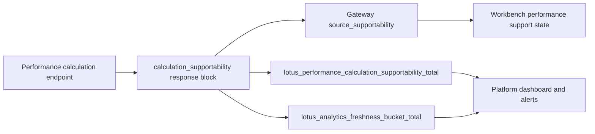

# Operations Runbook

This page is the first stop for production-support orientation. It summarizes the runtime surfaces
that operators can use to distinguish application health, durable execution progress, lineage
availability, recovery posture, and retention posture.

## Operator surface summary

Primary runtime surfaces:

- `GET /health`
- `GET /health/live`
- `GET /health/ready`
- `GET /metrics`
- `GET /integration/runtime-status`
- `GET /integration/runtime-work-items`
- `GET /integration/runtime-recoveries`
- `GET /integration/recovery-drills`
- `POST /integration/recovery-drills/run`
- `GET /integration/runtime-retention-cleanups`
- `POST /integration/runtime-retention-cleanups/run`
- `GET /performance/executions/{calculation_id}`
- `GET /performance/lineage/{calculation_id}`
- `POST /performance/inspections/twr`
- `GET /performance/inspections/{inspection_id}`

## First-response decision tree

| Symptom | First checks | Escalate with |
| --- | --- | --- |
| API is unavailable | `GET /health`, service logs, container status | failing health response, deployment revision, recent config changes |
| Readiness is false | `GET /health/ready`, `GET /integration/runtime-status`, database reachability | readiness payload, runtime-status snapshot, metadata database state |
| Async calculation is slow or stuck | `GET /performance/executions/{calculation_id}`, `GET /integration/runtime-work-items` | calculation id, execution state, work-item age, queue metrics |
| Completed calculation lacks expected evidence | `GET /performance/lineage/{calculation_id}`, endpoint result route, inspection route where applicable | request fingerprint, response supportability block, lineage metadata, artifact names |
| Recovery or retention looks degraded | runtime recoveries, recovery drills, retention cleanup history | recovery id or cleanup id, trigger source, terminal status, error summary |

## Calculation supportability metric

Completed TWR, MWR, contribution, and attribution responses emit a bounded calculation
supportability posture and increment:

`lotus_performance_calculation_supportability_total{operation,supportability_state,reason,freshness_bucket}`

The same response block includes `metric_labels` so downstream operators can see the exact
Prometheus label set that the service owns:

```json
{
  "metric_labels": ["operation", "supportability_state", "reason", "freshness_bucket"]
}
```

The same source-owned posture also increments the RFC-0108 cross-service freshness counter:

`lotus_analytics_freshness_bucket_total{service="lotus-performance",operation,freshness_bucket,supportability_state}`

Use `supportability_state="stale"` or `supportability_state="empty"` as operator attention signals
for front-office performance surfaces. Current operation labels are `twr`, `mwr`, `contribution`,
and `attribution`. The labels are intentionally bounded and must not carry portfolio, client,
tenant, account, benchmark, calculation, trace, correlation, request body, response body, or
security identifiers.



## Readiness semantics

`/health/ready` is intentionally strict. It returns ready only when the API can support durable
executor-backed and lineage-backed workflows.

Durable readiness probes are isolated from the async request loop and bounded by
`DURABLE_READINESS_TIMEOUT_SECONDS`. Treat `durable_metadata_readiness_timeout` as a database or
catalog responsiveness signal, and treat `lineage_storage_readiness_timeout` as a lineage-storage
mount, write, or fsync latency signal.

## TWR inspection support workflow

Use `POST /performance/inspections/twr` when support needs proof behind a portfolio-level TWR
result. For `subject_type="twr_calculation"`, the inspector loads the completed response and then
resolves the request source in this order:

1. durable lineage metadata,
2. materialized lineage files,
3. durable compute-job request payload for async calculations.

That fallback is intentional. It prevents a just-completed async TWR calculation from looking only
partially inspectable when the compute worker has finished the result but the API container cannot
yet see worker-local lineage files. A canonical stateful inspection should complete calculation
consistency, source quality, economic plausibility, reconciliation, and cash-flow classification
families. If those families remain pending, treat it as an implementation or runtime defect, not as
a support success.

Live proof command:

```powershell
python scripts/validate_canonical_twr_inspection.py
```

The 2026-05-10 gold-pass run completed against live containers with zero reconciliation gap dates,
zero nonpositive capital-base dates, zero cash-flow normalization/timing/type defects, and only the
allowed canonical data warnings.

## First-response documents

- alert handling:
  [docs/runbooks/runtime-alerts.md](../docs/runbooks/runtime-alerts.md)
- durable recovery:
  [docs/runbooks/durable-metadata-recovery.md](../docs/runbooks/durable-metadata-recovery.md)
- retention cleanup:
  [docs/runbooks/runtime-retention-cleanup.md](../docs/runbooks/runtime-retention-cleanup.md)
- MWR support:
  [docs/operations/mwr-production-support-playbook.md](../docs/operations/mwr-production-support-playbook.md)
  and `lotus_performance_mwr_solver_outcome_total` for fallback, no-root, and multiple-root rates.
- MWR alert and dashboard templates:
  [docs/operations/mwr-alert-rule-templates.md](../docs/operations/mwr-alert-rule-templates.md)

## Runtime thresholds and overlays

Threshold policy and compose overlays live in:

- [docs/standards/runtime-alert-policy.md](../docs/standards/runtime-alert-policy.md)
- [docs/standards/runtime-threshold-profiles.md](../docs/standards/runtime-threshold-profiles.md)
- [docs/examples](../docs/examples)

## Related pages

- [Architecture](Architecture)
- [Troubleshooting](Troubleshooting)
- [Validation and CI](Validation-and-CI)
