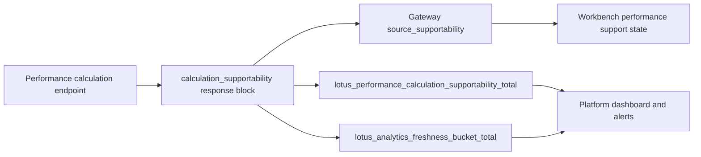

# Operations Runbook

## Operator surface summary

Primary runtime surfaces:

- `GET /health`
- `GET /health/live`
- `GET /health/ready`
- `GET /metrics`
- `GET /integration/runtime-status`
- `GET /integration/runtime-work-items`
- `GET /integration/runtime-recoveries`
- `GET /integration/recovery-drills`
- `POST /integration/recovery-drills/run`
- `GET /integration/runtime-retention-cleanups`
- `POST /integration/runtime-retention-cleanups/run`
- `GET /performance/executions/{calculation_id}`
- `GET /performance/lineage/{calculation_id}`

## Calculation supportability metric

Completed TWR, MWR, contribution, and attribution responses emit a bounded calculation
supportability posture and increment:

`lotus_performance_calculation_supportability_total{operation,supportability_state,reason,freshness_bucket}`

The same response block includes `metric_labels` so downstream operators can see the exact
Prometheus label set that the service owns:

```json
{
  "metric_labels": ["operation", "supportability_state", "reason", "freshness_bucket"]
}
```

The same source-owned posture also increments the RFC-0108 cross-service freshness counter:

`lotus_analytics_freshness_bucket_total{service="lotus-performance",operation,freshness_bucket,supportability_state}`

Use `supportability_state="stale"` or `supportability_state="empty"` as operator attention signals
for front-office performance surfaces. Current operation labels are `twr`, `mwr`, `contribution`,
and `attribution`. The labels are intentionally bounded and must not carry portfolio, client,
tenant, account, benchmark, calculation, trace, correlation, request body, response body, or
security identifiers.



## Readiness semantics

`/health/ready` is intentionally strict. It returns ready only when the API can support durable
executor-backed and lineage-backed workflows.

## First-response documents

- alert handling:
  [docs/runbooks/runtime-alerts.md](../docs/runbooks/runtime-alerts.md)
- durable recovery:
  [docs/runbooks/durable-metadata-recovery.md](../docs/runbooks/durable-metadata-recovery.md)
- retention cleanup:
  [docs/runbooks/runtime-retention-cleanup.md](../docs/runbooks/runtime-retention-cleanup.md)
- MWR support:
  [docs/operations/mwr-production-support-playbook.md](../docs/operations/mwr-production-support-playbook.md)
  and `lotus_performance_mwr_solver_outcome_total` for fallback, no-root, and multiple-root rates.
- MWR alert and dashboard templates:
  [docs/operations/mwr-alert-rule-templates.md](../docs/operations/mwr-alert-rule-templates.md)

## Runtime thresholds and overlays

Threshold policy and compose overlays live in:

- [docs/standards/runtime-alert-policy.md](../docs/standards/runtime-alert-policy.md)
- [docs/standards/runtime-threshold-profiles.md](../docs/standards/runtime-threshold-profiles.md)
- [docs/examples](../docs/examples)

## Related pages

- [Architecture](Architecture)
- [Troubleshooting](Troubleshooting)
