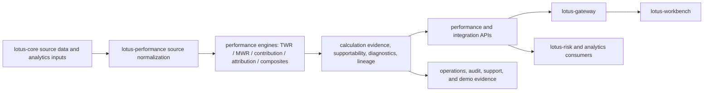

# Supported Features

This page lists implementation-backed `lotus-performance` capabilities. It is product material for
business users, engineers, operations, sales, pre-sales, and demo preparation. It is not a roadmap
claim list.

## How To Use This Page

Use this page as the current-state product evidence map:

- business users can see which performance analytics capabilities are implemented and where each
  capability stops
- operations can see which non-functional supportability controls are backed by runtime surfaces
  and tests
- sales and pre-sales can build demo stories around implemented supportability, lineage, and
  governed data-product posture without overclaiming target-state work
- engineers can trace each claim back to routes, contracts, docs, and repo-native validation gates

Every supported claim below must remain tied to code, contracts, tests, or governed docs. If a
capability is planned but not implemented, it belongs in [Roadmap](Roadmap), not this page.

## Current-State Capability Flow

The product value is not only the calculated number. The supported product is the calculated number
plus the evidence that explains source quality, methodology posture, fallback state, lineage,
runtime health, and downstream-consumption boundaries.

## Feature Matrix

| Capability | Supported scope | Primary route or surface | Evidence and boundary |
| --- | --- | --- | --- |
| Portfolio TWR | Portfolio-level stateless and stateful TWR, synchronous and async | `POST /performance/twr`, `GET /performance/twr/results/{calculation_id}` | Daily calculation evidence, linkability status, episode status, supportability metadata, reset diagnostics, lineage, and docs contract tests. Composite, group, and sleeve TWR are not part of the portfolio TWR endpoint; composite TWR is supported only through `POST /performance/composites/twr`. |
| Benchmark-aware TWR | Portfolio TWR with benchmark return and active return | `POST /performance/twr` with `include_benchmark=true` | `benchmark_context.supportability_evidence` exposes benchmark source/method, currency state, FX decomposition posture, calendar alignment, missing-date counts, and bounded warning codes. |
| TWR inspection | Source-quality, economic-plausibility, reconciliation, cash-flow classification, reset/linkability supportability | `POST /performance/inspections/twr` | Inspection findings and artifacts support operational diagnosis; resolved async TWR subjects can use durable compute-job request payloads when API-local lineage files are not yet visible. Inspection is the deeper support surface and does not replace the calculation response contract. |
| Money-weighted return | Portfolio-level XIRR, Modified Dietz fallback, Simple Dietz explicit path | `POST /performance/mwr` | Status, reason codes, warnings, convergence, fallback metadata, reporting currency, currency evidence, calculation supportability, and production-control docs. |
| Contribution | Portfolio, position, and hierarchy contribution, including stateful source-normalized input | `POST /performance/contribution` | Total, local, and FX contribution results with bounded supportability, Carino smoothing evidence, source-economics evidence, trust telemetry, and governed `ContributionAnalytics:v1` data-product declaration. RFC-047 proves external-deposit neutrality, income assignment, fee drag, missing classification, short-sleeve sign behavior, downstream Gateway preservation, and Workbench evidence display. Downstream consumers should not reconstruct contribution. |
| Attribution | Portfolio/benchmark attribution, including stateful source-normalized input | `POST /performance/attribution` | Allocation, selection, interaction, active return, currency-attribution evidence, period status, reason codes, residual materiality, bounded source-alignment evidence, supportability metadata, lineage artifacts, governed `AttributionAnalytics:v1` data-product declaration, and merged Gateway/Workbench consumption; fixed-income factor, derivative, sleeve, and composite attribution are not current supported claims. Benchmark-version, classification-version, calendar-policy, and fee/tax/income breakout attribution are also not current supported claims. |
| Composite TWR | Private-banking composite performance from persisted member-return facts | `POST /performance/composites/twr`, `POST /performance/composites/inspect` | Asset-weighted composite period returns, geometric linking, member weights and contributions, dispersion, blocked/degraded supportability, source fingerprints, source snapshots, restatement versions, classified inspector artifacts, governed `CompositePerformanceAnalytics:v1` data-product declaration, Gateway route realization, Workbench typed BFF consumption, and live RFC-049 proof. Downstream consumers should not reconstruct composite returns, weights, lineage, or restatement posture. |
| Returns series | Performance-owned return-series bundle for downstream analytics engines | `POST /integration/returns/series` | Correct downstream surface for risk engines; `lotus-risk` should consume this rather than direct TWR response internals. |
| Benchmark exposure context | Benchmark exposure rows for risk and integration workflows | `POST /integration/benchmarks/exposure-context` | Benchmark-context integration product; not a composite TWR calculation surface. |
| Mandate performance health context | Bounded active-return health posture for DPM supportability consumers | `POST /performance/mandate-health-context` | Source-owned `MandatePerformanceHealthContext:v1` evidence with threshold posture, methodology posture, request fingerprint, and reason codes. It does not create mandate actions, rebalance waves, client communications, orders, OMS actions, or execution instructions. |
| Workspace summary | Interaction-efficient performance summary for product surfaces | `POST /performance/workspace-summary` | Product-oriented summary contract for Gateway and Workbench. It should consume performance-owned calculations, not rebuild them. |
| Execution and lineage | Async polling, result retrieval, lineage metadata, artifacts | `/performance/executions/*`, `/performance/lineage/*` | Durable evidence path for reproducibility, operations, and support. |
| Runtime operations | Health, readiness, metrics, runtime status, recovery, retention | `/health`, `/metrics`, `/integration/runtime-status`, recovery and retention routes | Supports enterprise operational posture and CI/runtime diagnostics. |

## Non-Functional Capability Matrix

| Non-functional capability | Implemented current state | Primary evidence surfaces | Audience value |
| --- | --- | --- | --- |
| OpenAPI and Swagger quality | OpenAPI is generated through FastAPI and enriched before publication, including governed validation-error examples, named legacy error schemas where implemented, and shared default problem-detail schemas; `make check` runs the OpenAPI quality gate. | `/docs`, `/openapi.json`, `scripts/openapi_quality_gate.py`, `tests/unit/app/*_openapi_contract.py` | Engineers and client technical reviewers can inspect the live contract instead of relying on static slideware. |
| API vocabulary governance | Public API vocabulary drift is checked as part of the local fast gate. | `scripts/api_vocabulary_inventory.py --validate-only`, `docs/api-vocabulary-inventory.json` | Product and engineering teams can keep naming consistent across performance, gateway, and workbench surfaces. |
| No-alias governance | Compatibility aliases are guarded so stale request shapes do not silently become new product contracts. | `scripts/no_alias_contract_guard.py`, README request-shape notes, endpoint helper tests | Sales and delivery teams can demo current request shapes confidently and avoid legacy examples. |
| Async execution | Long-running analytics can return `202 Accepted`, persist work, and expose result retrieval through endpoint-specific result routes. | `/performance/executions/{calculation_id}`, result routes such as `/performance/twr/results/{calculation_id}` and `/integration/returns/series/results/{calculation_id}` | Operations and support can explain progress, completion, and failure without rerunning calculations blindly. |
| Lineage and reproducibility | Calculation requests and responses are captured with lineage metadata and materialized artifacts where supported. | `/performance/lineage/{calculation_id}`, `/performance/lineage/{calculation_id}/artifacts/{artifact_name}`, lineage worker, lineage metadata store | Audit, support, and client-facing teams can trace what was calculated and what evidence backed the answer. |
| Runtime health and readiness | Health, liveness, readiness, metrics, runtime status, work-item, recovery, drill, and retention surfaces are implemented. | `/health`, `/health/live`, `/health/ready`, `/metrics`, `/integration/runtime-status`, runtime work-item/recovery/retention endpoints | Operations can monitor service posture and separate application readiness from queued or degraded background work. |
| Durable execution controls | Execution registry, compute job store, async result store, and lineage store are bootstrapped through app lifespan. | `main.py`, `app/services/compute_job_store.py`, `app/services/async_result_store.py`, runtime certification docs | Engineers can reason about restart, recovery, and support paths instead of treating async execution as transient memory. |
| Data-product governance | Performance outputs are declared as domain data products with producer/consumer posture and trust telemetry where applicable. | `contracts/domain-data-products/lotus-performance-products.v1.json`, `contracts/trust-telemetry/`, `scripts/validate_domain_data_product_contracts.py` | Business, data, and platform teams can distinguish governed product outputs from internal implementation details. |
| Observability and audit middleware | Application startup wires observability and enterprise audit middleware. | `main.py`, `app/observability.py`, `app/enterprise_readiness.py`, `tests/unit/test_observability.py`, enterprise-readiness tests | Operations and security stakeholders can see that diagnostics and audit posture are part of runtime wiring. |
| Monetary-float discipline | Monetary float usage is guarded by a repo-native scanner and allowlist. | `scripts/check_monetary_float_usage.py`, `make monetary-float-guard` | Engineering and client assurance teams can see that numeric safety is actively governed rather than left to convention. |
| Validation lane discipline | Fast local and PR-grade gates cover lint, formatting, typecheck, contracts, docs, security, migrations, Docker, and tests. | `make check`, `make ci`, `make ci-local`, `Makefile`, `README.md`, [Validation and CI](Validation-and-CI) | Delivery and client-project teams can connect feature claims to repeatable release evidence. |

## Demo And Presentation Guidance

Use these implementation-backed stories in client demos and presentations:

1. Evidence-backed performance numbers
   show TWR, MWR, contribution, attribution, or composite outputs together with supportability,
   reason codes, warnings, benchmark context, and lineage. Do not present the numeric result alone
   when evidence is available.
2. Source-owned methodology boundaries
   explain that `lotus-performance` owns performance methodology while `lotus-core` owns source
   data. Gateway and Workbench present the emitted contracts; they do not reconstruct returns,
   attribution, contribution, or composite weights downstream.
3. Operational maturity
   include async execution, polling, lineage retrieval, runtime status, recovery, drills, retention,
   and metrics when the audience cares about production operations or managed-service support.
4. Governed data mesh posture
   highlight the domain data-product declarations and trust telemetry for supported analytics.
   These are implementation-backed data-product claims, not marketing labels.
5. Clear limitation language
   keep unsupported areas explicit: portfolio TWR is not group/sleeve/composite TWR; composite TWR
   is only through the composite endpoint; attribution does not currently claim fixed-income
   factor, derivative, sleeve, composite, fee/tax/income breakout, benchmark-version, or
   classification-version attribution.

Avoid demo claims that imply production support for target-state features listed only in
[Roadmap](Roadmap). For demo screenshots, prefer flows that preserve supportability and lineage
evidence end to end through Gateway or Workbench.

## Composite Performance Supported Detail

RFC-049 promotes persisted-fact composite performance as an implementation-backed supported
capability. The supported product boundary includes composite source authority, persisted
member-return facts, asset-weighted composite TWR over persisted facts,
`POST /performance/composites/twr`, `POST /performance/composites/inspect`,
`CompositePerformanceAnalytics:v1`, return-view separation, single reporting-currency guards,
source fingerprints, source snapshots, restatement versions, classified inspection artifacts,
Gateway route realization, Workbench typed BFF consumption, live direct API/Gateway/BFF proof,
canonical front-office validation, and operations evidence.

The calculation endpoint intentionally reads already-materialized member-return facts. It does not
fan out into hidden request-time member portfolio TWR calculations, infer membership policy, convert
return views, or perform cross-currency aggregation at request time.

composite contribution, composite attribution, composite MWR, carve-outs, sleeves, model portfolios,
wrap programs, pooled fund composites, private-market composites, portability records,
tax-aware composites, leveraged composites, long/short special composite structures, and
multi-currency composite aggregation beyond the current single reporting-currency guard are not
current supported claims.

## TWR RFC-046 Supported Detail

RFC-046 promotes the following TWR capabilities as supported because they are implemented,
documented, and tested:

- daily calculation evidence with denominator basis, flow timing, signed adjusted capital,
  adjusted capital after policy, performance P&L, daily return, status, reason codes, and warnings
- linkability status and episode status for reset boundaries, no-investment periods, and full-loss
  or not-calculated rows
- stateful source-quality evidence from `lotus-core` normalized inputs
- canonical inspection evidence for resolved stateful subjects, including source-quality,
  economic-plausibility, reconciliation, and cash-flow-classification check families
- benchmark/FX/calendar supportability evidence under `benchmark_context.supportability_evidence`
- Gateway workspace preservation of benchmark evidence
- Workbench presentation of benchmark evidence as an implementation-backed product metric
- explicit portfolio-only boundary for TWR

Gold-pass live validation on 2026-05-10 proved canonical stateful TWR inspection against the local
front-office stack. The inspector completed all required evidence families with zero reconciliation
gap dates, zero nonpositive capital-base dates, zero cash-flow normalization/timing/type defects,
and only the allowed canonical data warnings.

## Not Supported By RFC-046

The following are not supported product claims for the portfolio TWR endpoint delivered by RFC-046:

- group TWR calculation
- sleeve TWR calculation
- downstream reconstruction of TWR from raw source rows
- use of TWR response internals as the canonical risk return-series input
- unbounded Prometheus labels containing portfolio, client, account, trace, request, response, or
  security identifiers

## Data Product Posture

`TimeWeightedReturnAnalytics:v1` is a governed `lotus-performance` data product. It is declared in
`contracts/domain-data-products/lotus-performance-products.v1.json`, uses daily freshness semantics,
requires lineage, carries customer-consumable evidence posture, and is approved for Gateway
consumption. Gateway and Workbench can publish the evidence, but they do not redefine the
performance methodology.

`ContributionAnalytics:v1` is also a governed `lotus-performance` data product. It is declared in
`contracts/domain-data-products/lotus-performance-products.v1.json`, has repo-local trust telemetry
at `contracts/trust-telemetry/contribution-analytics.telemetry.v1.json`, uses daily freshness
semantics, requires lineage, and is approved for Gateway consumption. Stateful contribution depends
on `lotus-core` `PortfolioTimeseriesInput:v1` and `PositionTimeseriesInput:v1`; unsupported
component-P&L families are exposed as unsupported or degraded evidence rather than inferred
downstream. The product is detailed in [Contribution Analytics](Contribution-Analytics).

`AttributionAnalytics:v1` is also a governed `lotus-performance` data product. It is declared in
`contracts/domain-data-products/lotus-performance-products.v1.json`, has repo-local trust telemetry
at `contracts/trust-telemetry/attribution-analytics.telemetry.v1.json`, uses daily freshness
semantics, requires lineage and benchmark context, and is approved for Gateway consumption.
Downstream consumers may present attribution evidence, but must not reconstruct allocation,
selection, interaction, residual materiality, linked-return posture, or period status. The product is
detailed in [Attribution Analytics](Attribution-Analytics).

`MandatePerformanceHealthContext:v1` is a governed `lotus-performance` data product. It is declared
in `contracts/domain-data-products/lotus-performance-products.v1.json`, uses daily freshness
semantics, requires lineage posture, and is approved for Gateway and Manage consumption. Downstream
consumers may preserve the emitted active-return health posture, threshold posture, methodology
posture, request fingerprint, and reason codes; they must not treat it as a mandate decision,
client communication, trade recommendation, order, OMS action, or execution instruction.

## References

- [Time-Weighted Return](Time-Weighted-Return)
- [Contribution Analytics](Contribution-Analytics)
- [Attribution Analytics](Attribution-Analytics)
- [Mesh Data Products](Mesh-Data-Products)
- [docs/guides/mandate_performance_health_context.md](../docs/guides/mandate_performance_health_context.md)
- [docs/guides/twr.md](../docs/guides/twr.md)
- [docs/technical/twr-documentation-map.md](../docs/technical/twr-documentation-map.md)
- [docs/technical/twr-endpoint-certification.md](../docs/technical/twr-endpoint-certification.md)
- [docs/guides/twr_inspection_checks.md](../docs/guides/twr_inspection_checks.md)
- [docs/guides/attribution.md](../docs/guides/attribution.md)
- [docs/technical/attribution-documentation-map.md](../docs/technical/attribution-documentation-map.md)
