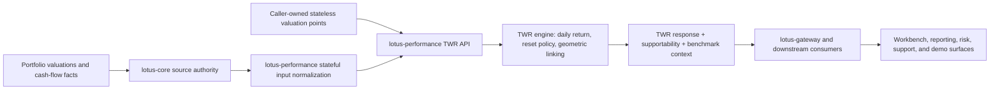
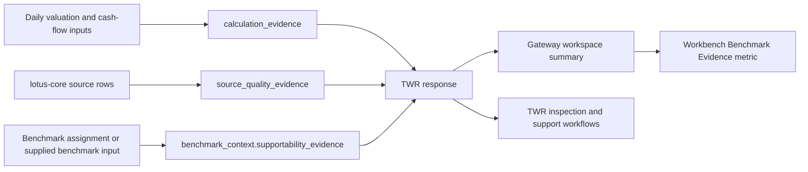

# Time-Weighted Return

Time-weighted return is the Lotus portfolio performance lens for measuring investment performance
independently from external client cash-flow timing. `lotus-performance` owns the calculation,
methodology, endpoint contract, supportability posture, and certification evidence for portfolio
TWR.

## Implemented Capability

Current `lotus-performance` TWR supports:

- stateless caller-owned valuation input through `POST /performance/twr`
- stateful lotus-core sourced portfolio timeseries through `input_mode="stateful"`
- synchronous execution for smaller requests
- asynchronous execution and result polling for larger workloads
- benchmark-aware TWR when `include_benchmark=true`
- relative performance against resolved benchmark output
- multi-currency return decomposition where the request supplies supported FX inputs
- reset and no-investment-period diagnostics
- daily calculation evidence with denominator basis, flow timing, signed adjusted capital,
  performance P&L, calculation status, linkability status, episode status, reason codes, and
  warnings
- stateful source-quality evidence for missing valuation points, unsupported cash-flow labels,
  stale source observations, and duplicate-date source conflicts
- benchmark supportability evidence for source/method, reporting currency, benchmark currency, FX
  decomposition posture, portfolio-vs-benchmark calendar overlap, missing benchmark dates, and
  bounded warning codes
- lineage and reproducibility artifacts for durable workflows
- bounded calculation supportability metadata and Prometheus freshness posture
- TWR inspection workflows for deeper source-quality and reconciliation evidence

## Product Contract

`POST /performance/twr` is a portfolio-level data product contract, not only a formula route. The
current response is designed so business users, support teams, and downstream applications can
understand whether the return is usable, explainable, benchmark-aware, and source-supported.

| Product question | Implementation-backed answer |
| --- | --- |
| What return was earned? | Period and breakdown returns are emitted under `results_by_period`. |
| How was each daily return produced? | Portfolio daily rows carry `calculation_evidence` with method, denominator, flow timing, adjusted capital, performance P&L, status, reasons, and warnings. |
| Can the daily return be geometrically linked? | `linkability_status` distinguishes `linkable`, `reset_boundary`, `not_calculated`, and `not_linkable`. |
| Did the portfolio path remain economically continuous? | `episode_status` identifies normal open periods, reset boundaries, no-investment rows, and rows outside the governed period. |
| Is the source data trustworthy enough? | `calculation_supportability` and, for stateful TWR, `source_quality_evidence` expose source freshness and degraded-state posture. |
| Is the benchmark comparison supportable? | `benchmark_context.supportability_evidence` exposes benchmark source, currency posture, FX decomposition, calendar overlap, missing dates, and warning codes. |
| Can operations reproduce or investigate the result? | Async execution, lineage, inspection, and artifact routes preserve durable evidence. |

## Business Flow

## Evidence Flow

## Integration Boundaries

`lotus-performance` owns performance conclusions. `lotus-core` owns portfolio, valuation,
cash-flow, benchmark-assignment, and source-data authority. Downstream consumers should use the
emitted TWR response, benchmark context, calculation supportability, execution polling, and lineage
surfaces rather than reconstructing performance calculations outside the service.

Primary downstream consumers include:

- `lotus-gateway`
- `lotus-workbench` through gateway-composed product surfaces
- selected `lotus-risk` workflows that consume returns series or performance evidence
- reporting, operations, and support tooling that need execution, lineage, or inspection evidence

RFC-046 realized the benchmark evidence path in `lotus-gateway` and `lotus-workbench`: Gateway
preserves benchmark currency state, calendar alignment state, warning codes, and missing benchmark
date count in workspace summaries; Workbench can present that posture as a `Benchmark Evidence`
metric. Reporting, AI, risk, and core were reviewed during the contract realization slice and did
not require immediate TWR response parser changes.

## Operational Posture

TWR is not only a formula endpoint. The current implementation also provides:

- health, readiness, and metrics surfaces
- async execution tracking
- durable lineage and artifact retrieval
- calculation supportability metadata
- bounded metric labels that avoid portfolio, client, account, trace, request, response, or
  security identifiers
- endpoint certification and docs contract tests
- inspection supportability for source-quality and reconciliation analysis

## Demo And Client-Ready Talking Points

Use these points only when the backed implementation has been deployed in the target environment:

- Lotus TWR separates client cash-flow timing from investment performance and geometrically links
  daily returns.
- The service explains the calculation rather than returning only a headline number.
- Support teams can see source quality, reset boundaries, no-investment periods, benchmark
  supportability, and bounded warning codes.
- Gateway and Workbench can carry benchmark evidence from the performance data product into the
  product experience without recomputing TWR downstream.
- Composite, group, and sleeve TWR are intentionally not claimed by RFC-046.

## Current Limitations

`POST /performance/twr` is a portfolio-level calculation contract. It does not expose
composite, group, or sleeve TWR calculation endpoints, and RFC-046 does not promote those
capabilities as supported product features.

Current governed boundaries:

- composite, group, and sleeve TWR are not promoted as supported RFC-046 capabilities
- group-level contribution and attribution remain separate analytics surfaces, not TWR substitutes
- benchmark exposure grouping is an integration context for benchmark and risk workflows, not
  composite TWR calculation
- long/short exposure handling inside portfolio TWR is portfolio exposure behavior, not sleeve
  performance reporting

## References

- [TWR guide](../docs/guides/twr.md)
- [TWR documentation map](../docs/technical/twr-documentation-map.md)
- [TWR endpoint certification](../docs/technical/twr-endpoint-certification.md)
- [TWR inspection checks](../docs/guides/twr_inspection_checks.md)
- [TWR inspection endpoint certification](../docs/technical/twr-inspection-endpoint-certification.md)
- [Performance reset scenarios](../docs/technical/performance-reset-scenarios.md)
- [Metric methodology index](../docs/methodologies/metrics/master-index.md)
