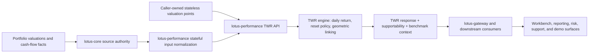

# Time-Weighted Return

Time-weighted return is the Lotus portfolio performance lens for measuring investment performance
independently from external client cash-flow timing. `lotus-performance` owns the calculation,
methodology, endpoint contract, supportability posture, and certification evidence for portfolio
TWR.

## Implemented Capability

Current `lotus-performance` TWR supports:

- stateless caller-owned valuation input through `POST /performance/twr`
- stateful lotus-core sourced portfolio timeseries through `input_mode="stateful"`
- synchronous execution for smaller requests
- asynchronous execution and result polling for larger workloads
- benchmark-aware TWR when `include_benchmark=true`
- relative performance against resolved benchmark output
- multi-currency return decomposition where the request supplies supported FX inputs
- reset and no-investment-period diagnostics
- lineage and reproducibility artifacts for durable workflows
- bounded calculation supportability metadata and Prometheus freshness posture
- TWR inspection workflows for deeper source-quality and reconciliation evidence

## Business Flow

## Integration Boundaries

`lotus-performance` owns performance conclusions. `lotus-core` owns portfolio, valuation,
cash-flow, benchmark-assignment, and source-data authority. Downstream consumers should use the
emitted TWR response, benchmark context, calculation supportability, execution polling, and lineage
surfaces rather than reconstructing performance calculations outside the service.

Primary downstream consumers include:

- `lotus-gateway`
- `lotus-workbench` through gateway-composed product surfaces
- selected `lotus-risk` workflows that consume returns series or performance evidence
- reporting, operations, and support tooling that need execution, lineage, or inspection evidence

## Operational Posture

TWR is not only a formula endpoint. The current implementation also provides:

- health, readiness, and metrics surfaces
- async execution tracking
- durable lineage and artifact retrieval
- calculation supportability metadata
- bounded metric labels that avoid portfolio, client, account, trace, request, response, or
  security identifiers
- endpoint certification and docs contract tests
- inspection supportability for source-quality and reconciliation analysis

## Current Limitations

`POST /performance/twr` is a portfolio-level calculation contract. It does not expose
composite, group, or sleeve TWR calculation endpoints, and RFC-046 does not promote those
capabilities as supported product features.

Current governed boundaries:

- composite, group, and sleeve TWR are not promoted as supported RFC-046 capabilities
- group-level contribution and attribution remain separate analytics surfaces, not TWR substitutes
- benchmark exposure grouping is an integration context for benchmark and risk workflows, not
  composite TWR calculation
- long/short exposure handling inside portfolio TWR is portfolio exposure behavior, not sleeve
  performance reporting

## References

- [TWR guide](../docs/guides/twr.md)
- [TWR documentation map](../docs/technical/twr-documentation-map.md)
- [TWR endpoint certification](../docs/technical/twr-endpoint-certification.md)
- [TWR inspection checks](../docs/guides/twr_inspection_checks.md)
- [TWR inspection endpoint certification](../docs/technical/twr-inspection-endpoint-certification.md)
- [Performance reset scenarios](../docs/technical/performance-reset-scenarios.md)
- [Metric methodology index](../docs/methodologies/metrics/master-index.md)
